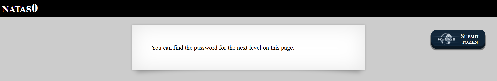

# Level 0

## Challenge Information
| Level | Username | URL |
| :--- | :--- | :--- |
| Level 0 | natas0 | http://natas0.natas.labs.overthewire.org |

**Objective:** Find the password for natas1 hidden somewhere on the page.

---

## Walkthrough

### 1. Initial Inspection

* **Observation:** Upon accessing the natas0 challenge, the page displays a simple message: "You can find the password for the next level on this page." The visible content provides a clear hint that the password is embedded within the current page, but not immediately visible to the user.

* **Evidence:**



### 2. Enumeration & Discovery

* **Tooling:** The most straightforward approach for client-side web challenges is to inspect the HTML source code. This can be accomplished by:
  - Pressing `Ctrl+U` (View Page Source) in the browser
  - Right-clicking and selecting "View Page Source"
  - Using browser Developer Tools (F12)

* **Findings:** Examining the HTML source code reveals the complete page structure, including HTML comments that are not rendered in the browser but remain visible in the source:

```html
<html>
<head>
<!-- This stuff in the header has nothing to do with the level -->
<link rel="stylesheet" type="text/css" href="http://natas.labs.overthewire.org/css/level.css">
<link rel="stylesheet" href="http://natas.labs.overthewire.org/css/jquery-ui.css" />
<link rel="stylesheet" href="http://natas.labs.overthewire.org/css/wechall.css" />
<script src="http://natas.labs.overthewire.org/js/jquery-1.9.1.js"></script>
<script src="http://natas.labs.overthewire.org/js/jquery-ui.js"></script>
<script src=http://natas.labs.overthewire.org/js/wechall-data.js></script><script src="http://natas.labs.overthewire.org/js/wechall.js"></script>
<script>var wechallinfo = { "level": "natas0", "pass": "natas0" };</script></head>
<body>
<h1>natas0</h1>
<div id="content">
You can find the password for the next level on this page.

<!--The password for natas1 is 0nz[REDACTED] -->
</div>
</body>
</html>
```

* **Critical Finding:** Within the HTML body, an HTML comment contains the password: `<!--The password for natas1 is 0nz[REDACTED] -->`

### 3. Exploitation

* **Vulnerability:** **Client-Side Source Code Disclosure** - Sensitive information (credentials) exposed in HTML comments. HTML comments are transmitted to the client browser as part of the page source but are not rendered visually. This is a common security misconfiguration where developers mistakenly believe that commenting out sensitive data makes it secure.

* **Payload/Command:** No exploitation payload is required. Simply viewing the page source (Ctrl+U) reveals the password.

* **Security Impact:** Any user with basic web browsing knowledge can access the HTML source code and extract sensitive information. This demonstrates why sensitive data should never be included in client-side code, even within comments.

---

## Flag / Password
**Next Level Password:** `0nz[REDACTED]`

**Attack Vector Summary:** Password disclosed in HTML source code comments, accessible via browser's "View Source" functionality.

---

## Key Takeaways

1. **Never trust client-side security:** Anything sent to the client browser can be inspected and extracted.
2. **HTML comments are not secure:** Comments in HTML are visible in the source code and should never contain sensitive information.
3. **Information Disclosure Vulnerability:** This represents a basic but critical web security flaw where confidential data is inadvertently exposed to unauthorized users.
