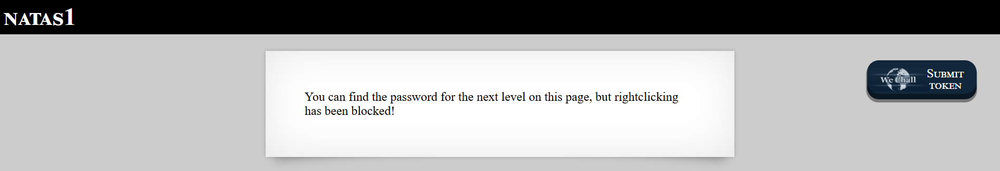

# Level 1

## Challenge Information
| Level | Username | URL |
| :--- | :--- | :--- |
| Level 1 | natas1 | http://natas1.natas.labs.overthewire.org |

**Objective:** Find the password for natas2 on a page where right-clicking has been blocked.

---

## Walkthrough

### 1. Initial Inspection

* **Observation:** Upon accessing the natas1 challenge, the page displays a message: "You can find the password for the next level on this page, but rightclicking has been blocked!" This introduces a client-side security control that attempts to prevent users from accessing the browser's context menu (typically accessed via right-click). The challenge hints that the password is hidden on the page, but a superficial protection mechanism is in place.

* **Evidence:**



* **Initial Analysis:** When attempting to right-click on the page, a JavaScript alert appears with the message "right clicking has been blocked!". This is a common but ineffective client-side protection mechanism that developers sometimes implement, falsely believing it will prevent source code inspection.

### 2. Enumeration & Discovery

* **Tooling:** Client-side JavaScript restrictions can be easily bypassed using alternative methods to access the HTML source code. Multiple approaches are available:

  **Method 1: Keyboard Shortcut**
  - Press `Ctrl+U` (Windows/Linux) or `Cmd+Option+U` (Mac) to view page source directly
  
  **Method 2: Browser Address Bar**
  - Type `view-source:http://natas1.natas.labs.overthewire.org` in the address bar
  
  **Method 3: Developer Tools**
  - Press `F12` or `Ctrl+Shift+I` to open Developer Tools
  - Navigate to the "Elements" or "Inspector" tab
  
  **Method 4: Browser Menu**
  - Navigate to browser menu → More Tools → View Page Source

* **Findings:** Using `Ctrl+U` to view the page source reveals the complete HTML structure, including the JavaScript-based protection mechanism and the hidden password:

```html
<html>
<head>
<!-- This stuff in the header has nothing to do with the level -->
<link rel="stylesheet" type="text/css" href="http://natas.labs.overthewire.org/css/level.css">
<link rel="stylesheet" href="http://natas.labs.overthewire.org/css/jquery-ui.css" />
<link rel="stylesheet" href="http://natas.labs.overthewire.org/css/wechall.css" />
<script src="http://natas.labs.overthewire.org/js/jquery-1.9.1.js"></script>
<script src="http://natas.labs.overthewire.org/js/jquery-ui.js"></script>
<script src=http://natas.labs.overthewire.org/js/wechall-data.js></script><script src="http://natas.labs.overthewire.org/js/wechall.js"></script>
<script>var wechallinfo = { "level": "natas1", "pass": "0nz[REDACTED]" };</script></head>
<body oncontextmenu="javascript:alert('right clicking has been blocked!');return false;">
<h1>natas1</h1>
<div id="content">
You can find the password for the
next level on this page, but rightclicking has been blocked!

<!--The password for natas2 is Tgu[REDACTED] -->
</div>
</body>
</html>
```

* **Critical Findings:**
  1. **Protection Mechanism:** The `<body>` tag contains an `oncontextmenu` event handler: `oncontextmenu="javascript:alert('right clicking has been blocked!');return false;"` - This intercepts right-click events and displays an alert, then returns `false` to prevent the default context menu from appearing.
  2. **Password Location:** The password is stored in an HTML comment: `<!--The password for natas2 is Tgu[REDACTED] -->`
  3. **Additional Info:** The JavaScript object `wechallinfo` contains the current level credentials, which could be useful for automated tools.

### 3. Exploitation

* **Vulnerability:** **Client-Side Security Control Bypass** - The application implements a JavaScript-based right-click protection mechanism that operates entirely on the client side. This represents a fundamental security flaw where the application relies on client-side controls to protect sensitive information.

* **Technical Explanation:** 
  - The `oncontextmenu` event handler only prevents the default browser context menu from appearing
  - It does NOT prevent access to the page source code through other methods
  - All HTML, JavaScript, and CSS sent to the client browser remains accessible regardless of client-side restrictions
  - Client-side security controls can always be disabled, bypassed, or ignored by determined users

* **Payload/Command:** No exploitation payload is required. Simply use the keyboard shortcut to bypass the JavaScript restriction:

```
Method: Press Ctrl+U (View Page Source)
Result: Full HTML source code revealed, including password in HTML comment
```

* **Security Impact:** 
  - Client-side protections provide a false sense of security
  - Sensitive data transmitted to the client is always accessible
  - JavaScript restrictions can be circumvented in seconds using built-in browser features
  - This demonstrates why "security through obscurity" fails in web applications

---

## Flag / Password
**Next Level Password:** `Tgu[REDACTED]`

**Attack Vector Summary:** Client-side JavaScript right-click protection bypassed using browser's built-in "View Source" functionality (Ctrl+U), revealing password in HTML comments.

---

## Key Takeaways

1. **Client-Side Controls Are Not Security:** Any restriction implemented in JavaScript can be trivially bypassed by end users.

2. **Multiple Bypass Methods Exist:** Even if one method is blocked (e.g., right-click), browsers provide numerous alternative ways to access source code (keyboard shortcuts, developer tools, view-source protocol, browser extensions).

3. **Defense in Depth Required:** Security controls must be implemented server-side. Client-side controls should only be used for user experience improvements, never for security enforcement.

4. **Proper Secret Management:** Sensitive information (passwords, API keys, tokens) should never be embedded in client-side code, comments, or JavaScript variables, as they are always accessible to end users.

5. **Common Misconception:** Disabling right-click or blocking DevTools does not prevent determined users from accessing page source - it only inconveniences legitimate users while providing zero actual security.
