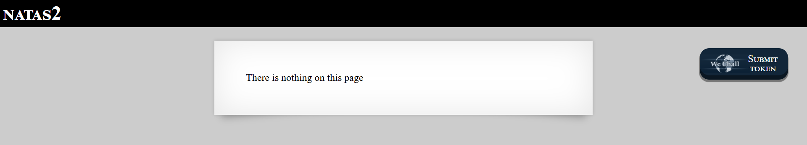
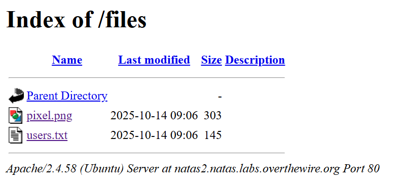

# Natas Level 2: When "Nothing" Actually Means "Everything"

## The Setup
| Level | Username | Target URL |
| :--- | :--- | :--- |
| Level 2 | natas2 | http://natas2.natas.labs.overthewire.org |

**Introduction:** 

So, I landed on Natas Level 2, and the page just flat-out told me: "There is nothing on this page." Classic misdirection, right? If you've been doing CTFs for even a little while, you know that when a webpage says "nothing to see here," it's basically winking at you. Let's dig deeper and see what's really going on.

---

## Hunting for Clues

First things first—let's check out what the page actually looks like in the browser:



Yeah, pretty boring. Just a plain message saying "There is nothing on this page." But here's the thing: as web security folks, we never take anything at face value. Time to peek under the hood.

I fired up the page source (good ol' `Ctrl+U`), and here's what I found:

```html
<html>
<head>
<!-- This stuff in the header has nothing to do with the level -->
<link rel="stylesheet" type="text/css" href="http://natas.labs.overthewire.org/css/level.css">
<link rel="stylesheet" href="http://natas.labs.overthewire.org/css/jquery-ui.css" />
<link rel="stylesheet" href="http://natas.labs.overthewire.org/css/wechall.css" />
<script src="http://natas.labs.overthewire.org/js/jquery-1.9.1.js"></script>
<script src="http://natas.labs.overthewire.org/js/jquery-ui.js"></script>
<script src=http://natas.labs.overthewire.org/js/wechall-data.js></script><script src="http://natas.labs.overthewire.org/js/wechall.js"></script>
<script>var wechallinfo = { "level": "natas2", "pass": "Tgu[REDACTED]" };</script></head>
<body>
<h1>natas2</h1>
<div id="content">
There is nothing on this page

</div>
</body></html>
```

Interesting! The page says there's "nothing," but the source code reveals something: ``. There's an image being loaded from a `files/` directory. That's a breadcrumb if I've ever seen one.

Let's check out what this mysterious `pixel.png` file looks like. I navigated to `http://natas2.natas.labs.overthewire.org/files/pixel.png` and:


Well, that's... underwhelming. It's literally just a tiny black pixel on a black background. But wait—here's where it gets fun. If there's a `files/` directory with a `pixel.png` in it, what else might be in there?

Time to try some good old-fashioned directory enumeration. I navigated directly to `http://natas2.natas.labs.overthewire.org/files/` to see if directory listing was enabled. And boom:



**Jackpot!** The server is serving up a directory listing for `/files/`. I can see:
- `pixel.png` (303 bytes) - the decoy image we already checked
- `users.txt` (145 bytes) - now THIS looks promising

---

## Breaking In

Alright, let's see what's inside `users.txt`. This is the kind of file that makes a pentester's heart skip a beat. I clicked on it and found:

```txt
# username:password
alice:BYNdCesZqW
bob:jw2ueICLvT
charlie:G5vCxkVV3m
natas3:3gq[REDACTED]
eve:zo4mJWyNj2
mallory:9urtcpzBmH
```

Oh, hello there! It's a plaintext credentials file just sitting in a publicly accessible directory. And right there in the middle of the list is our golden ticket: `natas3:3gq[REDACTED]`.

**The Vulnerability Breakdown:**

This level demonstrates a classic **Information Disclosure via Directory Listing** vulnerability. Here's what went wrong:

1. **Directory Indexing Enabled:** The web server's directory listing feature is turned on for the `/files/` directory. This means anyone can browse the contents just by navigating to the folder.

2. **Sensitive Files in Public Directory:** The `users.txt` file containing plaintext credentials was stored in a web-accessible location without proper access controls.

3. **Security Through Obscurity Failed:** The developers probably thought "nobody will find this file if we just don't link to it." Spoiler alert: that's not how security works.

In a real-world scenario, this could expose:
- Database backups
- Configuration files
- API keys
- User credentials (like we just saw)
- Internal documentation
- Source code

The fix? Disable directory listing on production servers and never, ever store sensitive files in web-accessible directories. And if you absolutely must, protect them with proper authentication and access controls.

---

## The Loot

**Next Level Password:** `3gq[REDACTED]`

**Quick Recap:** Discovered exposed directory listing in `/files/` endpoint, revealing a `users.txt` file with plaintext credentials including the natas3 password.

---

## Lessons Learned

This challenge is a great reminder that:

1. **Trust Nothing:** When a webpage says "there's nothing here," it's time to investigate harder.
2. **Read the Source:** Client-side code often leaks information about server-side structure (like that `files/pixel.png` path).
3. **Enumerate Directories:** If you find one file in a directory, always check if directory listing is enabled.
4. **Defense in Depth:** Relying on obscurity (hiding files without linking to them) is not a security control.

See you in Level 3!
