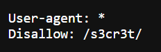
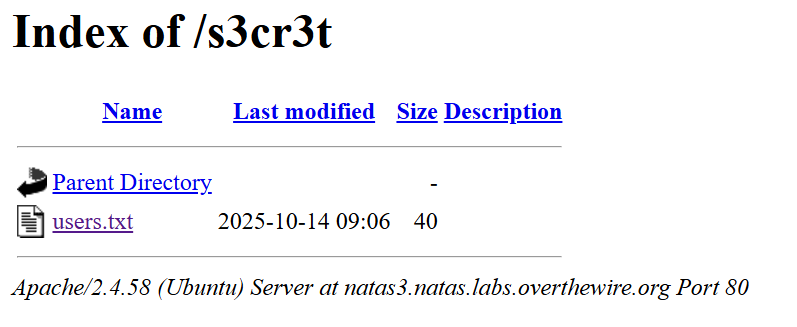

# Natas Level 3: Google's Little Helper

## The Setup
| Level | Username | Target URL |
| :--- | :--- | :--- |
| Level 3 | natas3 | http://natas3.natas.labs.overthewire.org |

**Introduction:** 

I landed on Natas Level 3, and honestly, it looked like a repeat of the previous level. The page greeted me with the familiar "There is nothing on this page" message. But this time, something felt different. I had a hunch there was more to the story, so I decided to dig into the source code.

---

## Hunting for Clues

Here's what the page looked like when I first opened it:


Pretty bland, right? Just that same "nothing on this page" claim. But I learned my lesson from the last level. Time to check the HTML source code and see what secrets might be hiding.

I opened the page source and found this:

```html
<html>
<head>
<!-- This stuff in the header has nothing to do with the level -->
<link rel="stylesheet" type="text/css" href="http://natas.labs.overthewire.org/css/level.css">
<link rel="stylesheet" href="http://natas.labs.overthewire.org/css/jquery-ui.css" />
<link rel="stylesheet" href="http://natas.labs.overthewire.org/css/wechall.css" />
<script src="http://natas.labs.overthewire.org/js/jquery-1.9.1.js"></script>
<script src="http://natas.labs.overthewire.org/js/jquery-ui.js"></script>
<script src=http://natas.labs.overthewire.org/js/wechall-data.js></script><script src="http://natas.labs.overthewire.org/js/wechall.js"></script>
<script>var wechallinfo = { "level": "natas3", "pass": "3gq[REDACTED]" };</script></head>
<body>
<h1>natas3</h1>
<div id="content">
There is nothing on this page
<!-- No more information leaks!! Not even Google will find it this time... -->
</div>
</body></html>
```

Wait a second. That HTML comment caught my eye: `<!-- No more information leaks!! Not even Google will find it this time... -->`

This was the clue I needed. The phrase "Not even Google will find it" immediately made me think about how search engines actually work. When Google crawls websites, it respects a special file called `robots.txt` that tells it which parts of the site to avoid indexing. This is a standard protocol used by web servers to communicate with search engine bots.

I decided to check if there was a `robots.txt` file on this server. I navigated to `http://natas3.natas.labs.overthewire.org/robots.txt` and found:



Bingo! The robots.txt file contained two lines:

```
User-agent: *
Disallow: /s3cr3t/
```

This tells all web crawlers (the asterisk means "all user agents") to stay away from the `/s3cr3t/` directory. But here's the thing about robots.txt: it's just a polite suggestion. It tells well behaved bots where not to go, but it doesn't actually prevent anyone from accessing those directories. In fact, it's basically a roadmap to potentially sensitive areas.

---

## Breaking In

Now that I knew about the `/s3cr3t/` directory, I navigated directly to it. The server had directory listing enabled, so I could see exactly what was inside:



The directory listing showed a single file: `users.txt` (40 bytes, last modified 2025-10-14 09:06). This was running on Apache 2.4.58 on Ubuntu, as indicated at the bottom of the page.

I clicked on `users.txt` and found the credentials I was looking for:

```text
natas4:Qry[REDACTED]
```

**The Vulnerability Breakdown:**

This level demonstrates a classic case of **Information Disclosure via robots.txt**. Here's what went wrong from a security perspective:

1. **Security Through Obscurity:** The developers tried to hide sensitive files in a directory called `/s3cr3t/` and relied on robots.txt to keep it out of search engines. But security through obscurity is not real security.

2. **Robots.txt is Public Information:** The robots.txt file is meant to be publicly accessible. Anyone can read it, which means it often serves as a guide to interesting directories rather than protection.

3. **No Access Controls:** The `/s3cr3t/` directory had no actual authentication or authorization mechanisms. It was just hoping nobody would find it, but robots.txt actually points directly to it.

4. **Directory Listing Enabled:** Once someone finds the directory, they can see all the files inside it because directory listing is turned on.

In real world penetration testing, checking robots.txt is always part of the initial reconnaissance phase. It frequently reveals admin panels, backup directories, staging environments, and other sensitive areas that developers thought they were hiding.

The proper fix would be to implement actual access controls (like HTTP Basic Auth or proper authentication), disable directory listing, and never rely on obscurity as a security measure.

---

## The Loot

**Next Level Password:** `Qry[REDACTED]`

**Quick Recap:** Discovered hidden directory path via robots.txt file, which revealed a publicly accessible users.txt file containing plaintext credentials.

---

## Lessons Learned

This challenge taught me several important lessons:

1. **Always Check robots.txt:** It's one of the first things you should look at during web app reconnaissance. It often reveals directories that developers want hidden from search engines but forgot to actually protect.

2. **Obscurity Is Not Security:** Hiding something in a directory with a "secret" name doesn't protect it. If there's no authentication or authorization, anyone who finds the path can access it.

3. **HTML Comments Are Clues:** Developers sometimes leave hints or notes in HTML comments that reveal information about the application architecture or security measures.

4. **Standard Files Matter:** Files like robots.txt, sitemap.xml, and .well-known directories are standard parts of web infrastructure and should always be part of your enumeration checklist.

On to Level 4!
