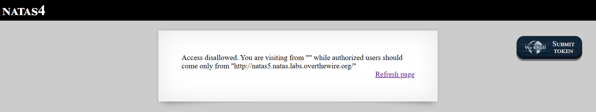

# Natas Level 4: The Referer Check Illusion

## The Setup
| Level | Username | Target URL |
| :--- | :--- | :--- |
| Level 4 | natas4 | http://natas4.natas.labs.overthewire.org |

**Introduction:** 

When I accessed Natas Level 4, I was immediately hit with an access denied message. The page was checking where I came from, and apparently I wasn't visiting from the right place. This looked like a classic case of HTTP header validation, so I knew exactly where to look.

---

## Hunting for Clues

Here's what greeted me when I first loaded the page:



The error message was pretty clear: "Access disallowed. You are visiting from "" while authorized users should come only from "http://natas5.natas.labs.overthewire.org/""

This told me a few important things right away:

1. The server is checking the HTTP Referer header (the page you came from)
2. My current Referer header is empty (shown as "")
3. The server expects the Referer to be `http://natas5.natas.labs.overthewire.org/`

The Referer header is an HTTP header that browsers automatically send to tell the destination server which page you were on before clicking a link. For example, if you click a link on Google to visit a website, that website sees "google.com" in the Referer header.

But here's the thing: the Referer header is completely controlled by the client. Browsers send it automatically, but anyone can modify it or set it to whatever value they want using tools like curl, Burp Suite, or browser extensions.

---

## Breaking In

I decided to use curl to craft a request with the exact Referer header the server wanted to see. The `-e` flag in curl sets the Referer header, and the `-u` flag handles HTTP Basic Authentication.

Here's the command I ran:

```bash
┌──(ouba㉿CLIENT-DESKTOP)-[/tmp/natas]
└─$ curl -u natas4:Qry[REDACTED] -e http://natas5.natas.labs.overthewire.org/ http://natas4.natas.labs.overthewire.org/
```

Let me break down what each part does:

- `curl`: The command line tool for making HTTP requests
- `-u natas4:Qry[REDACTED]`: Provides the Basic Auth credentials (username:password)
- `-e http://natas5.natas.labs.overthewire.org/`: Sets the Referer header to the URL the server expects
- `http://natas4.natas.labs.overthewire.org/`: The target URL we're accessing

And here's what came back:

```html
<html>
<head>
<!-- This stuff in the header has nothing to do with the level -->
<link rel="stylesheet" type="text/css" href="http://natas.labs.overthewire.org/css/level.css">
<link rel="stylesheet" href="http://natas.labs.overthewire.org/css/jquery-ui.css" />
<link rel="stylesheet" href="http://natas.labs.overthewire.org/css/wechall.css" />
<script src="http://natas.labs.overthewire.org/js/jquery-1.9.1.js"></script>
<script src="http://natas.labs.overthewire.org/js/jquery-ui.js"></script>
<script src=http://natas.labs.overthewire.org/js/wechall-data.js></script><script src="http://natas.labs.overthewire.org/js/wechall.js"></script>
<script>var wechallinfo = { "level": "natas4", "pass": "Qry[REDACTED]" };</script></head>
<body>
<h1>natas4</h1>
<div id="content">

Access granted. The password for natas5 is 0n3[REDACTED]
<br/>
<div id="viewsource"><a href="index.php">Refresh page</a></div>
</div>
</body>
</html>
```

Perfect! The server accepted my spoofed Referer header and granted access. The response now shows "Access granted" along with the password for the next level.

**The Vulnerability Breakdown:**

This challenge demonstrates **Insecure Referer Header Validation**. Here's why this is a security problem:

1. **Client Controlled Data:** The Referer header is sent by the client and can be trivially modified. Trusting it for access control is like asking someone "Are you authorized?" and believing whatever they say.

2. **No Real Authentication:** The server is using the Referer header as if it were a security mechanism, but it provides zero actual security. Anyone with basic HTTP knowledge can set any Referer value they want.

3. **False Sense of Security:** Developers sometimes use Referer checks thinking they're implementing a form of access control or preventing hotlinking, but it's easily bypassed.

4. **Privacy Concerns:** Even legitimate Referer headers can be problematic. Many browsers now limit or strip Referer information due to privacy concerns, which means this kind of validation can break normal user workflows.

In real world applications, Referer checking is sometimes used for:
- Preventing CSRF attacks (but this is weak and should use proper CSRF tokens instead)
- Preventing hotlinking of images (but dedicated hotlinkers will just spoof the header)
- Analytics and tracking (which is fine, since it's not a security control)

The proper way to implement access control is through server side session management, proper authentication mechanisms, and authorization checks that don't rely on client provided headers.

---

## The Loot

**Next Level Password:** `0n3[REDACTED]`

**Quick Recap:** Bypassed insecure Referer header validation by spoofing the HTTP Referer using curl's `-e` flag to match the expected source URL.

---

## Lessons Learned

This challenge reinforced several key security principles:

1. **Never Trust Client Side Data:** HTTP headers like Referer, User-Agent, and X-Forwarded-For are all controlled by the client and can be spoofed. They should never be used for security decisions.

2. **Referer is for Analytics, Not Security:** The Referer header is useful for tracking where traffic comes from, but it's completely unsuitable as an access control mechanism.

3. **Defense in Depth:** Real security requires server side validation, proper session management, and authentication mechanisms that can't be bypassed by simply changing an HTTP header.

4. **Command Line Tools are Powerful:** Tools like curl give you complete control over HTTP requests, making it trivial to manipulate headers, cookies, and other request parameters.

Moving on to Level 5!
