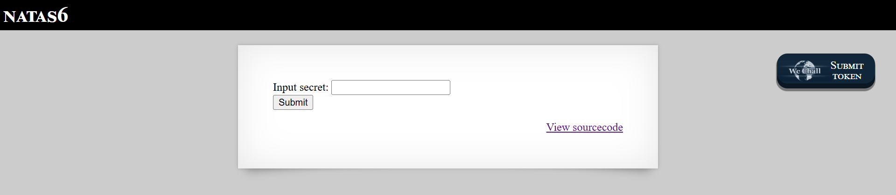
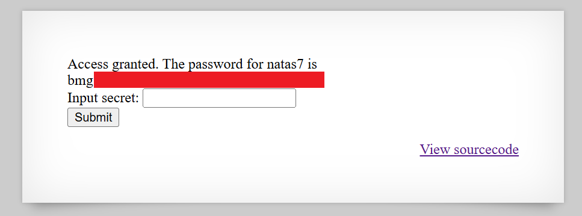

# Natas Level 6: The Include File Trail

## The Setup
| Level | Username | Target URL |
| :--- | :--- | :--- |
| Level 6 | natas6 | http://natas6.natas.labs.overthewire.org |

**Introduction:** 

Natas Level 6 presented me with a new challenge format. Instead of access control bypasses or cookie manipulation, this time I was facing an actual input form asking for a secret. The page had a simple text field and a submit button, but there was also something interesting: a "View sourcecode" link. I had a feeling that link was going to be the key to solving this one.

---

## Hunting for Clues

When I first loaded the page, I saw this interface:



The page displayed a clean form with "Input secret:" and a text field, along with a submit button. In the bottom right corner, there was a "View sourcecode" link that caught my attention immediately. This was different from the usual browser "View Page Source" option. It seemed like the developers intentionally provided a way to see the backend code.

I clicked on the "View sourcecode" link, which took me to `http://natas6.natas.labs.overthewire.org/index-source.html`. This revealed the PHP source code running on the server:

```php
...
<?

include "includes/secret.inc";

    if(array_key_exists("submit", $_POST)) {
        if($secret == $_POST['secret']) {
        print "Access granted. The password for natas7 is <censored>";
    } else {
        print "Wrong secret";
    }
    }
?>
...
```

This was gold. The source code showed me exactly how the application worked:

1. It includes a file called `includes/secret.inc` at the top
2. When the form is submitted (checked via `array_key_exists("submit", $_POST)`), it compares a variable called `$secret` with whatever the user submitted in the form field
3. If they match, it prints the password for the next level
4. If they don't match, it prints "Wrong secret"

The critical detail here was that first line: `include "includes/secret.inc";`. The application was loading the secret value from an external file. And here's the thing about web servers: if that file is in a web accessible directory and doesn't have proper access controls, I might be able to read it directly.

---

## Breaking In

I decided to navigate directly to the included file at `http://natas6.natas.labs.overthewire.org/includes/secret.inc`. When I opened it in my browser, I saw:

```php
<?
$secret = "FOE[REDACTED]";
?>
```

Perfect! The file was publicly accessible, and it revealed the exact value of the `$secret` variable that the application was checking against. The secret was `FOE[REDACTED]`.

Now all I had to do was go back to the main page and submit this secret in the form. I entered `FOE[REDACTED]` into the "Input secret:" field and clicked Submit.



Success! The page displayed "Access granted. The password for natas7 is bmg[REDACTED]". The form field was still visible below, showing that I had successfully authenticated by providing the correct secret value.

**The Vulnerability Breakdown:**

This challenge demonstrates **Information Disclosure via Include File Exposure**. Here's what went wrong:

1. **Sensitive Data in Separate Files:** The developers stored the secret in a separate include file, which is actually a good practice for code organization. However, they made a critical mistake in how they configured it.

2. **Web Accessible Includes Directory:** The `includes/` directory was publicly accessible via HTTP. Anyone could navigate directly to files within it.

3. **No Access Controls:** There was no `.htaccess` file or server configuration preventing direct access to `.inc` files. These files should be protected or stored outside the web root entirely.

4. **Source Code Disclosure:** The application helpfully provided a "View sourcecode" feature, which revealed the exact path to the include file. Even without this, directory enumeration or common path guessing would have found it.

In real world applications, this type of vulnerability can expose:
- Database credentials stored in configuration files
- API keys and secrets
- Internal application logic
- Hardcoded passwords
- Security tokens

**Proper Security Measures:**

To prevent this vulnerability, developers should:

1. **Store sensitive files outside the web root:** Include files should be placed in a directory that's not accessible via HTTP (like `/var/www/includes/` when the web root is `/var/www/html/`).

2. **Configure server restrictions:** Use `.htaccess` (Apache) or server configuration to deny access to sensitive file extensions like `.inc`, `.config`, or `.env`.

3. **Use environment variables:** Instead of hardcoding secrets in files, use environment variables that are loaded at runtime but never exposed to the web.

4. **Implement proper file permissions:** Set restrictive file permissions so only the web server user can read sensitive files.

5. **Never expose source code paths:** The "View sourcecode" feature, while helpful for learning, would never exist in a production application and revealed the exact include path.

---

## The Loot

**Next Level Password:** `bmg[REDACTED]`

**Quick Recap:** Discovered the secret value by accessing an exposed include file (`includes/secret.inc`) that was publicly accessible due to misconfigured server permissions.

---

## Lessons Learned

This level reinforced several important security principles:

1. **Include Files Need Protection:** Just because a file has a `.inc` extension doesn't mean it's automatically protected. Server configuration must explicitly deny access to these files.

2. **Directory Structure Matters:** Sensitive files should be stored outside the web root directory entirely, making them impossible to access via HTTP regardless of configuration mistakes.

3. **Source Code Review Reveals Secrets:** When source code is exposed (intentionally or through misconfiguration), attackers can identify exactly where sensitive data is stored and how to access it.

4. **Defense in Depth:** Multiple security layers should protect sensitive data. Even if the code structure is known, proper access controls should prevent unauthorized file access.

5. **Common Paths are Easy Targets:** Using predictable directory names like `includes/`, `config/`, or `lib/` makes it easier for attackers to guess where sensitive files might be located.

Moving forward to Level 7!
