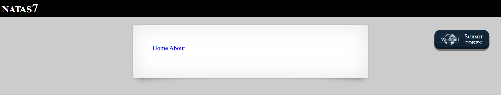
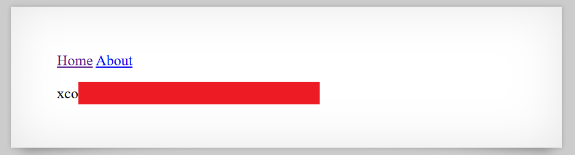

# Natas Level 7: Path Traversal Paradise

## The Setup
| Level | Username | Target URL |
| :--- | :--- | :--- |
| Level 7 | natas7 | http://natas7.natas.labs.overthewire.org |

**Introduction:** 

When I loaded Natas Level 7, I was greeted with a simple navigation menu. Just two links: Home and About. Nothing fancy, nothing obviously vulnerable at first glance. But I've learned by now that simple interfaces often hide interesting vulnerabilities. Time to dig into the source code and see what's really going on.

---

## Hunting for Clues

The initial page looked like this:



The page displayed "NATAS7" at the top with two navigation links: "Home" and "About". Pretty minimal. I immediately noticed something interesting about those links though. When I hovered over them, I could see they were pointing to `index.php?page=home` and `index.php?page=about`. That `page` parameter caught my attention. Anytime I see user input being used to determine which content to display, my mind immediately goes to potential file inclusion vulnerabilities.

I decided to check the page source to see if there were any hints. I hit Ctrl+U and found this:

```html
<html>
<head>
<!-- This stuff in the header has nothing to do with the level -->
<link rel="stylesheet" type="text/css" href="http://natas.labs.overthewire.org/css/level.css">
<link rel="stylesheet" href="http://natas.labs.overthewire.org/css/jquery-ui.css" />
<link rel="stylesheet" href="http://natas.labs.overthewire.org/css/wechall.css" />
<script src="http://natas.labs.overthewire.org/js/jquery-1.9.1.js"></script>
<script src="http://natas.labs.overthewire.org/js/jquery-ui.js"></script>
<script src=http://natas.labs.overthewire.org/js/wechall-data.js></script><script src="http://natas.labs.overthewire.org/js/wechall.js"></script>
<script>var wechallinfo = { "level": "natas7", "pass": "bmg[REDACTED]" };</script></head>
<body>
<h1>natas7</h1>
<div id="content">

<a href="index.php?page=home">Home</a>
<a href="index.php?page=about">About</a>
<br>
<br>

<!-- hint: password for webuser natas8 is in /etc/natas_webpass/natas8 -->
</div>
</body>
</html>
```

Jackpot! Right there in the HTML comments was a huge hint: `<!-- hint: password for webuser natas8 is in /etc/natas_webpass/natas8 -->`

This told me two critical things:
1. The password for the next level is stored in a file at `/etc/natas_webpass/natas8`
2. The developers left this hint in the source code, which suggests I need to find a way to read that file

Now, remember that `page` parameter I noticed earlier? This was starting to come together. The application was using the `page` parameter to include different content. If the application wasn't properly validating or sanitizing this input, I might be able to use it to read arbitrary files from the server.

This is a classic Local File Inclusion (LFI) vulnerability scenario.

---

## Breaking In

I had everything I needed: a vulnerable parameter (`page`) and a target file path (`/etc/natas_webpass/natas8`). Time to test if the LFI vulnerability actually existed.

I constructed a URL that would attempt to read the password file directly:

`http://natas7.natas.labs.overthewire.org/index.php?page=/etc/natas_webpass/natas8`

Instead of passing `home` or `about` as the page value, I passed the full path to the password file. I navigated to this URL in my browser and:



Success! The page displayed the password right there on the screen. I could see "xco" followed by the rest of the password (shown as the red box in the screenshot, which I've redacted here). The Home and About links were still visible at the top, but below them was the contents of the `/etc/natas_webpass/natas8` file.

The application took my input from the `page` parameter and used it to include a file without proper validation. Instead of restricting me to just `home` and `about`, it allowed me to specify any file path on the system.

**The Vulnerability Breakdown:**

This challenge demonstrates a **Local File Inclusion (LFI)** vulnerability. Here's what went wrong:

1. **Unsanitized User Input:** The application takes user input from the `page` parameter and uses it to determine which file to include, without validating that the input is safe.

2. **Direct File Path Usage:** Instead of using a whitelist of allowed pages (like `['home', 'about']`) and mapping those to specific files, the application appears to be directly using the user input in a file operation.

3. **No Path Restrictions:** The application doesn't restrict file access to a specific directory. It allowed me to traverse to `/etc/` which is completely outside the web application directory.

4. **Information Disclosure:** The application revealed the exact file path in an HTML comment, making the attack trivial to execute.

**How LFI Works:**

In PHP, developers often use constructs like:
```php
include($_GET['page'] . '.php');
```

This is meant to dynamically load different page content. With proper input validation, it would only allow values like `home` or `about`. But without validation, an attacker can pass:
- Absolute paths: `/etc/passwd`
- Relative paths with traversal: `../../../../etc/passwd`
- Null byte injection (in older PHP): `/etc/passwd%00` (to bypass file extension checks)

**Real World Impact:**

LFI vulnerabilities can lead to:
- Reading sensitive configuration files (database credentials, API keys)
- Accessing system files like `/etc/passwd` or `/etc/shadow`
- Reading application source code
- In some cases, remote code execution when combined with log poisoning or file upload vulnerabilities
- Full server compromise

**Proper Mitigation:**

To prevent LFI vulnerabilities, developers should:

1. **Use Whitelisting:** Only allow specific, predefined values
   ```php
   $allowed_pages = ['home', 'about'];
   if (in_array($_GET['page'], $allowed_pages)) {
       include($_GET['page'] . '.php');
   }
   ```

2. **Never Use Direct User Input:** Map user input to safe file paths
   ```php
   $pages = ['home' => 'pages/home.php', 'about' => 'pages/about.php'];
   $page = $_GET['page'] ?? 'home';
   if (isset($pages[$page])) {
       include($pages[$page]);
   }
   ```

3. **Implement Path Restrictions:** Use `basename()` to strip directory traversal attempts
4. **Disable Dangerous Functions:** Configure PHP to disable `allow_url_include`
5. **Principle of Least Privilege:** Run web servers with minimal file system permissions

---

## The Loot

**Next Level Password:** `xco[REDACTED]`

**Quick Recap:** Exploited a Local File Inclusion vulnerability in the `page` parameter to read the password file at `/etc/natas_webpass/natas8` directly from the server's file system.

---

## Lessons Learned

This level taught me several important lessons about file inclusion vulnerabilities:

1. **Parameter Analysis is Key:** Whenever you see URL parameters that seem to control which content is displayed, investigate whether they might be vulnerable to file inclusion attacks.

2. **HTML Comments Are Treasure:** Developers sometimes leave helpful comments in the source code. Always check the HTML source for hints, debug information, or accidentally exposed paths.

3. **LFI is Powerful:** Local File Inclusion might seem less severe than Remote Code Execution, but it can expose critical system files, configuration data, and credentials that lead to complete compromise.

4. **Whitelisting Over Blacklisting:** Trying to filter out dangerous characters or paths is always less secure than explicitly allowing only safe, predefined values.

5. **Defense in Depth Matters:** Even if file inclusion is necessary, other security layers (proper permissions, secure file locations, input validation) should protect sensitive data.

On to Level 8!
