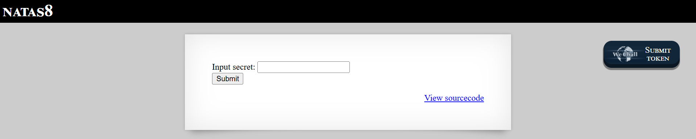
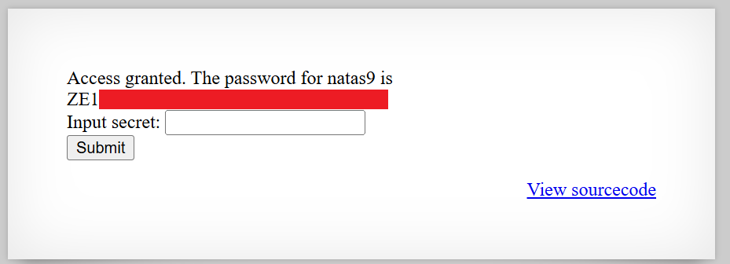

# Natas Level 8: Reversing the Encoding Chain

## The Setup
| Level | Username | Target URL |
| :--- | :--- | :--- |
| Level 8 | natas8 | http://natas8.natas.labs.overthewire.org |

**Introduction:** 

Natas Level 8 presented me with another secret input form, similar to Level 6. But this time, I had a feeling the solution would be more interesting than just reading an include file. I was right. This challenge was all about understanding encoding functions and reversing them to recover the original secret.

---

## Hunting for Clues

When I loaded the page, I saw a familiar layout:



The page displayed "NATAS8" at the top with a simple form asking for "Input secret:" followed by a text field and a Submit button. Just like in Level 6, there was a "View sourcecode" link in the bottom right corner. I clicked it immediately to see what was happening behind the scenes.

The source code revealed some fascinating PHP logic:

```php
...
<?

$encodedSecret = "3d3d516343746d4d6d6c315669563362";

function encodeSecret($secret) {
    return bin2hex(strrev(base64_encode($secret)));
}

if(array_key_exists("submit", $_POST)) {
    if(encodeSecret($_POST['secret']) == $encodedSecret) {
    print "Access granted. The password for natas9 is <censored>";
    } else {
    print "Wrong secret";
    }
}
?>
...
```

This was much more interesting than Level 6. Let me break down what I saw:

1. There's a hardcoded `$encodedSecret` variable with the value `"3d3d516343746d4d6d6c315669563362"`
2. There's an `encodeSecret()` function that performs three encoding operations in sequence:
   - `base64_encode($secret)` - Encodes the secret in Base64
   - `strrev()` - Reverses the Base64 string
   - `bin2hex()` - Converts the reversed string to hexadecimal
3. When I submit the form, my input goes through this encoding chain and gets compared to the hardcoded encoded secret

The key insight here is that I don't need to guess the secret. I just need to reverse the encoding operations to decode the `$encodedSecret` value back to its original plaintext form.

---

## Breaking In

To solve this, I needed to reverse each encoding step in the opposite order. If the encoding process is:

`secret → base64_encode → strrev → bin2hex → "3d3d516343746d4d6d6c315669563362"`

Then the decoding process should be:

`"3d3d516343746d4d6d6c315669563362" → hex2bin → reverse → base64_decode → secret`

I could have written a PHP script to do this, but I decided to use command line tools instead. Linux has everything I need:

- `xxd -r -p` to convert hex to binary (reverse of bin2hex)
- `rev` to reverse a string (reverse of strrev)
- `base64 -d` to decode Base64 (reverse of base64_encode)

I chained these commands together using pipes:

```bash
┌──(ouba㉿CLIENT-DESKTOP)-[/tmp/natas]
└─$ echo "3d3d516343746d4d6d6c315669563362" | xxd -r -p | rev | base64 -d
oub[REDACTED]
```

Perfect! The command output revealed the original secret: `oub[REDACTED]`

Let me explain what each part does:

- `echo "3d3d516343746d4d6d6c315669563362"` - Outputs the encoded secret
- `| xxd -r -p` - Converts the hex string back to binary. The `-r` flag means reverse (decode), and `-p` means plain hexdump style
- `| rev` - Reverses the string character by character
- `| base64 -d` - Decodes the Base64 encoded data. The `-d` flag means decode

Now I had the plaintext secret. I went back to the main page, entered `oub[REDACTED]` into the input field, and clicked Submit:



Success! The page displayed "Access granted. The password for natas9 is ZE1" followed by the rest of the password (shown in the red box, which I've redacted). The input form was still visible below, showing that my submission was processed successfully.

**The Vulnerability Breakdown:**

This challenge demonstrates **Security Through Obscurity** and **Reversible Encoding as Authentication**. Here's what went wrong:

1. **Encoding Is Not Encryption:** The application uses encoding functions (Base64, string reversal, hex conversion) rather than cryptographic hashing or encryption. Encoding is designed to be reversible, which makes it completely unsuitable for protecting secrets.

2. **Hardcoded Secrets in Source Code:** The encoded secret is hardcoded directly in the source code, and the source code is accessible to users. Even if the encoding was more complex, exposing the encoded value and the encoding algorithm makes it trivial to reverse.

3. **Deterministic Transformation:** The `encodeSecret()` function always produces the same output for the same input. This is fine for encoding, but for security purposes, you need one way cryptographic hash functions.

4. **No Salt or Key:** The encoding doesn't use any secret key or salt. Anyone with access to the encoded value and the algorithm can decode it.

**Encoding vs. Hashing vs. Encryption:**

This is a good opportunity to clarify these concepts:

- **Encoding** (Base64, hex, URL encoding): Designed to be reversible. Used for data transmission and compatibility, NOT security. Examples: `base64_encode()`, `bin2hex()`

- **Hashing** (MD5, SHA-256, bcrypt): One way transformation. Cannot be reversed, but you can verify if an input produces the same hash. Used for password storage, data integrity. Examples: `password_hash()`, `hash('sha256', $data)`

- **Encryption** (AES, RSA): Reversible transformation that requires a secret key. Used to protect confidential data. Examples: `openssl_encrypt()`, `sodium_crypto_secretbox()`

**Proper Implementation:**

For secret validation like this, the correct approach would be:

```php
$secretHash = password_hash("the_actual_secret", PASSWORD_BCRYPT);

if(password_verify($_POST['secret'], $secretHash)) {
    print "Access granted";
}
```

This uses a one way cryptographic hash that cannot be reversed, even if an attacker sees the hashed value.

---

## The Loot

**Next Level Password:** `ZE1[REDACTED]`

**Quick Recap:** Reversed the encoding chain (hex to binary, string reversal, Base64 decode) to recover the plaintext secret from its encoded form exposed in the source code.

---

## Lessons Learned

This challenge reinforced several important cryptography and security principles:

1. **Encoding Is Not Security:** Functions like Base64, hex encoding, and string reversal are designed for data representation, not protection. They can always be reversed.

2. **Source Code Exposure Matters:** When source code is accessible (intentionally or through misconfiguration), any security mechanism that relies on keeping the algorithm secret will fail.

3. **Use Proper Cryptography:** For password verification, use one way hash functions like bcrypt, Argon2, or scrypt. For protecting data confidentiality, use encryption with proper key management.

4. **Command Line Tools Are Powerful:** Understanding tools like `xxd`, `base64`, `openssl`, and others makes it easy to manipulate encoded data and test security mechanisms.

5. **Reversibility Is Key:** Always ask yourself: "Can this transformation be reversed?" If the answer is yes and you're trying to protect secrets, you're using the wrong tool.

6. **Defense in Depth:** Even if encoding were acceptable, storing the encoded secret in accessible source code defeats any protection the encoding might provide.

Moving on to Level 9!
