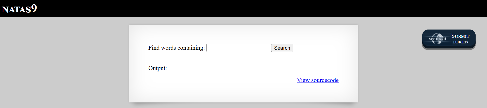
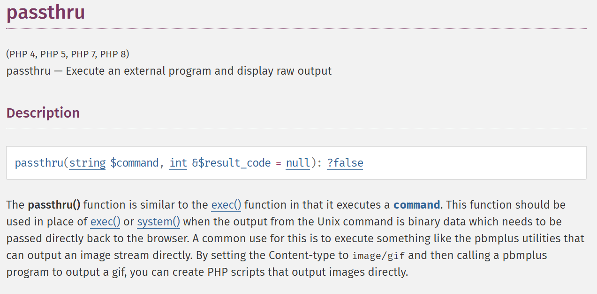
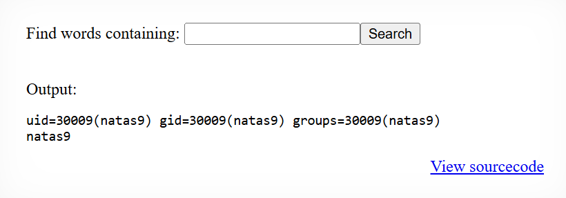
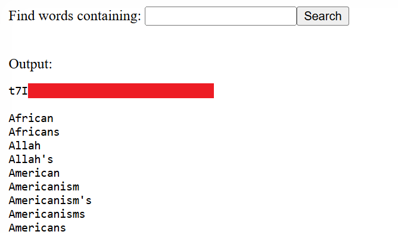

# Natas Level 9: When grep Becomes a Gateway

## The Setup
| Level | Username | Target URL |
| :--- | :--- | :--- |
| Level 9 | natas9 | http://natas9.natas.labs.overthewire.org |

**Introduction:** 

Natas Level 9 looked innocent enough at first glance. Just a simple search form to find words in a dictionary. But as I've learned from the previous levels, simple interfaces often hide dangerous vulnerabilities. This time, the vulnerability was going to be a serious one: command injection leading to remote code execution.

---

## Hunting for Clues

The initial page presented a straightforward interface:



The page displayed "NATAS9" at the top with a form labeled "Find words containing:" followed by a text input field and a Search button. Below that was an "Output:" section (currently empty) and the familiar "View sourcecode" link in the bottom right. The form seemed designed to search for words in a dictionary file, which is a common feature in web applications.

I clicked on "View sourcecode" to see what was happening on the backend. The PHP code revealed something very concerning:

```php
...
<?
$key = "";

if(array_key_exists("needle", $_REQUEST)) {
    $key = $_REQUEST["needle"];
}

if($key != "") {
    passthru("grep -i $key dictionary.txt");
}
?>
...
```

This code was extremely dangerous. Let me break down what I saw:

1. The code takes user input from a parameter called `needle` (the search term)
2. It stores this input in the `$key` variable
3. If `$key` is not empty, it passes it directly to the `passthru()` function as part of a shell command
4. The command being executed is: `grep -i $key dictionary.txt`

The problem? There's absolutely no input validation or sanitization. The user input is being inserted directly into a shell command.

I needed to understand what `passthru()` actually does, so I looked up the PHP documentation:



The documentation confirmed my suspicions. The `passthru()` function "Execute an external program and display raw output." It's similar to `exec()` and `system()`, but it passes the command output directly to the browser. This is a dangerous function when combined with user input because it allows command execution on the server.

The vulnerability here is **Command Injection**. Since the application doesn't sanitize the input before passing it to the shell, I could inject additional commands using shell metacharacters like semicolons, pipes, or ampersands.

---

## Breaking In

First, I wanted to verify that command injection was actually possible. I decided to test with a simple payload that would execute some harmless system commands to confirm I had code execution.

I entered the following payload into the search field:

`; id ; whoami ;`

This payload works because:
- The semicolon (`;`) is a command separator in shell commands
- After the grep command fails (or completes), the shell executes my injected commands
- `id` shows the current user ID and group information
- `whoami` prints the username

When I submitted this, the page displayed:



Perfect! The output showed:

```
uid=30009(natas9) gid=30009(natas9) groups=30009(natas9)
natas9
```

This confirmed that:
1. Command injection is definitely possible
2. The web server is running as the `natas9` user
3. I can execute arbitrary commands on the server

Now that I had confirmed remote code execution, I could read the password file directly. Based on the pattern from previous levels, I knew the password for natas10 would be in `/etc/natas_webpass/natas10`.

I crafted a new payload:

`; cat /etc/natas_webpass/natas10`

This would:
- End the grep command with a semicolon
- Execute `cat` to read the password file
- Display the contents in the output

I entered this payload into the search field and submitted the form:



Voila! The output displayed `t7I` followed by the rest of the password (shown in the red redacted box). Below that were some dictionary words that grep managed to find before my injected command took over.

**The Vulnerability Breakdown:**

This challenge demonstrates a critical **Command Injection** vulnerability, which is one of the most severe web application security flaws. Here's what went wrong:

1. **Unsanitized User Input:** The application takes user input and inserts it directly into a shell command without any validation, filtering, or escaping.

2. **Dangerous PHP Function:** The `passthru()` function executes shell commands and is extremely dangerous when combined with user input. Other dangerous functions include `exec()`, `system()`, `shell_exec()`, and backticks.

3. **No Input Validation:** There's no whitelist of allowed characters, no blacklist of dangerous characters, and no escaping of shell metacharacters.

4. **Direct Shell Execution:** The command is executed directly by the system shell, which interprets special characters like `;`, `|`, `&`, `&&`, `||`, `$()`, and backticks as command separators or operators.

**How Command Injection Works:**

The vulnerable code constructs a command like this:
```
grep -i USER_INPUT dictionary.txt
```

When I inject `; cat /etc/passwd`, it becomes:
```
grep -i ; cat /etc/passwd dictionary.txt
```

The shell interprets this as two separate commands:
1. `grep -i` (which might fail or do nothing)
2. `cat /etc/passwd dictionary.txt` (which reads the password file)

**Real World Impact:**

Command injection vulnerabilities can lead to complete server compromise:
- Reading sensitive files (passwords, configuration, source code)
- Modifying or deleting files
- Installing backdoors or malware
- Using the server for further attacks (pivoting)
- Data exfiltration
- Denial of service
- Cryptocurrency mining
- Complete system takeover with privilege escalation

**Proper Mitigation:**

To prevent command injection, developers should:

1. **Avoid Shell Execution:** Never use functions like `passthru()`, `exec()`, `system()`, or `shell_exec()` with user input.

2. **Use Safe Alternatives:** In this case, PHP has built in functions for searching files that don't involve shell execution:
   ```php
   $lines = file('dictionary.txt');
   foreach($lines as $line) {
       if(stripos($line, $key) !== false) {
           echo $line;
       }
   }
   ```

3. **Input Validation:** If shell execution is absolutely necessary, use strict whitelisting:
   ```php
   if(preg_match('/^[a-zA-Z0-9]+$/', $key)) {
       // Only alphanumeric characters allowed
   }
   ```

4. **Escape Shell Arguments:** PHP provides `escapeshellarg()` and `escapeshellcmd()`:
   ```php
   $safe_key = escapeshellarg($key);
   passthru("grep -i $safe_key dictionary.txt");
   ```

5. **Use Parameterized Execution:** Some languages offer parameterized command execution that separates the command from arguments.

6. **Principle of Least Privilege:** Run web applications with minimal system permissions to limit damage from successful exploits.

---

## The Loot

**Next Level Password:** `t7I[REDACTED]`

**Quick Recap:** Exploited command injection vulnerability in the `passthru()` function by injecting shell metacharacters to execute arbitrary commands and read the password file.

---

## Lessons Learned

This level taught me several critical lessons about command injection:

1. **Command Injection is Critical:** This vulnerability ranks among the most dangerous web application flaws because it provides direct access to the underlying operating system.

2. **Shell Metacharacters are Powerful:** Characters like `;`, `|`, `&`, `&&`, `||`, `$()`, and backticks have special meaning in shells and can be used to chain or substitute commands.

3. **Dangerous Functions Need Extra Care:** PHP functions like `passthru()`, `exec()`, `system()`, and `shell_exec()` should be avoided entirely when dealing with user input.

4. **Defense in Depth:** Even with input validation, executing shell commands from web applications is risky. Using safe alternatives is always better.

5. **Testing is Important:** The progression from testing with `id` and `whoami` to the actual exploit demonstrates good penetration testing methodology: confirm the vulnerability first, then exploit it.

6. **Documentation Helps:** Understanding what functions like `passthru()` actually do at the system level is crucial for identifying and exploiting vulnerabilities.

On to Level 10!
