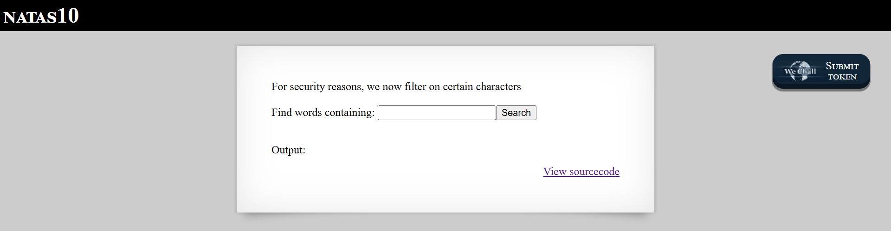
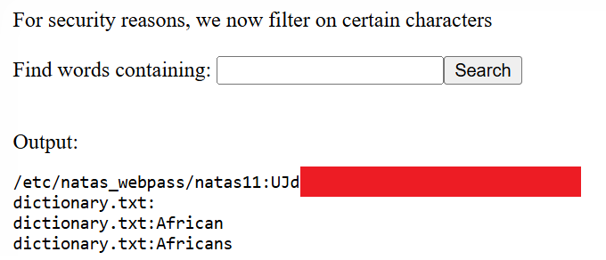

# Natas Level 10: Bypassing Character Filters

## The Setup
| Level | Username | Target URL |
| :--- | :--- | :--- |
| Level 10 | natas10 | http://natas10.natas.labs.overthewire.org |

**Introduction:** 

After exploiting the command injection vulnerability in Level 9, I was curious to see if the developers would patch it in Level 10. Turns out they did implement some security measures, but as I would soon discover, their fix was incomplete. Sometimes a partial fix can be just as dangerous as no fix at all.

---

## Hunting for Clues

When I loaded the page, I immediately noticed something different from Level 9:



The page displayed "NATAS10" at the top, but now there was a warning message right at the top: "For security reasons, we now filter on certain characters." Below that was the familiar "Find words containing:" search form with an input field and Search button. The Output section was empty, and the "View sourcecode" link was waiting for me in the bottom right.

The warning message told me that the developers had recognized the vulnerability from Level 9 and attempted to fix it with input filtering. I was immediately curious about which characters they were blocking and whether the filter could be bypassed.

I clicked on "View sourcecode" to see exactly what changed:

```php
...
<?
$key = "";

if(array_key_exists("needle", $_REQUEST)) {
    $key = $_REQUEST["needle"];
}

if($key != "") {
    if(preg_match('/[;|&]/',$key)) {
        print "Input contains an illegal character!";
    } else {
        passthru("grep -i $key dictionary.txt");
    }
}
?>
...
```

This was interesting. Let me compare this to the Level 9 code:

**Level 9 (vulnerable):**
```php
passthru("grep -i $key dictionary.txt");
```

**Level 10 (with filter):**
```php
if(preg_match('/[;|&]/',$key)) {
    print "Input contains an illegal character!";
} else {
    passthru("grep -i $key dictionary.txt");
}
```

The developers added a regular expression check: `preg_match('/[;|&]/',$key)`. This filters out three characters:
- `;` (semicolon) - used to chain commands
- `|` (pipe) - used to pipe output between commands
- `&` (ampersand) - used to run commands in background or chain them

These are indeed the most common command injection characters. But here's the thing: the filter is incomplete. They're still using `passthru()` with user input, and there are other ways to manipulate the grep command without using those three characters.

---

## Breaking In

I needed to think about how grep actually works. The command being executed is:

```bash
grep -i USER_INPUT dictionary.txt
```

The developers blocked command chaining characters, but they didn't block spaces. And in Unix commands, spaces are argument separators. This means I can add additional arguments to the grep command itself.

Here's my insight: grep can search multiple files at once. If I use:

```bash
grep -i "" /etc/natas_webpass/natas11 dictionary.txt
```

This tells grep to:
1. Search for an empty string `""` (which matches every line)
2. Look in `/etc/natas_webpass/natas11` first
3. Then look in `dictionary.txt`

Grep will display results from both files, prefixing each line with the filename. I'm not injecting a new command. I'm just manipulating the arguments to the existing grep command.

I entered this payload into the search field:

`"" /etc/natas_webpass/natas11`

When the application processes this, it becomes:

```bash
grep -i "" /etc/natas_webpass/natas11 dictionary.txt
```

I submitted the form and got:



Voila! The output showed:

```
/etc/natas_webpass/natas11:UJd[REDACTED]
dictionary.txt:
dictionary.txt:African
dictionary.txt:Africans
```

Perfect! The first line shows the password file path followed by the password (with the actual password shown in the red redacted box). Below that, grep also searched the dictionary.txt file and found lines matching the empty string (which is everything).

The grep output format when searching multiple files is:
```
filename:matched_line
```

So I successfully read the password file by manipulating grep's file arguments rather than trying to inject a completely new command.

**The Vulnerability Breakdown:**

This challenge demonstrates **Insufficient Input Validation** and **Filter Bypass**. Here's what went wrong:

1. **Incomplete Blacklist:** The developers blocked `;`, `|`, and `&`, but these aren't the only ways to exploit command execution. They focused on command chaining but ignored argument manipulation.

2. **Still Using Dangerous Functions:** The root problem (using `passthru()` with user input) wasn't fixed. They only added a filter in front of it.

3. **Not Understanding the Attack Surface:** The filter assumes the only danger is running additional commands. But manipulating the arguments to the existing command can be just as dangerous.

4. **Grep Accepts Multiple Files:** The developers didn't consider that grep naturally accepts multiple file arguments, and users can specify which files to search.

**Why This Bypass Works:**

The payload `"" /etc/natas_webpass/natas11` doesn't contain any filtered characters, so it passes the `preg_match()` check. When inserted into the command, it becomes valid grep syntax:

```bash
grep -i "" /etc/natas_webpass/natas11 dictionary.txt
```

Breaking this down:
- `grep` - the command
- `-i` - case insensitive flag
- `""` - the search pattern (empty string matches everything)
- `/etc/natas_webpass/natas11` - first file to search
- `dictionary.txt` - second file to search

This is completely legitimate grep usage. The security issue is that the application allows users to specify arbitrary file paths.

**Other Potential Bypasses:**

Even with the current filter, other attacks might be possible:
- Using newline characters (`%0A`) to inject commands (if the filter doesn't check for them)
- Using `$()` or backticks for command substitution (not blocked by the filter)
- Using glob patterns like `*` or `?` to list files
- Using grep flags like `-f` to specify a file containing search patterns

**Proper Mitigation:**

The developers should have:

1. **Avoided Shell Execution Entirely:**
   ```php
   // Use PHP's file reading instead
   $search_term = $_REQUEST['needle'];
   $lines = file('dictionary.txt');
   foreach($lines as $line) {
       if(stripos($line, $search_term) !== false) {
           echo htmlspecialchars($line) . "<br>";
       }
   }
   ```

2. **Implemented Strict Whitelisting:**
   ```php
   // Only allow alphanumeric characters
   if(preg_match('/^[a-zA-Z0-9]+$/', $key)) {
       passthru("grep -i " . escapeshellarg($key) . " dictionary.txt");
   }
   ```

3. **Used Proper Escaping:**
   ```php
   $safe_key = escapeshellarg($key);
   passthru("grep -i $safe_key dictionary.txt");
   ```

4. **Limited File Access:** Even if grep is used, restrict it to only search the dictionary file by using `escapeshellarg()` and never allowing user control over file paths.

---

## The Loot

**Next Level Password:** `UJd[REDACTED]`

**Quick Recap:** Bypassed character blacklist filter by manipulating grep's file arguments to search the password file instead of injecting new commands, avoiding the blocked semicolon, pipe, and ampersand characters.

---

## Lessons Learned

This level reinforced several important security concepts:

1. **Blacklists Are Incomplete:** Trying to block dangerous characters is almost always insufficient. There are too many ways to bypass filters, and attackers only need to find one.

2. **Understand the Full Attack Surface:** The developers focused on preventing command chaining but didn't consider that the grep command itself could be manipulated to read arbitrary files.

3. **Defense in Depth Fails Here:** Adding a filter without fixing the underlying problem (using `passthru()` with user input) is security theater. It looks like a fix but doesn't actually solve the vulnerability.

4. **Argument Injection is Real:** Even when you can't inject new commands, manipulating the arguments to the existing command can be just as dangerous.

5. **Whitelist Over Blacklist:** Explicitly allowing only safe characters is much more secure than trying to block all dangerous ones.

6. **Know Your Tools:** Understanding how grep (and other Unix commands) handle multiple files and arguments is crucial for both exploitation and defense.

This challenge perfectly demonstrates why partial fixes can give developers a false sense of security while still leaving the application vulnerable.

On to Level 11!
