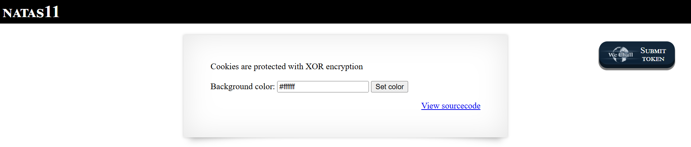

# Natas Level 11: Breaking XOR Encryption

## The Setup
| Level | Username | Target URL |
| :--- | :--- | :--- |
| Level 11 | natas11 | http://natas11.natas.labs.overthewire.org |

**Introduction:** 

Natas Level 11 introduced something completely different from the previous levels. Instead of command injection or file inclusion, this challenge was all about cryptography. Well, actually pseudo cryptography. The page claimed that cookies are "protected with XOR encryption," which immediately made me suspicious. XOR is not encryption in the cryptographic sense, and as I would soon discover, it has some interesting properties that make it reversible when you have enough information.

---

## Hunting for Clues

When I first loaded the page, I saw this interface:



The page displayed "NATAS11" at the top with a message: "Cookies are protected with XOR encryption." Below that was a simple form with a "Background color:" field pre-filled with `#ffffff` and a "Set color" button. At the bottom right was the familiar "View sourcecode" link.

The mention of XOR encryption was the main clue. XOR (exclusive OR) is a bitwise operation that has a unique property: if you XOR the same value twice, you get back the original. In other words, `A XOR B XOR B = A`. This property makes XOR encryption vulnerable when you have both the plaintext and ciphertext.

I clicked on "View sourcecode" to see how the application was handling cookies:

```php
...
<?

$defaultdata = array( "showpassword"=>"no", "bgcolor"=>"#ffffff");

function xor_encrypt($in) {
    $key = '<censored>';
    $text = $in;
    $outText = '';

    // Iterate through each character
    for($i=0;$i<strlen($text);$i++) {
    $outText .= $text[$i] ^ $key[$i % strlen($key)];
    }

    return $outText;
}

function loadData($def) {
    global $_COOKIE;
    $mydata = $def;
    if(array_key_exists("data", $_COOKIE)) {
    $tempdata = json_decode(xor_encrypt(base64_decode($_COOKIE["data"])), true);
    if(is_array($tempdata) && array_key_exists("showpassword", $tempdata) && array_key_exists("bgcolor", $tempdata)) {
        if (preg_match('/^#(?:[a-f\d]{6})$/i', $tempdata['bgcolor'])) {
        $mydata['showpassword'] = $tempdata['showpassword'];
        $mydata['bgcolor'] = $tempdata['bgcolor'];
        }
    }
    }
    return $mydata;
}

function saveData($d) {
    setcookie("data", base64_encode(xor_encrypt(json_encode($d))));
}

$data = loadData($defaultdata);

if(array_key_exists("bgcolor",$_REQUEST)) {
    if (preg_match('/^#(?:[a-f\d]{6})$/i', $_REQUEST['bgcolor'])) {
        $data['bgcolor'] = $_REQUEST['bgcolor'];
    }
}

saveData($data);


?>

<h1>natas11</h1>
<div id="content">
<body style="background: <?=$data['bgcolor']?>;">
Cookies are protected with XOR encryption<br/><br/>

<?
if($data["showpassword"] == "yes") {
    print "The password for natas12 is <censored><br>";
}

?>
...
```

This was fascinating. Let me break down what I learned:

1. **Default Data Structure:** The application starts with `array("showpassword"=>"no", "bgcolor"=>"#ffffff")`
2. **Cookie Process:** The data is JSON encoded, XOR encrypted with a secret key, then Base64 encoded before being stored in a cookie
3. **The Goal:** If I can set `showpassword` to `"yes"`, the password will be revealed
4. **XOR Encryption:** The `xor_encrypt()` function XORs each character with a repeating key pattern

The critical insight was at the bottom of the source code:

```php
if($data["showpassword"] == "yes") {
    print "The password for natas12 is <censored><br>";
}
```

So I needed to manipulate the cookie to change `showpassword` from `"no"` to `"yes"`.

First, I needed to see what cookie the server was setting. I used curl to grab the HTTP headers:

```bash
┌──(ouba㉿CLIENT-DESKTOP)-[/tmp/natas]
└─$ curl -u natas11:UJd[REDACTED] http://natas11.natas.labs.overthewire.org/ -I
HTTP/1.1 200 OK
Date: Sat, 14 Feb 2026 15:50:10 GMT
Server: Apache/2.4.58 (Ubuntu)
Set-Cookie: data=HmYkBwozJw4WNyAAFyB1VUcqOE1JZjUIBis7ABdmbU1GIjEJAyIxTRg%3D
Content-Type: text/html; charset=UTF-8
```

Perfect! The server set a cookie named `data` with the value `HmYkBwozJw4WNyAAFyB1VUcqOE1JZjUIBis7ABdmbU1GIjEJAyIxTRg%3D` (the `%3D` is URL encoded `=`).

---

## Breaking In

Here's where the XOR vulnerability comes into play. I have:
- **Plaintext:** `{"showpassword":"no","bgcolor":"#ffffff"}` (the JSON encoded default data)
- **Ciphertext:** The Base64 decoded cookie value

Because XOR has the property that `plaintext XOR key = ciphertext`, I can reverse it: `plaintext XOR ciphertext = key`

I wrote a PHP script to extract the XOR key:

```bash
┌──(ouba㉿CLIENT-DESKTOP)-[/tmp/natas]
└─$ cat solve.php
<?php
$default_data = array("showpassword"=>"no", "bgcolor"=>"#ffffff");
$plaintext = json_encode($default_data);
$ciphertext = base64_decode("HmYkBwozJw4WNyAAFyB1VUcqOE1JZjUIBis7ABdmbU1GIjEJAyIxTRg=");

$key = "";
for($i=0;$i<strlen($plaintext);$i++) {
    $key .= $plaintext[$i] ^ $ciphertext[$i % strlen($ciphertext)];
}

echo "The repeated key is: " . $key . "\n";
?>
```

Let me explain what this script does:
1. Creates the default data array and JSON encodes it (giving me the plaintext)
2. Base64 decodes the cookie value (giving me the ciphertext)
3. XORs each character of the plaintext with the corresponding character of the ciphertext
4. This reveals the repeating XOR key

I ran the script:

```bash
┌──(ouba㉿CLIENT-DESKTOP)-[/tmp/natas]
└─$ php solve.php
The repeated key is: eDWoeDWoeDWoeDWoeDWoeDWoeDWoeDWoeDWoeDWoe
```

Excellent! The key repeats as `eDWoeDWoeDWo...` which means the actual key is just `eDWo` (it repeats because the plaintext is longer than the key).

Now that I had the key, I could create my own cookie with `showpassword` set to `"yes"`. I wrote another PHP script to generate the malicious cookie:

```bash
┌──(ouba㉿CLIENT-DESKTOP)-[/tmp/natas]
└─$ cat x.php
<?php
$key = "eDWo";
$data = array("showpassword"=>"yes", "bgcolor"=>"#ffffff");
$plaintext = json_encode($data);
$outText = '';

for($i=0; $i<strlen($plaintext); $i++) {
    $outText .= $plaintext[$i] ^ $key[$i % strlen($key)];
}

echo "New Cookie Data: " . base64_encode($outText) . "\n";
?>
```

This script:
1. Uses the extracted key `eDWo`
2. Creates a new data array with `showpassword` set to `"yes"`
3. JSON encodes it
4. XOR encrypts it with the same key
5. Base64 encodes the result to create a valid cookie value

I ran it:

```bash
┌──(ouba㉿CLIENT-DESKTOP)-[/tmp/natas]
└─$ php x.php
New Cookie Data: HmYkBwozJw4WNyAAFyB1VUc9MhxHaHUNAic4Awo2dVVHZzEJAyIxCUc5
```

Perfect! I now had a crafted cookie value that would decrypt to `{"showpassword":"yes","bgcolor":"#ffffff"}` when the server processed it.

Time to test it. I used curl to send a request with my malicious cookie:

```bash
┌──(ouba㉿CLIENT-DESKTOP)-[/tmp/natas]
└─$ curl -u natas11:UJd[REDACTED] -b "data=HmYkBwozJw4WNyAAFyB1VUc9MhxHaHUNAic4Awo2dVVHZzEJAyIxCUc5" http://natas11.natas.labs.overthewire.org/ -i
HTTP/1.1 200 OK
Date: Sat, 14 Feb 2026 15:46:24 GMT
Server: Apache/2.4.58 (Ubuntu)
Set-Cookie: data=HmYkBwozJw4WNyAAFyB1VUc9MhxHaHUNAic4Awo2dVVHZzEJAyIxCUc5
Vary: Accept-Encoding
Content-Length: 1149
Content-Type: text/html; charset=UTF-8

<html>
<head>
<!-- This stuff in the header has nothing to do with the level -->
<link rel="stylesheet" type="text/css" href="http://natas.labs.overthewire.org/css/level.css">
<link rel="stylesheet" href="http://natas.labs.overthewire.org/css/jquery-ui.css" />
<link rel="stylesheet" href="http://natas.labs.overthewire.org/css/wechall.css" />
<script src="http://natas.labs.overthewire.org/js/jquery-1.9.1.js"></script>
<script src="http://natas.labs.overthewire.org/js/jquery-ui.js"></script>
<script src=http://natas.labs.overthewire.org/js/wechall-data.js></script><script src="http://natas.labs.overthewire.org/js/wechall.js"></script>
<script>var wechallinfo = { "level": "natas11", "pass": "UJd[REDACTED]" };</script></head>

<h1>natas11</h1>
<div id="content">
<body style="background: #ffffff;">
Cookies are protected with XOR encryption<br/><br/>

The password for natas12 is yZd[REDACTED]<br>
<form>
Background color: <input name=bgcolor value="#ffffff">
<input type=submit value="Set color">
</form>

<div id="viewsource"><a href="index-source.html">View sourcecode</a></div>
</div>
</body>
</html>
```

Voila! Right there in the response body: `The password for natas12 is yZd[REDACTED]<br>`

The server accepted my crafted cookie, decrypted it, saw that `showpassword` was set to `"yes"`, and revealed the password.

**The Vulnerability Breakdown:**

This challenge demonstrates **Weak Cryptography and Known Plaintext Attack**. Here's what went wrong:

1. **XOR is Not Encryption:** XOR is a reversible operation, not cryptographic encryption. It's fine for obfuscation but should never be used for security purposes.

2. **Known Plaintext Attack:** I knew what the default data structure looked like because:
   - The source code revealed `$defaultdata = array("showpassword"=>"no", "bgcolor"=>"#ffffff")`
   - I could easily predict how it would be JSON encoded
   - With both plaintext and ciphertext, extracting the XOR key was trivial

3. **Predictable Data Structure:** The application uses a simple, predictable data format that makes it easy to craft valid payloads once you know the key.

4. **Key Reuse:** The same XOR key is used for all cookies, so once you extract it from one cookie, you can create unlimited forged cookies.

**Why XOR Fails as Encryption:**

XOR has several properties that make it unsuitable for encryption:

- **Reversible:** `A XOR B XOR B = A` means if you XOR twice with the same key, you get the original value
- **No Authentication:** There's no way to verify the cookie hasn't been tampered with
- **Key Recovery:** If an attacker has both plaintext and ciphertext, they can recover the key
- **Pattern Analysis:** Repeating keys create patterns that can be analyzed

**Proper Mitigation:**

To secure cookies properly, developers should:

1. **Use Authenticated Encryption:**
   ```php
   // Using PHP's built-in functions
   $key = random_bytes(32);
   $nonce = random_bytes(SODIUM_CRYPTO_SECRETBOX_NONCEBYTES);
   $ciphertext = sodium_crypto_secretbox(json_encode($data), $nonce, $key);
   $cookie = base64_encode($nonce . $ciphertext);
   ```

2. **Sign Cookies:** Use HMAC to prevent tampering
   ```php
   $data_json = json_encode($data);
   $signature = hash_hmac('sha256', $data_json, $secret_key);
   $cookie = base64_encode($data_json . '|' . $signature);
   ```

3. **Use Framework Features:** Most frameworks provide secure session management (Laravel's encrypted cookies, Django's signed cookies, etc.)

4. **Store Sensitive State Server Side:** Instead of storing `showpassword` in a cookie, use server side sessions with only a session ID in the cookie.

5. **Add Timestamps and Expiry:** Even with encryption, add timestamps to prevent replay attacks.

---

## The Loot

**Next Level Password:** `yZd[REDACTED]`

**Quick Recap:** Exploited weak XOR encryption by performing a known plaintext attack to extract the encryption key, then crafted a malicious cookie with `showpassword` set to `yes` to reveal the password.

---

## Lessons Learned

This level taught me several important cryptography lessons:

1. **XOR is Not Encryption:** While XOR has legitimate uses in cryptography (like in stream ciphers), using it alone with a static key is not secure encryption.

2. **Known Plaintext Attacks are Real:** When an attacker knows or can predict the plaintext, weak encryption schemes like simple XOR become trivially breakable.

3. **Key Recovery is Devastating:** Once the encryption key is extracted, the entire security model collapses. The attacker can read all past cookies and forge new ones indefinitely.

4. **Client Side Data Cannot Be Trusted:** Even with encryption, cookies can be manipulated. Security critical decisions should rely on server side state, not client side data.

5. **Use Proper Cryptography Libraries:** Modern languages provide secure, tested cryptography libraries. There's no reason to implement your own encryption, especially with outdated methods like simple XOR.

6. **Authentication Matters:** Encryption without authentication allows tampering. Use authenticated encryption modes (like AES-GCM or ChaCha20-Poly1305) that verify integrity.

This challenge perfectly demonstrates why understanding cryptography fundamentals is crucial for both attackers and defenders. A seemingly "encrypted" cookie turned out to be completely vulnerable to a textbook attack.

On to Level 12!
