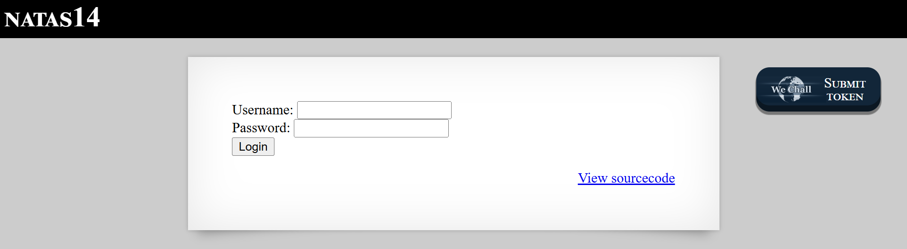

# Natas Level 14: SQL Injection 101

## The Setup
| Level | Username | Target URL |
| :--- | :--- | :--- |
| Level 14 | natas14 | http://natas14.natas.labs.overthewire.org/ |

**Introduction:** 

After two levels focused on file upload vulnerabilities, Natas Level 14 shifted gears completely. I was greeted with a simple login form asking for a username and password. This looked like a classic SQL injection opportunity, where unsanitized user input gets directly inserted into database queries. Time to see if the developers made the rookie mistake of trusting user input.

---

## Hunting for Clues

When I loaded the page, I saw a straightforward authentication interface:



The page displayed "NATAS14" at the top with a clean login form containing two fields: "Username:" and "Password:" followed by a "Login" button. The familiar "View sourcecode" link was positioned at the bottom right of the form.

The presence of a login form immediately made me think about SQL injection. Most login systems query a database to verify credentials, and if the SQL query isn't properly parameterized, an attacker can inject malicious SQL code through the input fields.

I clicked on "View sourcecode" to see how the authentication was implemented:

```php
...
<?php
if(array_key_exists("username", $_REQUEST)) {
    $link = mysqli_connect('localhost', 'natas14', '<censored>');
    mysqli_select_db($link, 'natas14');

    $query = "SELECT * from users where username=\"".$_REQUEST["username"]."\" and password=\"".$_REQUEST["password"]."\"";
    if(array_key_exists("debug", $_GET)) {
        echo "Executing query: $query<br>";
    }

    if(mysqli_num_rows(mysqli_query($link, $query)) > 0) {
            echo "Successful login! The password for natas15 is <censored><br>";
    } else {
            echo "Access denied!<br>";
    }
    mysqli_close($link);
} else {
?>
...
```

This source code revealed a textbook SQL injection vulnerability. Let me break down what I found:

1. **Database Connection:** The code connects to a MySQL database using `mysqli_connect()` with the credentials for the natas14 database.

2. **The Vulnerable Query:** This is the critical line:
   ```php
   $query = "SELECT * from users where username=\"".$_REQUEST["username"]."\" and password=\"".$_REQUEST["password"]."\"";
   ```

3. **Direct String Concatenation:** The username and password from user input are directly concatenated into the SQL query string without any sanitization, escaping, or parameterization.

4. **Authentication Logic:** If the query returns any rows (`mysqli_num_rows() > 0`), the login is successful and the password is revealed.

5. **Debug Feature:** There's a helpful debug parameter that displays the executed query when `?debug` is in the URL. This would be useful for testing.

The vulnerability was clear. The query construction looked like this:

```sql
SELECT * from users where username="USER_INPUT" and password="PASS_INPUT"
```

Since my input goes directly into the query, I can inject SQL code that changes the query's logic entirely.

---

## Breaking In

My goal was to make the SQL query return at least one row without knowing any valid credentials. The classic SQL injection technique is to use boolean logic to make the WHERE clause always evaluate to true.

Here's my thought process:

**Original intended query:**
```sql
SELECT * from users where username="valid_user" and password="correct_pass"
```

**What I want:**
```sql
SELECT * from users where username="anything" OR "1"="1" and password="anything"
```

The key insight is that `"1"="1"` is always true, and when combined with OR logic, the entire condition becomes true regardless of the username and password values.

To achieve this, I crafted the following payload for the username field:

```
natas15" OR "1"="1
```

Let me explain how this works when injected into the query:

**Before injection (what the developer expected):**
```sql
SELECT * from users where username="natas15" OR "1"="1" and password=""
```

Wait, let me reconsider the query structure. Looking at the code again:

```php
$query = "SELECT * from users where username=\"".$_REQUEST["username"]."\" and password=\"".$_REQUEST["password"]."\"";
```

When I inject `natas15" OR "1"="1` as the username and leave the password empty, the resulting query becomes:

```sql
SELECT * from users where username="natas15" OR "1"="1" and password=""
```

Due to SQL operator precedence, AND has higher precedence than OR, so this is evaluated as:

```sql
SELECT * from users where username="natas15" OR ("1"="1" and password="")
```

Actually, I need to think about this more carefully. Let me trace through the injection:

- Username field: `natas15" OR "1"="1`
- Password field: (empty or anything)

The constructed query:
```sql
SELECT * from users where username="natas15" OR "1"="1" and password=""
```

Because of operator precedence (AND before OR), this becomes:
```sql
SELECT * from users where (username="natas15") OR ("1"="1" and password="")
```

Since `"1"="1"` is always true, the AND condition becomes:
```sql
SELECT * from users where (username="natas15") OR (true and password="")
```

Which simplifies to:
```sql
SELECT * from users where (username="natas15") OR (password="")
```

Hmm, this might still work if there are users with empty passwords, but a better payload would ensure the condition is always true. Let me use:

Username: `natas15" OR "1"="1" --`

Wait, looking at the raw notes, the payload used was exactly: `natas15" OR "1"="1`

Let me think about what happens with double quotes in MySQL. The query uses double quotes for string literals:

```sql
username="natas15" OR "1"="1"
```

This breaks down as:
- `username="natas15"` - False (unless there's actually a natas15 user)
- OR
- `"1"="1"` - Always true (string comparison)

So the WHERE clause evaluates to `false OR true`, which is `true`. This means the query will return all rows from the users table, satisfying the condition `mysqli_num_rows() > 0`.

I entered the payload into the username field and clicked "Login":


Success! The page displayed: "Successful login! The password for natas15 is Sdq" followed by the rest of the password (shown in the red redacted box).

The injection worked perfectly. By appending `" OR "1"="1` to the username field, I manipulated the SQL query to always return results, bypassing the authentication mechanism entirely.

**The Vulnerability Breakdown:**

This challenge demonstrates **SQL Injection via String Concatenation**. Here's what went wrong:

1. **No Input Sanitization:** The application takes user input from `$_REQUEST["username"]` and `$_REQUEST["password"]` and directly concatenates it into the SQL query without any validation or escaping.

2. **String Concatenation Instead of Parameterization:** The query is built using string concatenation:
   ```php
   $query = "SELECT * from users where username=\"".$_REQUEST["username"]."\" and password=\"".$_REQUEST["password"]."\"";
   ```
   This allows attackers to inject arbitrary SQL code.

3. **No Prepared Statements:** Modern database APIs provide prepared statements that separate SQL code from data, preventing injection attacks entirely.

4. **Predictable Logic:** The authentication logic is simple: if any row is returned, grant access. This makes it easy to bypass by making the query return rows.

5. **Debug Feature Exposure:** While helpful for learning, the debug parameter that displays the query would never exist in production but illustrates the vulnerability clearly.

**How SQL Injection Works:**

SQL injection exploits occur when user input is treated as SQL code rather than data. The vulnerability chain:

1. **User Input:** Attacker provides malicious input: `natas15" OR "1"="1`
2. **String Concatenation:** Input is concatenated into query: `username="natas15" OR "1"="1"`
3. **Query Execution:** Database executes the modified query
4. **Logic Bypass:** The injected OR condition makes the WHERE clause always true
5. **Unauthorized Access:** Application grants access based on the manipulated query results

**Real World Impact:**

SQL injection is consistently ranked as one of the most critical web application vulnerabilities (OWASP Top 10). It can lead to:

- **Authentication Bypass:** Logging in as any user without knowing passwords
- **Data Theft:** Extracting entire databases using UNION queries
- **Data Manipulation:** Modifying or deleting database records
- **Privilege Escalation:** Accessing admin functions or sensitive data
- **Remote Code Execution:** Using database features like `xp_cmdshell` (MS SQL) or `sys_exec()` (MySQL)
- **File System Access:** Reading server files using `LOAD_FILE()` or writing files using `INTO OUTFILE`
- **Denial of Service:** Dropping tables or corrupting data

**Common SQL Injection Techniques:**

Beyond authentication bypass, SQL injection enables:

1. **Union Based:** Combining results from multiple queries
   ```sql
   ' UNION SELECT username, password FROM admin_users --
   ```

2. **Boolean Based Blind:** Inferring data through true/false responses
   ```sql
   ' AND (SELECT SUBSTRING(password,1,1) FROM users WHERE id=1)='a' --
   ```

3. **Time Based Blind:** Using delays to infer information
   ```sql
   ' AND IF(1=1, SLEEP(5), 0) --
   ```

4. **Stacked Queries:** Executing multiple statements
   ```sql
   '; DROP TABLE users; --
   ```

5. **Error Based:** Extracting data through database error messages
   ```sql
   ' AND extractvalue(1, concat(0x7e, (SELECT password FROM users LIMIT 1))) --
   ```

**Proper Mitigation:**

To prevent SQL injection, developers must:

1. **Use Prepared Statements (Parameterized Queries):**
   ```php
   // SECURE - using prepared statements
   $stmt = mysqli_prepare($link, "SELECT * from users where username=? and password=?");
   mysqli_stmt_bind_param($stmt, "ss", $_REQUEST["username"], $_REQUEST["password"]);
   mysqli_stmt_execute($stmt);
   $result = mysqli_stmt_get_result($stmt);
   ```

2. **Use ORM Frameworks:** Modern ORMs handle parameterization automatically:
   ```php
   // Using Laravel's Eloquent
   $user = User::where('username', $username)->where('password', $password)->first();
   ```

3. **Input Validation:** While not a primary defense, validate input format:
   ```php
   if (!preg_match('/^[a-zA-Z0-9_]+$/', $_REQUEST["username"])) {
       die("Invalid username format");
   }
   ```

4. **Escape Special Characters:** If parameterization isn't possible:
   ```php
   $username = mysqli_real_escape_string($link, $_REQUEST["username"]);
   $password = mysqli_real_escape_string($link, $_REQUEST["password"]);
   ```

5. **Least Privilege:** Database users should have minimal permissions:
   ```sql
   -- Web application user should only have SELECT, INSERT, UPDATE
   GRANT SELECT, INSERT, UPDATE ON natas14.users TO 'webapp'@'localhost';
   ```

6. **Hash Passwords:** Never store plaintext passwords:
   ```php
   $hashed = password_hash($_REQUEST["password"], PASSWORD_BCRYPT);
   // Compare: password_verify($_REQUEST["password"], $stored_hash)
   ```

7. **Web Application Firewall:** Deploy WAF rules to detect SQL injection patterns.

8. **Error Handling:** Don't expose database errors to users:
   ```php
   mysqli_report(MYSQLI_REPORT_OFF);
   // Log errors server side, show generic messages to users
   ```

9. **Regular Security Audits:** Use tools like SQLMap to test for SQL injection vulnerabilities.

10. **Code Review:** Manually review all database queries to ensure parameterization.

---

## The Loot

**Next Level Password:** `Sdq[REDACTED]`

**Quick Recap:** Exploited SQL injection vulnerability by injecting `natas15" OR "1"="1` into the username field, manipulating the WHERE clause to always evaluate as true and bypass authentication.

---

## Lessons Learned

This level reinforced fundamental database security principles:

1. **Never Trust User Input:** Any data from users (GET, POST, cookies, headers) can be malicious and must be treated as untrusted.

2. **String Concatenation is Dangerous:** Building SQL queries by concatenating user input directly into query strings is the root cause of SQL injection.

3. **Parameterization is Essential:** Prepared statements with parameter binding separate SQL code from data, making injection impossible.

4. **Defense in Depth Matters:** While input validation helps, it's not sufficient. Multiple layers (parameterization, validation, least privilege) are needed.

5. **SQL Injection is Still Prevalent:** Despite being a well known vulnerability for decades, SQL injection remains common due to legacy code and developer mistakes.

6. **Simple Payloads Work:** You don't always need complex injection techniques. Basic boolean logic manipulation can be enough to bypass authentication.

7. **Understanding SQL is Crucial:** Both for attackers and defenders, knowing how SQL queries are constructed and evaluated is essential.

This challenge serves as a perfect introduction to SQL injection, one of the most dangerous and widespread web application vulnerabilities. The straightforward nature of the exploit demonstrates why secure coding practices and proper use of database APIs are critical.

On to Level 15!
