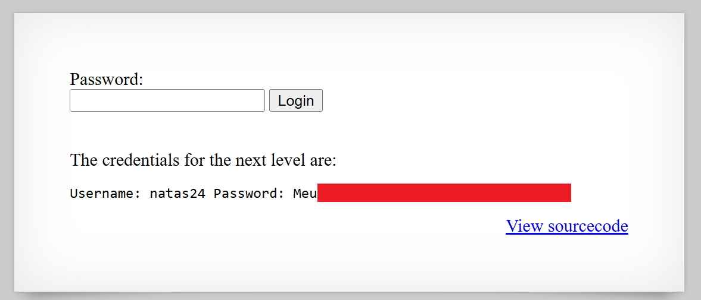

# Natas Level 23: When Strings Pretend to Be Numbers

## The Setup
| Level | Username | Target URL |
| :--- | :--- | :--- |
| Level 23 | natas23 | http://natas23.natas.labs.overthewire.org |

**Introduction:** Level 23 is all about PHP type juggling, one of my favorite weird behaviors in the language. This challenge presents what looks like an impossible condition: your input must contain a specific word AND be greater than a number. How can text be greater than a number? Welcome to the wonderful world of loose type comparison in PHP.

---

## Hunting for Clues

When I first loaded the page, I saw a simple password form.


The page displays "NATAS23" in white text on a black header bar. Below that is a clean white content area with a single labeled input field "Password:", followed by a text box and a "Login" button. In the lower right corner is the familiar blue "View sourcecode" link. There's also a WeChall "SUBMIT TOKEN" button in the top right. The minimalist design suggested that the real complexity was in the validation logic.

I clicked on the source code to see what conditions I needed to meet:

```php
<?php
    if(array_key_exists("passwd",$_REQUEST)){
        if(strstr($_REQUEST["passwd"],"iloveyou") && ($_REQUEST["passwd"] > 10 )){
            echo "<br>The credentials for the next level are:<br>";
            echo "<pre>Username: natas24 Password: <censored></pre>";
        }
        else{
            echo "<br>Wrong!<br>";
        }
    }
    // morla / 10111
?>
```

Looking at this code, I needed to satisfy two conditions simultaneously:

1. `strstr($_REQUEST["passwd"], "iloveyou")` - My input must contain the string "iloveyou"
2. `$_REQUEST["passwd"] > 10` - My input must be greater than 10

At first glance, this seemed contradictory. How can a string that contains "iloveyou" also be numerically greater than 10? The answer lies in understanding how PHP handles type comparisons.

### Understanding PHP Type Juggling

PHP is a loosely typed language, which means it automatically converts types when you compare different types of values. When you compare a string to an integer using operators like `>`, `<`, or `==`, PHP tries to convert the string to a number.

The conversion rules are simple but powerful:

1. **If the string starts with a number**, PHP extracts that number up to the first non numeric character
2. **If the string starts with a letter or non numeric character**, PHP treats it as 0

Let me show you some examples of how PHP converts strings to numbers:

- `"123abc"` becomes `123`
- `"45.67xyz"` becomes `45.67`
- `"999iloveyou"` becomes `999`
- `"iloveyou123"` becomes `0` (starts with a letter)
- `"abc"` becomes `0`

This means that when PHP evaluates `"123abc" > 10`, it actually compares `123 > 10`, which is true.

### The Attack Vector

Now the vulnerability became clear. I needed to craft an input that:

1. Contains the substring "iloveyou" anywhere in it (to pass the `strstr()` check)
2. Starts with a number greater than 10 (to pass the numeric comparison)

The `strstr()` function doesn't care where "iloveyou" appears in the string. It just checks if the substring exists anywhere. So I could put "iloveyou" at the end and put a number at the beginning.

Perfect input: `11iloveyou`

Let me trace through how PHP evaluates this:

1. `strstr("11iloveyou", "iloveyou")` returns true (the substring exists)
2. `"11iloveyou" > 10` converts to `11 > 10`, which is true
3. Both conditions are true, so the password is revealed

I could also use `11111iloveyou`, `999iloveyou`, or any number greater than 10 followed by "iloveyou".

## Breaking In

Time to test my theory. I crafted the URL with my payload:

```
/index.php?passwd=11111iloveyou
```

I visited the URL in my browser and watched the magic happen.



Success! The page now displays "The credentials for the next level are:" followed by "Username: natas24 Password: Meu[REDACTED]" (shown with a red redaction box in the screenshot). The password input field and Login button are still visible at the top, along with the "View sourcecode" link at the bottom.

The exploit worked exactly as expected. PHP evaluated my input in two different contexts:

1. For `strstr()`, it treated `"11111iloveyou"` as a string and found the substring "iloveyou"
2. For the `> 10` comparison, it converted `"11111iloveyou"` to the integer `11111` and compared it to 10

Both checks passed, and I got the password.

### Why This Works

Let me break down exactly what happens in PHP's interpreter:

**Step 1: String Check**
```php
strstr("11111iloveyou", "iloveyou")
```
This returns the portion of the string starting from "iloveyou", which is truthy. Check passed.

**Step 2: Numeric Comparison**
```php
"11111iloveyou" > 10
```
PHP sees a string being compared to an integer. It converts the string to a number by looking at the beginning. It finds "11111" and stops at the first non numeric character "i". The comparison becomes:
```php
11111 > 10  // true
```
Check passed.

**Step 3: Both Conditions Met**
```php
true && true  // true
```
The password is printed.

### Alternative Payloads

Any of these would work:

- `11iloveyou` - Minimal solution, 11 > 10
- `100iloveyou` - Using a larger number
- `999999iloveyou` - Even larger number
- `12.5iloveyou` - Floats work too (12.5 > 10)

What would NOT work:

- `iloveyou11` - Starts with a letter, converts to 0, and 0 is not > 10
- `iloveyou` - Same issue, converts to 0
- `10iloveyou` - The number is 10, not greater than 10 (10 > 10 is false)
- `9iloveyou` - The number 9 is not greater than 10

### Real World Implications

This type of vulnerability appears in real applications more often than you might think. Here's why it matters:

**Weak Validation Logic**: Developers might think they're implementing complex validation by combining multiple checks, but type juggling can bypass these controls in unexpected ways.

**Authentication Bypasses**: Imagine a system that checks if a PIN is numeric and equals a stored value. If the comparison uses loose equality (`==` instead of `===`), an attacker might bypass it with type juggling.

**Price Manipulation**: E-commerce applications that validate prices or quantities using loose comparisons could be exploited to manipulate values.

**API Parameter Validation**: REST APIs that accept string parameters but perform numeric comparisons on them are vulnerable to this type of attack.

### How to Prevent This

The fix involves understanding and respecting PHP's type system:

1. **Use Strict Comparisons**: Always use `===` and `!==` instead of `==` and `!=` for comparisons. Strict comparisons don't perform type conversion:
   ```php
   if(strstr($_REQUEST["passwd"], "iloveyou") && ($_REQUEST["passwd"] === 10)) {
       // This would never pass with a string input
   }
   ```

2. **Explicit Type Checking**: Verify the type of user input before processing:
   ```php
   if(is_string($_REQUEST["passwd"]) && strstr($_REQUEST["passwd"], "iloveyou")) {
       if(is_numeric($_REQUEST["passwd"]) && intval($_REQUEST["passwd"]) > 10) {
           // Now you're explicitly controlling the type conversion
       }
   }
   ```

3. **Separate Validation Logic**: Don't mix string operations and numeric operations on the same user input:
   ```php
   // Bad: mixing concerns
   if(strstr($input, "keyword") && $input > 10) { }
   
   // Good: separate validation
   if(strstr($input, "keyword")) {
       $numericValue = filter_var($input, FILTER_VALIDATE_INT);
       if($numericValue !== false && $numericValue > 10) {
           // Both conditions properly validated
       }
   }
   ```

4. **Input Sanitization**: Use PHP's filter functions to validate and sanitize input:
   ```php
   $password = filter_input(INPUT_GET, 'passwd', FILTER_SANITIZE_STRING);
   $numericCheck = filter_var($password, FILTER_VALIDATE_INT);
   
   if(strstr($password, "iloveyou") && $numericCheck !== false && $numericCheck > 10) {
       // Properly validated
   }
   ```

5. **Type Declarations**: Use PHP 7+ type declarations to enforce types:
   ```php
   function validatePassword(string $passwd): bool {
       // $passwd is guaranteed to be a string
       // Any numeric comparison will be explicit
       return strstr($passwd, "iloveyou") && (int)$passwd > 10;
   }
   ```

6. **Static Analysis Tools**: Use tools like PHPStan or Psalm to catch type juggling issues during development:
   ```bash
   # These tools will warn about loose comparisons
   phpstan analyse src/
   ```

7. **Code Review Checklist**: Train developers to recognize dangerous patterns:
   - Look for comparisons between `$_REQUEST`/`$_GET`/`$_POST` variables and numbers
   - Flag any use of `==` or `!=` with user input
   - Review complex conditions that mix string and numeric operations

8. **Testing**: Write tests that specifically check for type juggling vulnerabilities:
   ```php
   // PHPUnit test
   public function testPasswordValidationRejectsNumericStrings() {
       $this->assertFalse(validatePassword("11iloveyou"));
       $this->assertFalse(validatePassword("999iloveyou"));
   }
   ```

9. **Framework Protection**: Modern frameworks like Laravel provide validation helpers that handle types correctly:
   ```php
   // Laravel validation
   $validated = $request->validate([
       'passwd' => 'required|string|min:6',
   ]);
   
   // Separate numeric validation if needed
   if(Str::contains($validated['passwd'], 'iloveyou')) {
       // Explicit logic, no type juggling
   }
   ```

10. **Documentation and Training**: Make sure your team understands PHP type juggling. It's a common source of security vulnerabilities that even experienced developers can overlook.

The core principle is simple: **never trust PHP to handle type conversions in security critical code**. Always be explicit about types, use strict comparisons, and validate input properly before making security decisions based on it.

---

## The Loot

**Next Level Password:** Meu[REDACTED]

**Quick Recap:** PHP type juggling vulnerability allowed bypassing dual validation checks by using a string that starts with a number greater than 10 followed by the required substring, exploiting loose type comparison during numeric operations.
