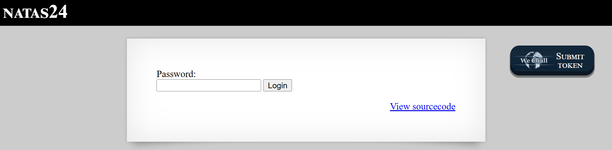
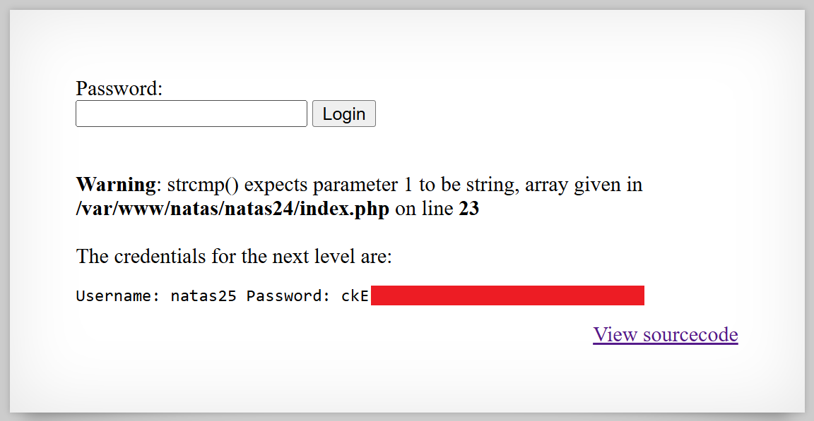

# Natas Level 24: Breaking strcmp With Type Confusion

## The Setup
| Level | Username | Target URL |
| :--- | :--- | :--- |
| Level 24 | natas24 | http://natas24.natas.labs.overthewire.org |

**Introduction:** Level 24 introduces another type juggling vulnerability, but this time it's not about comparisons between strings and numbers. Instead, it's about what happens when you pass the wrong data type to a function that expects something specific. This challenge demonstrates why defensive programming and type checking matter in security critical code.

---

## Hunting for Clues

When I first loaded the page, I saw a familiar password form.



The page displays "NATAS24" in large white text on a black header bar. Below that is a white content area with a simple form containing a "Password:" label, an empty text input field, and a "Login" button. In the bottom right corner is the blue "View sourcecode" link. There's also a WeChall "SUBMIT TOKEN" button in the top right corner. The clean interface suggested that once again, the vulnerability would be in the validation logic.

I clicked on the source code to see how password verification was implemented:

```php
<?php
    if(array_key_exists("passwd",$_REQUEST)){
        if(!strcmp($_REQUEST["passwd"],"<censored>")){
            echo "<br>The credentials for the next level are:<br>";
            echo "<pre>Username: natas25 Password: <censored></pre>";
        }
        else{
            echo "<br>Wrong!<br>";
        }
    }
    // morla / 10111
?>
```

The code was deceptively simple. It uses PHP's `strcmp()` function to compare the user submitted password with the actual password. Let me break down how this is supposed to work:

### Normal strcmp() Behavior

The `strcmp()` function compares two strings:
- Returns `0` if the strings are identical
- Returns a negative number if the first string is less than the second
- Returns a positive number if the first string is greater than the second

The code uses `!strcmp()` which means "if strcmp returns 0 (strings match), negate it to true and grant access."

So the logic is:
```php
strcmp("correct", "correct") = 0
!0 = true
// Access granted
```

This seems secure at first. You need to know the exact password to make strcmp return 0. But there's a critical flaw: what happens when strcmp receives something that isn't a string?

### The Type Confusion Vulnerability

I did some research on strcmp behavior and discovered something interesting. In older versions of PHP (and even in newer versions without strict type checking), if you pass an array to strcmp instead of a string, the function doesn't know how to compare an array to a string. It emits a warning and returns `NULL`.

Here's the critical part: in PHP's loose type comparison, `NULL` is treated as equivalent to `0`.

Let me trace through what happens:
```php
strcmp(array(), "secret_password") = NULL  // Warning: type mismatch
!NULL = true  // In loose comparison, NULL == false, so !NULL == true
// Access granted!
```

This means I could bypass the password check entirely without knowing the password. I just needed to send an array instead of a string.

### How to Send an Array

In PHP, when you want to send an array through HTTP parameters, you use square brackets in the parameter name. For example:
- `passwd=test` sends a string
- `passwd[]=test` sends an array with one element
- `passwd[]=` sends an empty array

The empty array would be perfect for this exploit.

## Breaking In

I crafted my payload using the array notation. The URL would be:

```
/index.php?passwd[]=
```

By adding `[]` after the parameter name, I was telling PHP to treat `passwd` as an array instead of a string. The empty value meant it would be an empty array.

Let me visit that URL and see what happens.



Perfect! The page now shows several important things:

1. **A PHP Warning**: "Warning: strcmp() expects parameter 1 to be string, array given in /var/www/natas/natas24/index.php on line 23"

This confirms exactly what I expected. The strcmp function received an array when it was expecting a string, and it complained about it.

2. **The Credentials**: "The credentials for the next level are: Username: natas25 Password: ckE[REDACTED]" (shown with a red redaction box)

Despite the warning, the authentication bypass worked! The strcmp function returned NULL, which was treated as 0 in the loose comparison, and `!NULL` evaluated to true.

3. **The Original Form**: The password input and Login button are still visible at the top, showing that the page completed its execution despite the warning.

The exploit succeeded perfectly. I bypassed password authentication without knowing a single character of the actual password.

### Understanding the Full Attack

Let me walk through exactly what happened in PHP's execution:

**Step 1: Parameter Parsing**
```php
$_REQUEST["passwd"] = array()  // Empty array because of passwd[]=
```

**Step 2: strcmp Execution**
```php
strcmp(array(), "<censored>")
// Error: Cannot compare array to string
// Returns: NULL
// Warning: strcmp() expects parameter 1 to be string, array given
```

**Step 3: Negation Check**
```php
!NULL
// In PHP, NULL is falsy, so !NULL is truthy
// Evaluates to: true
```

**Step 4: Access Granted**
```php
if(true) {
    echo "The credentials for the next level are...";
}
```

The password check was completely bypassed.

### Why This Works

This vulnerability exists because of several PHP quirks working together:

1. **Weak Type System**: PHP allows you to pass any type to most functions, even if they expect a specific type
2. **Loose Comparison**: The `!` operator uses loose type checking, where NULL and 0 are considered equivalent
3. **No Input Validation**: The code never checks if the password parameter is actually a string
4. **Function Return on Error**: strcmp returns NULL on type mismatch instead of throwing an exception

### Real World Impact

This type of vulnerability has appeared in real applications. Here's why it matters:

**Authentication Bypass**: Any login system using strcmp with loose comparison is vulnerable to this attack. Attackers can gain admin access without knowing credentials.

**API Security**: REST APIs that use strcmp for token validation or signature verification could be bypassed using this technique.

**Legacy Code**: Older PHP applications (especially those running PHP 5.x) are particularly vulnerable, as they often rely on strcmp for security critical comparisons.

**Framework Weaknesses**: Even some frameworks had this vulnerability in their authentication layers before it became widely known.

### Proper Mitigation Strategies

Here's how to protect against this vulnerability:

1. **Use Strict Comparison**: Use the strict equality operator `===` instead of relying on strcmp:
   ```php
   if($_REQUEST["passwd"] === $correct_password) {
       // Access granted
   }
   ```

2. **Type Validation**: Always validate that user input is the expected type:
   ```php
   if(is_string($_REQUEST["passwd"]) && !strcmp($_REQUEST["passwd"], $correct_password)) {
       // Now safe
   }
   ```

3. **Use hash_equals for Security Comparisons**: PHP 5.6+ provides `hash_equals()` which is timing attack resistant and type safe:
   ```php
   if(hash_equals($correct_password, (string)$_REQUEST["passwd"])) {
       // Secure comparison
   }
   ```

4. **Enable Strict Types**: PHP 7+ supports strict type declarations:
   ```php
   declare(strict_types=1);
   
   function validatePassword(string $password): bool {
       // $password must be a string, or a TypeError is thrown
       return !strcmp($password, CORRECT_PASSWORD);
   }
   ```

5. **Input Filtering**: Use filter functions to ensure proper types:
   ```php
   $password = filter_input(INPUT_GET, 'passwd', FILTER_SANITIZE_STRING);
   if($password !== null && $password !== false) {
       if(!strcmp($password, $correct_password)) {
           // Safe
       }
   }
   ```

6. **Password Hashing**: Never compare plaintext passwords. Always use proper password hashing:
   ```php
   // Storing password
   $hash = password_hash($password, PASSWORD_DEFAULT);
   
   // Verifying password
   if(password_verify($_REQUEST["passwd"], $stored_hash)) {
       // Access granted
   }
   ```
   Note: `password_verify()` is type safe and will return false if given an array.

7. **Error Handling**: Configure PHP to not display warnings in production:
   ```php
   // php.ini
   display_errors = Off
   log_errors = On
   ```
   While this doesn't fix the vulnerability, it prevents attackers from seeing the warning that confirms their attack worked.

8. **Static Analysis**: Use tools like PHPStan or Psalm to catch type issues:
   ```php
   // PHPStan will warn about this
   if(!strcmp($_REQUEST["passwd"], $secret)) { }
   ```

9. **Framework Functions**: Use your framework's authentication system instead of rolling your own:
   ```php
   // Laravel
   if(Hash::check($request->input('passwd'), $user->password)) {
       // Secure, type safe
   }
   ```

10. **Security Testing**: Include type confusion tests in your security test suite:
   ```php
   // PHPUnit test
   public function testPasswordRejectsArrayInput() {
       $response = $this->get('/login?passwd[]=');
       $this->assertStringNotContainsString('credentials', $response);
   }
   ```

### The Broader Lesson

This challenge teaches an important principle: **never assume the type of user input**. In loosely typed languages like PHP, user input can be manipulated to be arrays, objects, or other unexpected types. Security critical code must explicitly validate types before using data in comparisons or operations.

The strcmp vulnerability is particularly dangerous because:
- It looks secure at first glance
- The function itself isn't "broken"
- The issue is subtle (loose comparison of NULL)
- It completely bypasses authentication
- No password knowledge is required

Always remember: security through obscurity doesn't work, and security through language quirks definitely doesn't work.

---

## The Loot

**Next Level Password:** ckE[REDACTED]

**Quick Recap:** Type confusion vulnerability in strcmp() allowed authentication bypass by passing an array instead of a string, causing the function to return NULL which was treated as 0 in loose comparison, completely bypassing password verification.
